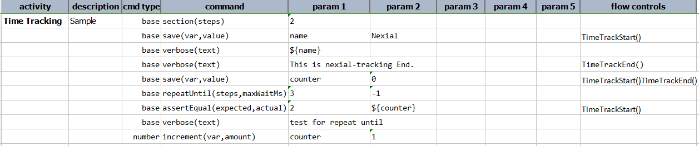
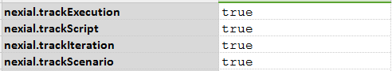
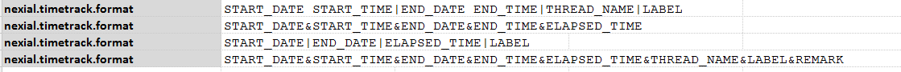

### Description
In dealing with automation, often one finds the necessity to have performance testing or analysis charts for tests. 
The ability to articulate such idea gives our automation more flexibility. This is main purpose of **Time Tracking.** 
This will help Nexial user to analyse the time results for test steps and also for different execution levels.

Nexial will generate new log file **`nexial-timetrack.log`** in `logs` folder of output directory under target project.
It will have logs for the tracked steps and tracked execution levels.

Remark is simply a tracking status. Following are the remarks for some scenarios
1. If execution is ended due to `EndIf` condition without ending tracking, remark will be "Execution interrupted".
2. If execution is failed in the middle without ending tracking, remark will be "Execution failed".
3. If execution is completed without ending tracking, remark will be "Execution ended."
4. If tracking ended with `TimeTrackEnd`, remark will be empty.

Time tracking should be specified in flow controls column so as they are treated just like flow control. 
The syntax of Time Tracking is same as that of flow control. The general syntax looks like: 
**[`TimeTrackStart(label)`](#timetrackstart(label))** 
**[`TimeTrackEnd()`](#timetrackend())**

### TimeTrackStart(label)
`TimeTrackStart` will be start point for time tracking for steps. Label is simply the description, or label, for an 
instance of time tracking.  Label is OPTIONAL. Default label is `script-name#scenario-name`. During execution, Nexial 
will evaluate this before test step execution. So start time will be the start time of that step. 

### TimeTrackEnd()
`TimeTrackEnd` will be end point for time tracking. During execution, Nexial will evaluate this after test step 
execution. So end time will be the end time of that step. 

Lets have a look how to add `TimeTrackStart` and `TimeTrackEnd` in scripts.

### Example
Script: 

Log File: 

In above images, you can see that first two lines are without remark while third line is with remark as tracking is not
ended in the script. 

### Notes
1. Nexial does not support nested tracking till this point. For example, you have `TimeTrackStart` for the first step,
   again in third steps you have `TimeTrackStart`. You have not closed first `TimeTrackStart` with `TimeTrackEnd`. This 
   is nested tracking. Currently Nexial does not support this feature at this time.
2. If you have `TimeTrackStart` in successive steps without having `TimeTrackEnd`, Nexial will take first one into 
   consideration for tracking purpose. Two successive `TimeTrackEnd` will do the same.
3. If you have a `TimeTrackStart` in your script without a corresponding `TimeTrackEnd()`, Nexial will automatically end
   that tracking at iteration level.

### Event Tracking
Nexial also supports time tracking for different execution events via System variables.
1. [`nexial.timetrack.trackExecution`](../systemvars/index#nexial.timetrack.trackExecution) - This is event for 
   tracking logs with start, end and elapsed time of the execution. Default value is `false`.
2. [`nexial.timetrack.trackScript`](../systemvars/index#nexial.timetrack.trackScript) - This is event for tracking logs 
   with start, end and elapsed time of each script. Default value is `false`.
3. [`nexial.timetrack.trackIteration`](../systemvars/index#nexial.timetrack.trackIteration) - This is event for tracking 
   logs with start, end and elapsed time of each iteration. Default value is `false`.
4. [`nexial.timetrack.trackScenario`](../systemvars/index#nexial.timetrack.trackScenario) - This is event for tracking 
   logs with start, end and elapsed time of each scenario. Default value is `false`.

To activate time tracking for any of these events, simply define the corresponding System variables as `true`:

### Log file format
The time tracking information is logged to `logs/nexial-timetrack.log` under the 
[output directory](../userguide/UnderstandingProjectStructure#nexial-project-structure). By default, the log information
follows the following format:

`START_DATE|START_TIME|END_DATE|END_TIME|ELAPSED_TIME|THREAD_NAME|LABEL|REMARK`

It is possible to customize this log format via the 
[`nexial.timetrack.format`](../systemvars/index#nexial.timetrack.format) System variable. One may customize what 
information to log and the order thereof. For example, 

