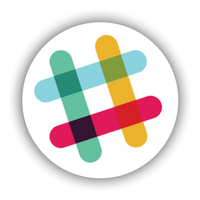
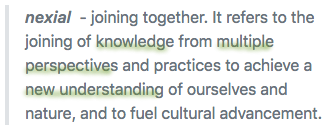
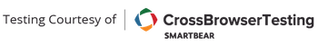

<h2 id="nexial-automation">
Nexial Automation

<a href="https://github.com/nexiality/nexial-core/releases">Download</a> &nbsp;&nbsp;
<a href="https://github.com/nexiality/nexial-core/">Fork to GitHub</a> &nbsp;&nbsp;
<a href="https://nexiality.github.io/documentation/userguide/InstallingNexial">Installation Guide</a> &nbsp;&nbsp;
<a href="http://nexiality.slack.com/">Slack</a>

 
</h2>

#### Test Automation Platform for _Everyone_! 

&nbsp;&nbsp;&nbsp;&nbsp;&nbsp;

The name reflects our desire and intention to perfect the "art" and "science" of Software Testing and the promotion of 
Quality Artisans.  As professional Quality Advocates, we are all _nexialists_ - we see links in the disconnected, 
synergy in the seemingly independent, and draw from such new ideas/solutions.

The main motivation of Nexial is to provide a set of capabilities to automate software testing.  
Here are some of the core design considerations for this platform:

- ***Test automation for everyone*** - no coding required (but supported), simple and 
  relevant to all project participants
- Hybrid, Keyword-driven and standards-based; simple/familiar spreadsheet (Excel) interface
- Supports many application architecture and interface - web (browser), desktop, API/REST/SOAP, database, batch, ssh
- Extensible and flexible test and data management
- Local and remote (Jenkins, BrowserStack) support
- Integration to existing collaboration tools such as JIRA and Confluence
- Supports F.R.I.P. (functional, regression, integration, performance testing)

 
## **<a href="http://nexiality.slack.com/" style="background-color:transparent !important;vertical-align: middle;">Find us on slack!</a>**

---------------------------------------------

## Nexial in Action
To see Nexial in action, watch this short demo showcasing how Nexial 
1. performs a few Google searches (browser automation), 
2. uses one of the search results to invoke a few REST API calls (API automation),
3. bulk generates a series of SQL INSERT statements (text manipulation via Nexial expression),
4. stores API responses and Google search stats into database (database automation, with sqlite),
5. finally, performs a few simple data analytical queries and reports (database automation, Nexial expression). 

[Nexial in Action](https://www.youtube.com/watch?v=b372XikN1YU&cc_lang_pref=en&cc_load_policy=1)
<iframe width="820" height="555" src="https://www.youtube-nocookie.com/embed/b372XikN1YU?cc_lang_pref=en&cc_load_policy=1" 
  frameborder="0" style="margin-bottom:20px" allow="autoplay; encrypted-media" allowfullscreen></iframe>

#### Wanna try? Have at it!
<ol>
<li>
  Download <a href="https://github.com/nexiality/nexial-core/releases">Nexial distro</a>
</li>
<li>
  Follow the <a href="https://nexiality.github.io/documentation/userguide/InstallingNexial">installation guide</a> 
  (mostly one-time setup)
</li>
<li>
  Download the <a href="nexial-in-action.zip">"nexial-in-action"</a> project and unzip to local directory
</li>
<li>Run it

    <ul class="tab-links tabs-collapsed">
        <li class="active"><a href="#tabwin">Windows</a></li>
        <li><a href="#tabmac">Mac/Linux</a></li>
    </ul>
    

        

        Set up an environment variable - <code>NEXIAL_HOME</code> - and point it to the location where Nexial is 
        installed. For example,
<pre>set NEXIAL_HOME=C:\projects\nexial-core</pre>
        Also, set up another environment variable - <code>PROJECT_HOME</code> - and set it to the location where 
        the <a href="nexial-in-action.zip">"nexial-in-action"</a> project is unzipped. For example,
<pre>set PROJECT_HOME=C:\projects\nexial-in-action</pre>
        To execute:
<pre>
cd %NEXIAL_HOME%\bin
nexial.cmd -plan %PROJECT_HOME%\artifact\plan\demo1-plan.xlsx
</pre>
        

        

        Set up an environment variable - <code>NEXIAL_HOME</code> - and point it to the location where Nexial is 
        installed. For example,
<pre>export NEXIAL_HOME=~/projects/nexial-core</pre>
        Also, set up another environment variable - <code>PROJECT_HOME</code> - and set it to the location where 
        the <a href="nexial-in-action.zip">"nexial-in-action"</a> project is unzipped. For example,
<pre>export PROJECT_HOME=~/projects/nexial-in-action</pre>
        To execute:
<pre>
cd $NEXIAL_HOME/bin
./nexial.sh -plan $PROJECT_HOME/artifact/plan/demo1-plan.xlsx
</pre>
        

    

</li>
</ol>
 

#### Nexial Sighting
[Nexial Automation was presented](https://www.youtube.com/watch?v=3lpsiC4j5L4&t=177s) in the Software Test Automation 
Meetup held on 2019/11/19. For those interested, here is:
- The [presentation](meetup-1119/Nexial%20Meetup%20-%202019-11-19.pdf),
- The [demo automation project](Software_Test_Automation_Meetup_Demo.20191119.zip), and
- The [presentation recording (Youtube)](https://www.youtube.com/watch?v=3lpsiC4j5L4&t=177s)

---------------------------------------------

For a better understanding of Nexial, check out the **[Introduction](userguide/IntroductionAndFAQ)** page.

---------------------------------------------

    
    

        Nexial Automation enables test automation with <a href="http://browserstack.com" class="external-link" 
        target="_nexial_link">BrowserStack</a>
    

 

    
     
    

        Nexial Automation enables test automation with <a href="http://crossbrowsertesting.com" class="external-link" 
        target="_nexial_link">CrossBrowserTesting</a>
    

