## Introduction
While we strive to create an intuitive and empowering platform for automation, Nexial might still seem challenging for 
the uninitiated. Those unfamiliar with automation or software testing, the idea of designing "steps" to "break" a 
software system might seem awkward at first. However after a few tries, one could quickly grasp the core concept and 
gain momentum. As the saying goes, _practice makes perfect_. It is through repeated practices, in fact through failure, 
that one truly learn.

This is the initial impetus of **Nexial Interactive**. The idea is to provide an environment where one learn about 
Nexial and about automation at a more consumable and effective pace. One can use Nexial Interactive to step through one 
or more commands repeatedly, each time with possibly different parametrization. The try-observe-repeat cycle 
through Nexial Interactive hopefully fosters a more engaging and intuitive way to:
- learn Nexial
- learn about automation
- learn about the target application (AUT)
- learn about an existing automation script/suite

## Capabilities
Currently Nexial Interactive comes with the following capabilities:
- (re)assign and (re)load test script
- (re)assign and (re)load data file
- (re)assign test scenario
- (re)assign activities; may be out of designed sequence
- (re)assign steps; may be out of designed sequence
- inspection
- execute the assigned activities or steps

Note that the main objective of Nexial Interactive is to execute a subset of the automation script, possibly repeatedly,
so that we can better understand the target application, the automation objective, or the Nexial capability. For such
reasons, Nexial Interactive does not support test plan or multiple scenarios. The common pattern is to focus on a block 
of steps (of one scenario, naturally), work through the experiment-observe-repeat cycle, and move on to the next block 
of steps. One can (re)assign the number of steps or scenario between execution. 

## Try it yourself
To activate Nexial Interactive, simply add the `-interactive` flag to your Nexial execution command line argument. One 
may include `-scenario ...` and `-data ...` command line argument - they are optional. 

    <ul class="tab-links tabs-collapsed">
        <li><a href="#tab1">Windows</a></li>
        <li><a href="#tab2">Mac OSX</a></li>
    </ul>
    

        

        From command console, start a Nexial execution as you normally would, but also add a <code>-interactive</code>
        flag at the end:
        <pre>cd C:
cd C:\projects\nexial-core\bin
nexial.cmd -script C:\projects\MyProject\artifact\script\MyTestScript1.xlsx <b style="color:red">-interactive</b></pre>
        

        

        From a terminal session, start a Nexial execution as you normally would, but also add a <code>-interactive</code>
        flag at the end:
        <pre>cd ~/projects/nexial-core/bin
nexial.sh -script ~/projects/MyProject/artifact/script/MyTestScript1.xlsx <b style="color:red">-interactive</b></pre>
        

    

 

If all goes well, a console-based menu (like below) will appear. 

This represents an active Nexial Interactive session. The top half of the menu shows the current configuration: the 
assigned script, the assigned scenario and the assigned activities/steps to execute. The second half are the available 
options and actions to control the current Nexial Interactive session - these options and actions are the characters 
highlighted with white background. Click one of the tabs below to see more details on these options and actions:

    <ul class="tab-links tabs-collapsed">
        <li><a href="#tab3"><code>1</code> assign test script</a></li>
        <li><a href="#tab4"><code>2</code> assign data script</a></li>
        <li><a href="#tab5"><code>3</code> assign scenario</a></li>
        <li><a href="#tab6"><code>4</code> assign iteration</a></li>
        <li><a href="#tab7"><code>5</code> assign activities</a></li>
        <li><a href="#tab8"><code>6</code> assign step(s)</a></li>
        <li><a id="current" href="#tab9"><code>7</code> reload assigned test script</a></li>
        <li><a href="#tab10"><code>8</code> reload assigned data file</a></li>
        <li><a href="#tab11"><code>9</code> reload project.properties</a></li>
        <li><a href="#tab12">re<code>L</code>oad data file and project.properties</a></li>
        <li><a href="#tab13">desktop re<code>C</code>ording</a></li>
        <li><a href="#tab14"><code>R</code>eload menu</a></li>
        <li><a href="#tab15">e<code>X</code>ecute</a></li>
        <li><a href="#tab16"><code>I</code>nspect</a></li>
        <li><a href="#tab17"><code>A</code>ll steps</a></li>
        <li><a href="#tab18"><code>S</code>cript open</a></li>
        <li><a href="#tab19"><code>D</code>ata file open</a></li>
        <li><a href="#tab20"><code>H</code>elp</a></li>
        <li><a href="#tab21"><code>Q</code>uit</a></li>
    </ul>
    

        

            Use <code>1</code> to assign another script in the current Nexial Interactive session. 
             
            By doing so, one can execute another script - and by nature of that, another scenario - without restarting
            Nexial Interactive. This also means that the AUT (application under test) is also kept as is and not
            restarted. This can be very useful if one wishes to execute another script after having executed the script
            initially specified. One can think of this as a way to interrupt the intended execution
            flow, with the possibility of surfacing new automation routes or validations. 
             
            Here's how From the <code>command:</code> prompt, enter <code>1</code> then 
            the fully qualified path of the new script. To see the changes, use <code>R</code> (or <code>r</code>) to 
            reload the Nexial Interactive menu. One will observe that the script file, scenario and activity information
            is updated to reflect the newly specified file. Below is a snapshot of assign another script in a Nexial 
            Interactive session: 
            
        

        

            Use <code>2</code> to assign another data file in the current Nexial Interactive session. 
             
            By doing so, one can execute the same script with a data file that is different than what was initially 
            specified or loaded by convention. This means one can run the same script with different data, and thus 
            exercise possibly different test scenarios. One can also think of this as a form of data-driven exploratory 
            testing. 
             
            Here's how From the <code>command:</code> prompt, enter <code>2</code> then 
            the fully qualified path of the new data file. Use <code>I</code> (or <code>i</code>) to activate 
            <b>Inspection</b> where one can see the newly loaded or changed data variables. Below is an example of
            this feature in action: 
             
            Suppose this is the data file that is loaded initially: 
            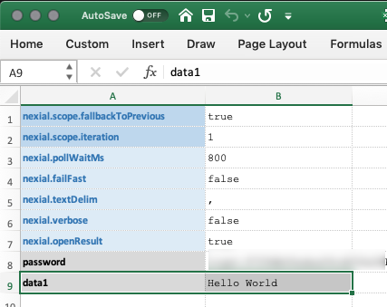 
            We can see that <code>data1</code> is correctly loaded via <b>Inspection</b>: 
            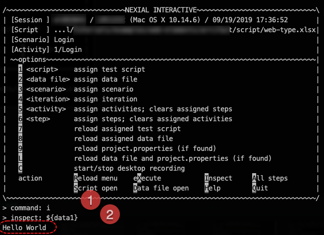 
            Now, suppose we have another data file which contains a different value for <code>data1</code>:
            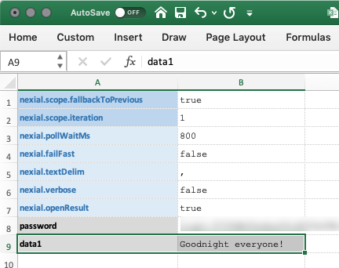 
            To load it, we will use the Option <code>2</code> as follows: 
            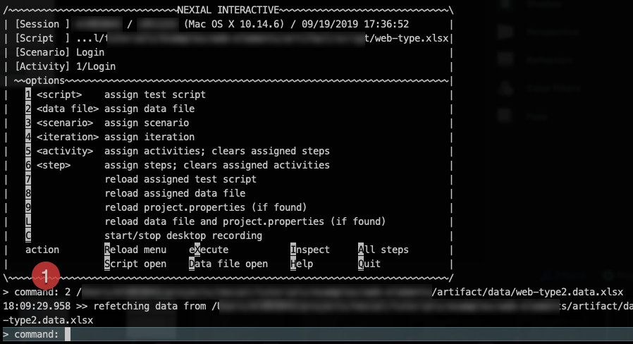 
            To see that the data file has been newly reassigned, and the corresponding data loaded correctly, we can
            re-activate <b>Inspection</b> again: 
            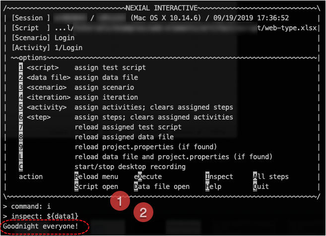
        

        

            Use <code>3</code> to assign another scenario of the current script in the current Nexial Interactive 
            session. 
             
            By doing so, one can execute another scenario without restarting Nexial Interactive. This also means 
            that the AUT (application under test) is also kept as is and not restarted. This can be very useful if one 
            wishes to execute another scenario not previously considered. One can think of this as a way to interrupt 
            the intended execution flow, with the possibility of surfacing new automation routes or validations. 
             
            Here's how From the <code>command:</code> prompt, enter <code>3</code> then 
            the target scenario name of the currently assigned script. To see the changes, use <code>R</code> (or 
            <code>r</code>) to reload the Nexial Interactive menu. One will observe that the scenario and activity 
            information is updated to reflect the newly assigned scenario. Below is a snapshot of assign scenario in a 
            Nexial Interactive session: 
            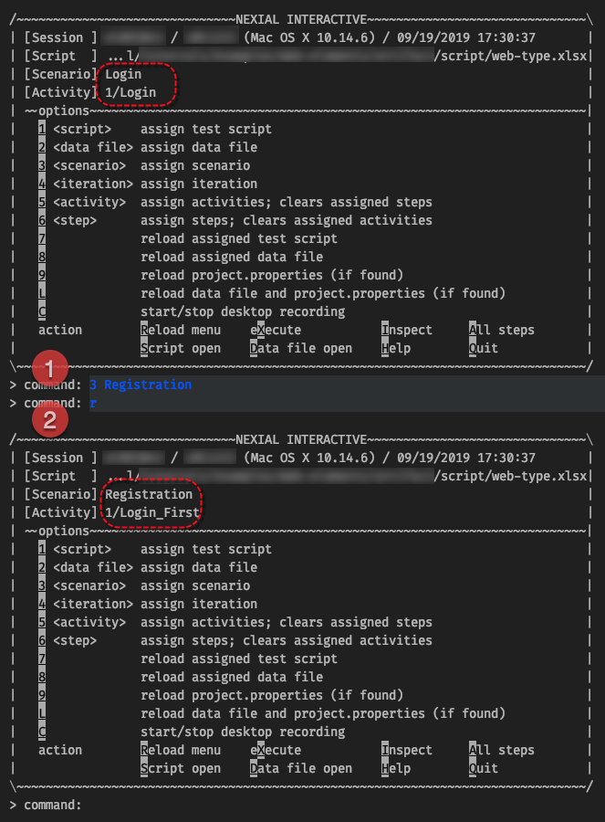
        

        

            Use <code>4</code> to assign a different iteration in the current Nexial Interactive session. 
             
            All Nexial execution contains at least 1 iteration. The first iteration is loaded by default. To utilize the
            data of another iteration, we can use this option to load and override existing data variables. The effect
            and usefulness of this is similar to that of assigning a different data file (Option 2), where one can 
            execute the same script with a different set of data than what was initially loaded. 
             
            Here's how From the <code>command:</code> prompt, enter <code>4</code> then
            the iteration index (1-based). The specified iteration must exist in the currently assigned data file. Below 
            is an example of this feature in action: 
             
            Suppose this is the data file that is loaded in current Nexial Interactive: 
            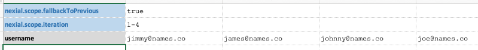 
            We can confirm that only the data in Iteration 1 is loaded in current Nexial Iteration: 
             
            To load the data from Iteration 3, enter <code>4 3</code>. After that, we can see that the same data 
            variable <code>username</code> has been updated to what is set to Iteration 3: 
            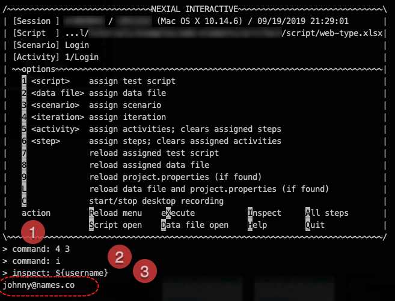
        

        

            Use <code>5</code> to assign a specific activity or activities to execute in the current Nexial Interactive 
            session. 
             
            Using this option, one can alter the intended order of execution as laid out within a scenario. One can
            skip over or re-run certain activity, or alter the order of execution amongst the activities of a scenario.
            Much like the purpose of other options in Nexial Interactive, this option allow one to explore the behavior
            and edge cases of the target application. 
             
            Here's how From the <code>command:</code> prompt, enter <code>5</code> then
            either the name of the activity to execute, or its "index". For multiple activities, one may also specify 
            a list of activities as a range. For example, <code>2-5</code> means the second activity through the fifth 
            activity. We can also use <code>2,3,4,5</code> to reach the effect. Let's see this in action via the 
            following example: 
             
            Suppose this is the script that is currently loaded in Nexial Interactive: 
            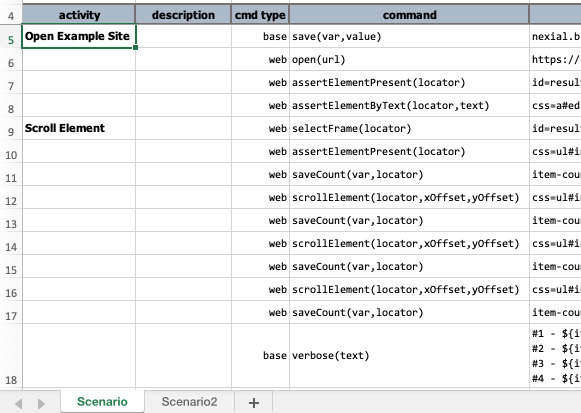 
            We can see (screenshot below) that the 2 activities are properly recognized and displayed in the Nexial
            Interactive menu. To change to execute just the first activity - "Open Example Site", enter 
            <code>5 Open Example Site</code>. We can reload the menu (<code>r</code>) to verify that the activity list 
            has been updated:  
            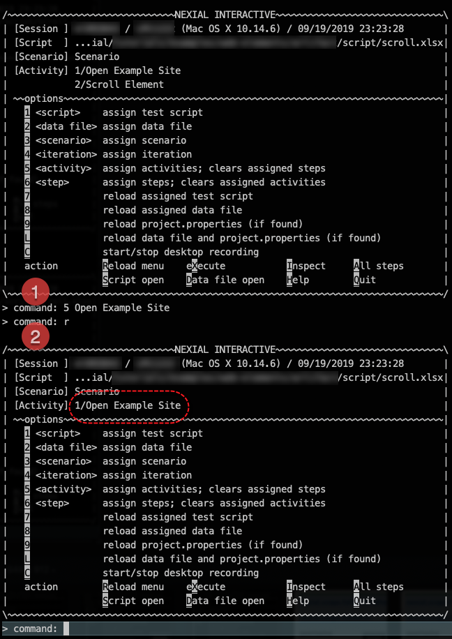 
            We can also switch the order of the activities. Below we are using the "index" instead of the activity 
            names: 
            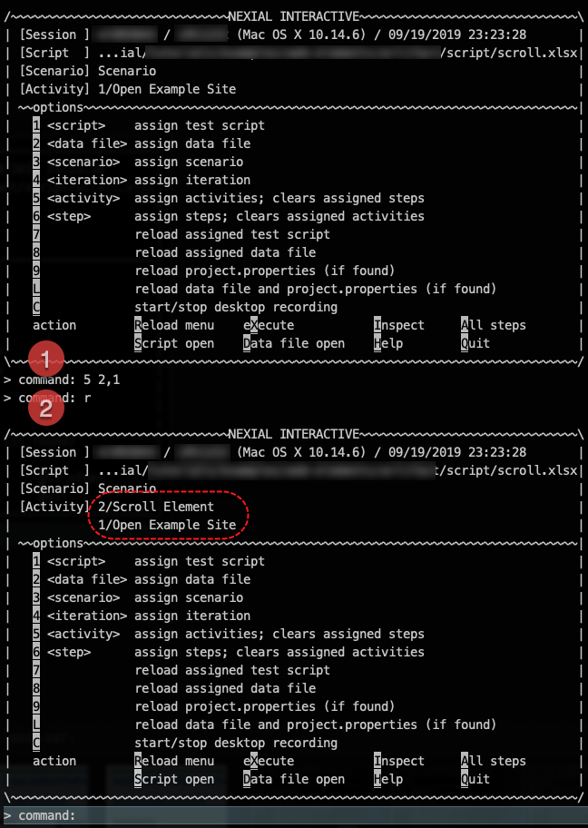 
             
            Note that this option only change the activity or activities to execute. To commence the execution, use
            <code>X</code>.
        

        

            Use <code>6</code> to assign a specific steps to execute in the current Nexial Interactive session. 
             
            Using this option, one can alter the intended order of execution as laid out within a scenario. One can
            skip over or re-run certain step(s), or alter the order of execution amongst the steps of a scenario.
            Much like the purpose of other options in Nexial Interactive, this option allow one to explore the behavior
            and edge cases of the target application. 
             
            Here's how From the <code>command:</code> prompt, enter <code>6</code> then
            the row number of the step(s) to execute. For multiple steps, one may also specify them in range - as in,
            <code>5-9</code> - or as individual steps such as <code>5,9,12,6,8,8</code>. Let's see this in action via 
            the following example: 
             
            Suppose this is the script that is currently loaded in Nexial Interactive: 
             
            We can see (screenshot below) by default Nexial Interactive will execute all the steps via the activities 
            found in current scenario. To change to execute Step 8 through Step 12, enter <code>6 8-12</code>. We can 
            reload the menu (<code>r</code>) to verify that the target steps to executed have been updated: 
            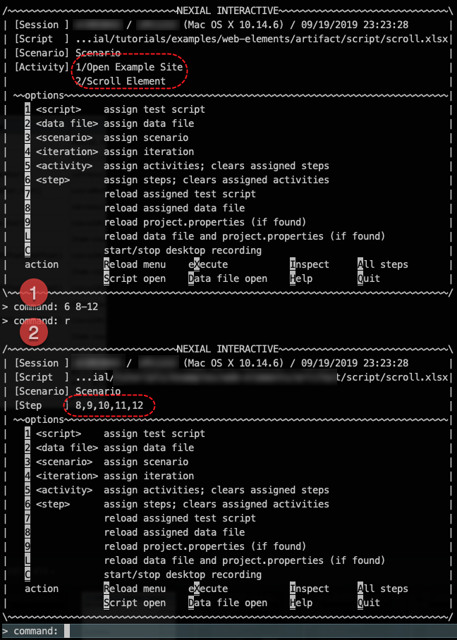 
            We can also switch the order of the steps: 
            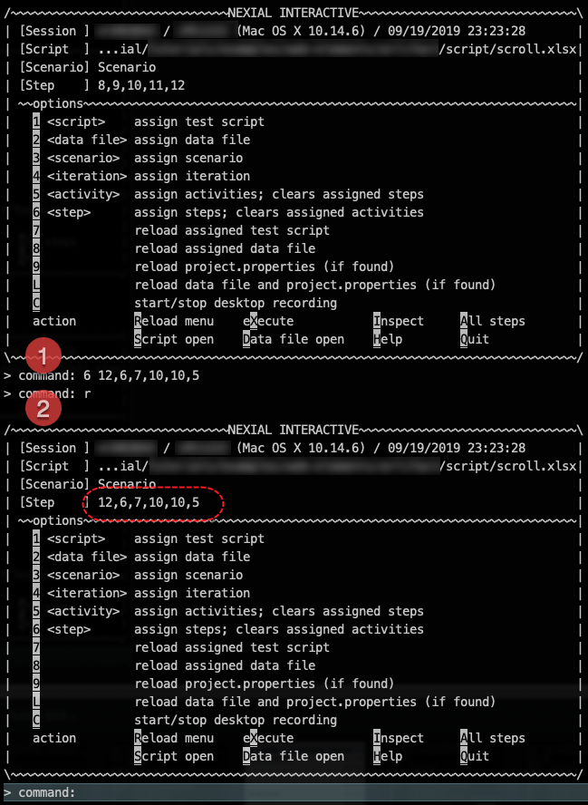 
            Note that this option only change the step or steps to execute. To commence the execution, use
            <code>X</code>.
        

        

            Use <code>7</code> to reload the assigned script file in the current Nexial Interactive session. 
            More information coming soon...
        

        

            Use <code>8</code> to reload the assigned data file in the current Nexial Interactive session. 
            More information coming soon...
        

        

            Use <code>9</code> to reload the project.properties (if exists) of current project. 
            More information coming soon...
        

        

            Use <code>9</code> to reload both the assigned data file and the current project's 
            <code>project.properties</code> file. 
            More information coming soon...
        

        

            Use <code>C</code> to toggle desktop recording during current Nexial Ineractive session 
            More information coming soon...
        

        

            Use <code>R</code> to reload Interactive Interactive menu. 
            More information coming soon...
        

        

            Use <code>X</code> to execute the currently assigned activities or steps. 
            More information coming soon... 
             
             
        

        

            One can also activate Inspection (similar to <a href="../systemvars/index#nexial.inspectOnPause">
            <code>nexial.inspectOnPause</code></a> to analyze and learn about data variables, 
            <a href="../functions">built-in functions</a> and <a href="../expressions">Nexial expressions]</a>. 
            
             
             
            Furthermore, one may create, modify or clear a data variable on-the-fly:<pre>
> inspect: SAVE(myData) = [LIST(1,2,3,4,5,6,7,8,9,10) => sum]
11:15:15.786 >> LIST    => sum                   NUMBER(55)
11:15:15.787 >> creating data variable [a] to [55]
 
> inspect: CLEAR(b,a,nexial.runID)
11:14:27.730 >> removing data variable [b, a, nexial.runID]
11:14:27.731 >> The following data variable(s) are READ ONLY and ignored: nexial.runID
11:14:27.731 >> The following data variable(s) are removed from execution: a
 
> inspect: CLEAR(*)
11:14:27.730 >> removing data variable [*]
11:14:27.731 >> The following data variable(s) are removed from execution:
11:14:27.731 >>     data1
11:14:27.731 >>     password
11:14:27.731 >>     target_url </pre>
            Using <code>SAVE(var)</code> syntax in Inspection allows one to create or override a data variable. The value 
            of such data variable may be literal or derived from built-in functions or Nexial Expression. 
             
            Using <code>CLEAR(var1,var2,...)</code> syntax allows one to clear one or more data variables. Using 
            <code>CLEAR(*)</code> would clear off all user-defined data variables except defined on command line (via 
            <code>-override</code> flag) and those defined in project.properties.
        

        

            Use <code>A</code> to reset all custom step assignment to assign to all steps.
        

        

            Use <code>S</code> to open currently assigned script. 
             
            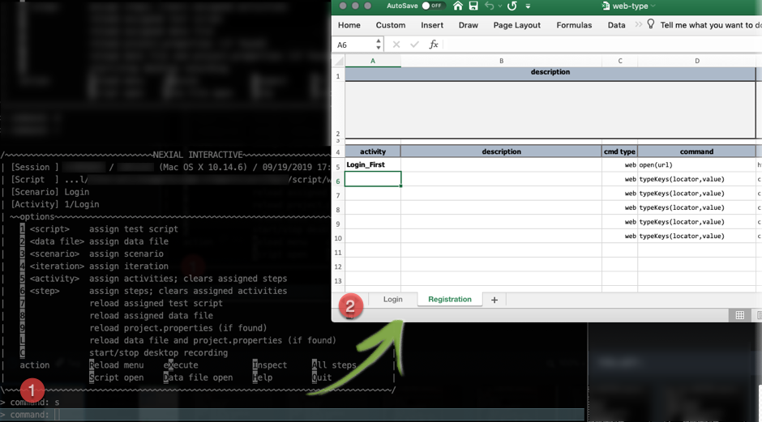
        

        

            Use <code>D</code> to open currently assigned data file. 
             
            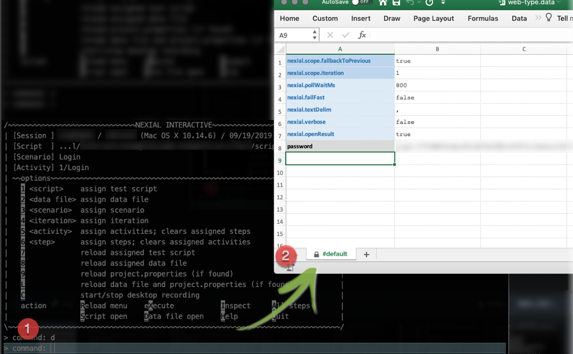
        

        

            Use <code>H</code> to display help information that contains further information on each of the options 
            available in Nexial Interactive 
            
        

        

            Use <code>Q</code> to quit Nexial Interactive. Note that all inflight changes to data variables or 
            iteration assignment will be lost when Nexial Interactive ends.
        

    

 
 

### Limitation
This is the first release of Nexial Interactive. As time permits and if requests should be made, we will enhance 
Nexial Interactive with more learning goodness. Currently here are the enhancement candidates that we are considering 
for Nexial Interactive. No timeline has been committed as of yet.
- Desktop GUI version of Nexial Interactive
- Record a Nexial Interactive session so that it can be played back for further observation and analysis
- Switching between interactive and non-interactive (normal execution) mode
- Switch browser; currently some System variables cannot be adjusted within the same Nexial Interactive session
- Remembering last-run Nexial Interactive session to improve efficiency.

Also, please note the following limitations:
- The console scrollback limited by the console application (Command console for Windows and terminal for MacOSX). 
  Please check the documentation of the respective console application on how to extend the scrollback limits.
- Cannot run steps in parallel.
- Nexial Interactive is not a true debugging environment. Yes it can be an effective learning tool. But it is not - 
  and probably never will be - equivalent to a true debugger like those of popular, modern-day IDE.

### Feedback
We love to hear your feedback! Give it a try and 
<a href="https://github.com/nexiality/nexial-core/issues/new/choose" class="external-link" target="_nexial_link">let us know</a> 
what you think!

