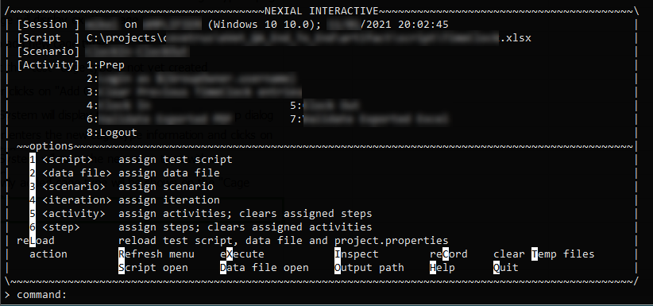
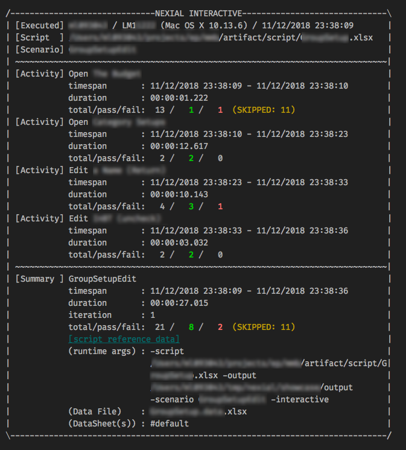
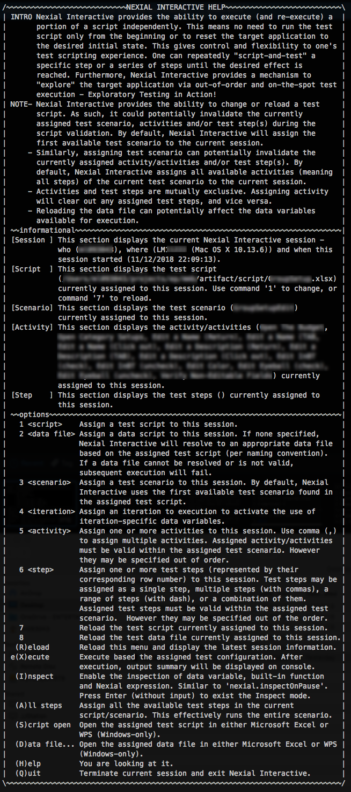
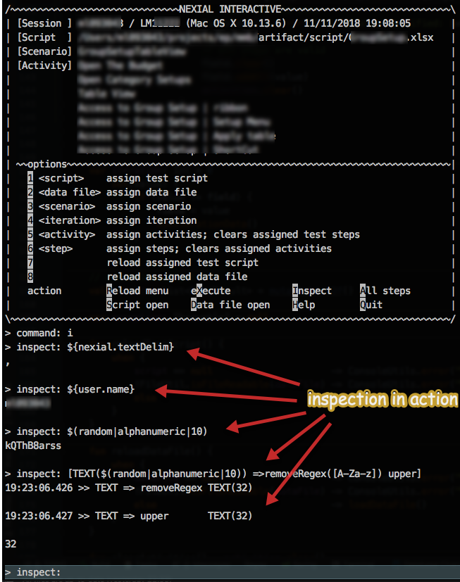

### Introduction
While we strive to create an intuitive and empowering platform for automation, Nexial might still seem challenging for 
the uninitiated. Those unfamiliar with automation or software testing, the idea of designing "steps" to "break" a 
software system might seem awkward at first. However after a few tries, one could quickly grasp the core concept and 
gain momentum. As the saying goes, _practice makes perfect_. It is through repeated practices, in fact through failure, 
that one truly learn.

This is the initial impetus of **Nexial Interactive**. The idea is to provide an environment where one learn about 
Nexial and about automation at a more consumable and effective pace. One can use Nexial Interactive to step through one 
or more commands repeatedly, each time with possibly different parametrization. The experiment-observe-repeat cycle 
through Nexial Interactive hopefully fosters a more engaging and intuitive way to:
- learn Nexial
- learn about automation
- learn about the target application (AUT)
- learn about an existing automation script/suite


### Capabilities
Currently Nexial Interactive comes with the following capabilities:
- (re)assign and (re)load test script
- (re)assign and (re)load data file
- (re)assign test scenario
- (re)assign activities; may be out of designed sequence
- (re)assign steps; may be out of designed sequence
- inspection mode
- execute the assigned activities or steps


#### Try it yourself
To activate Nexial Interactive, simply add the `-interactive` flag to your Nexial execution command line argument:<br/>
(On Windows)<br/>
```
cd C:
cd C:\projects\nexial-core\bin
nexial.cmd -script C:\projects\MyProject\artifact\script\MyTestScript1.xlsx -interactive
```

(On MacOSX/*NIX)<br/>
```
cd ~/projects/nexial-core/bin
nexial.sh -script ~/projects/MyProject/artifact/script/MyTestScript1.xlsx -interactive
```

One may include `-scenario ...` and `-data ...` command line argument - they are optional.

If all goes well, a console-based menu (like below) will appear.<br/>


This represents the active Nexial Interactive session. The top half of the menu shows the current configuration: the 
assigned script, the assigned scenario and the assigned activities/steps to execute. The second half are the available 
options one can use to control the current Nexial Interactive session. Use the option keys (highlighted with white 
background) to control current session. 

- Use `X` to execute the currently assigned activities or steps. 
  
- Use `H` to display help information, where contain further information of these options.<br/>
  
- Use `Q` to quit Nexial Interactive.

#### Inspection
Note that the main objective of Nexial Interactive is to execute a subset of the automation script, possibly repeatedly,
so that we can better understand the target application, the automation objective, or the Nexial capability. For such
reasons, Nexial Interactive does not support test plan or multiple scenarios. The common pattern is to focus on a block 
of steps (of one scenario, naturally), work through the experiment-observe-repeat cycle, and move on to the next block 
of steps. One can (re)assign the number of steps or scenario between execution. One can also activate Inspection (
similar to [`nexial.inspectOnPause`](../systemvars/index#nexial.inspectOnPause)) to analyze and learn about data 
variables, [built-in functions](../functions) and [Nexial expressions](../expressions).<br/>



In addition to inspecting existing data variables and System variables, one may also invoke Nexial 
[built-in functions](../functions) and [Nexial Expression](../expressions), or the combination of both. Furthermore,
one may create, modify or clear a data variable on-the-fly:
```
> inspect: SAVE(myData) = [LIST(1,2,3,4,5,6,7,8,9,10) => sum]
11:15:15.786 >> LIST    => sum                   NUMBER(55)
11:15:15.787 >> creating data variable [a] to [55]

> inspect: CLEAR(b,a,nexial.runID)
11:14:27.730 >> removing data variable [b, a, nexial.runID]
11:14:27.731 >> The following data variable(s) are READ ONLY and ignored: nexial.runID
11:14:27.731 >> The following data variable(s) are removed from execution: a
```

Using `SAVE(var)` syntax in Inspection allows one to create or override a data variable. The value such data variable
may be literal or derived from built-in functions or Nexial Expression.

Using `CLEAR(var1,var2,...)` syntax allows one to clear one or more data variables. Notice that certain System variables
are considered read-only and cannot be cleared (see above).


### Limitation
This is the first release of Nexial Interactive. As time permits and if requests should be made, we will enhance 
Nexial Interactive with more learning goodness. Currently here are the enhancement candidates that we are considering 
for Nexial Interactive. No timeline has been committed as of yet.
- Desktop GUI version of Nexial Interactive
- Record a Nexial Interactive session so that it can be played back for further observation and analysis
- Switching between interactive and non-interactive (normal execution) mode
- Switch browser; currently some System variables cannot be adjusted within the same Nexial Interactive session
- Remembering last-run Nexial Interactive session to improve efficiency.

Also, please note the following limitations:
- The console scrollback limited by the console application (Command console for Windows and terminal for MacOSX). 
  Please check the documentation of the respective console application on how to extend the scrollback limits.
- Cannot run steps in parallel.
- Nexial Interactive is not a true debugging environment. Yes it can be an effective learning tool. But it is not - 
  and probably never will be - equivalent to a true debugger like those of popular, modern-day IDE.


### Feedback
We love to hear your feedback! Give it a try and 
<a href="https://github.com/nexiality/nexial-core/issues/new/choose" class="external-link" target="_nexial_link">let us know</a> 
what you think!

