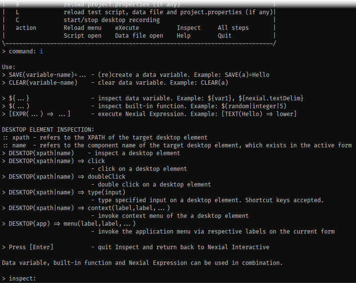
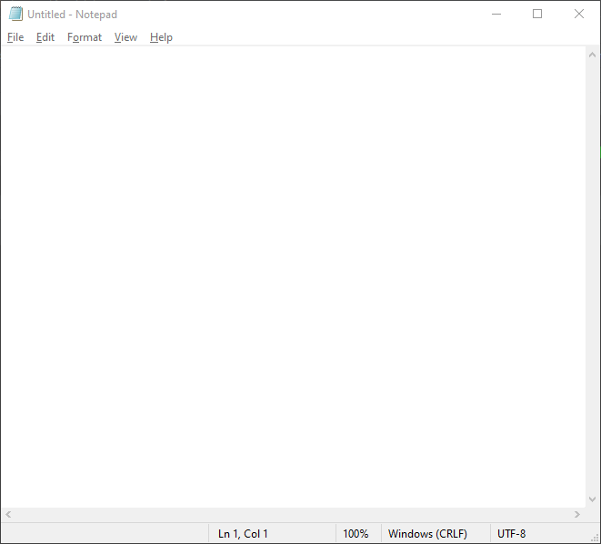
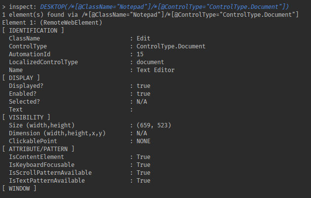
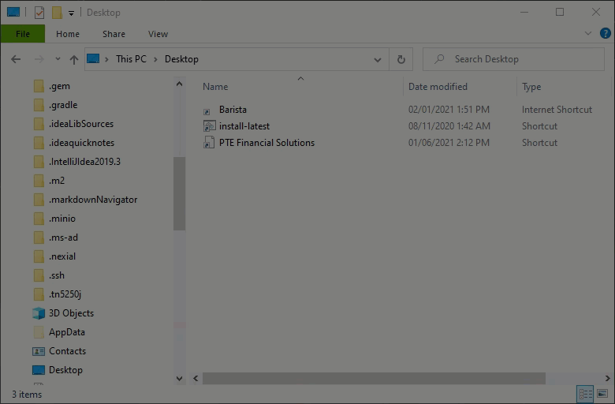
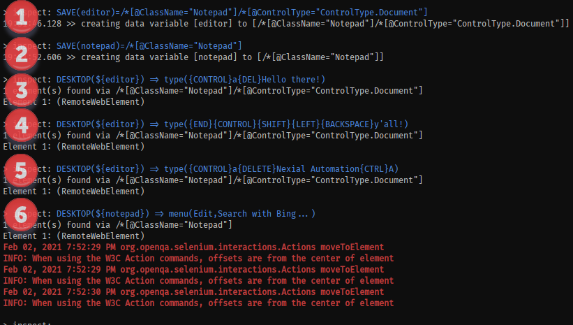

## Introduction
Starting from [Nexial v3.7](../release/nexial-core-v3.7.changelog), Nexial Interactive supports the inspection and
testing of desktop components. Such capabilities can greatly expedite the script creation of desktop applications, as 
well as improving the learning process of desktop automaton. One can use these capabilities to verify that:
- A desktop element is accurately mapped to a XPATH.
- A desktop element is properly "autoscanned", and the corresponding label is mapped.
- A desktop element is clickable or "double-clickable".
- A desktop element can receive text input, including shortcut key(s).
- The application menu of an desktop window contains a series of menu and sub-menu items.
- The context menu (i.e. right-click) of a desktop element, along with a series of its sub-menu items can be triggered.


## Getting started
To start utilizing the Inspect desktop element feature:
1. Start Nexial Interactive. Click [here](index#try-it-yourself) for instruction.
2. Once Nexial Interactive is started, one can perform some desktop automations to bring the target 
   application to the desired state (for e.g., open a certain window or form) if necessary. Note that if one wishes to 
   inspect desktop elements via the [autoscan labels](../commands/desktop/configureDesktopApplication#autoscan), the 
   appropriate [desktop &raquo; `useApp(appId)`](../commands/desktop/useApp(appId)) and 
   [desktop &raquo; `useForm(formForm)`](../commands/desktop/useForm(formName)) must be invoked prior to Inspect.
3. When the desired state of the target application is reached, start the "Inspect" mode in Nexial Interactive by 
   entering `I` or `i`.
4. One should see a short description about Inspect, like this:
	 
5. Now we are ready to try out desktop inspection


## Inspect Desktop Element(s)
To inspect a desktop element, use the `DESKTOP(locator|name)` syntax. A desktop element can be referenced by its 
XPATH (hint: use [UISpy](../commands/desktop/uispy_xpath) to formulate the appropriate XPATH), or by its component
name (derived during [autoscanning](../commands/desktop/configureDesktopApplication#autoscan-via-desktop--useappappid)).

Suppose we want to inspect the component property of a Notepad application:<br/>

<br/>

Using [UISpy](../commands/desktop/uispy_xpath), we can derive the following XPATH for the editor area of Notepad:
```
/*[@ClassName="Notepad"]/*[@ControlType="ControlType.Document"]
```

We can inspect such component using this XPATH, and the result would look something like this:


The inspection result can differ based on the target desktop element. Some desktop elements such as a Window can expose
some information about its dimension, while simpler/embedded elements like a radio button might not. The Inspect feature
in Nexial Interactive will adjust its output accordingly to the target desktop element.

Using this feature allows one to verify the accuracy of the XPATH against the intended element, as well as some insights
into the interaction possibility for a desktop element. For example, if a desktop element should render `True` for 
`IsTextPatternAvailable`, this is a good indication that such element can receive text input (i.e. keyboard input).


## Testing Desktop Element(s)
One can also use this Inspect feature to perform some simple automation against a desktop element. This can be a great
way to verify the expected behavior of a desktop element, as well as discover the interaction possibility with a desktop
element.

As of now, here are the possible automation that can be performed from Inspect:
1. `DESKTOP(xpath|name) => click` - to click on a desktop element, possibly to invoke a click event or to focus on an 
   element.
2. `DESKTOP(xpath|name) => doubleClick` - to double click on a desktop element.
3. `DESKTOP(xpath|name) => type(input)` - to enter text (i.e. keyboard input) on a desktop element. Shortcuts are 
   supported here.
4. `DESKTOP(xpath|name) => context(label,label,...)` - to activate the context menu (i.e. right-click) on a desktop 
   element. To trigger submenu, specify the successive list of menu items separated by commas. Alternatively one can
   also trigger the context menu via the position of the menu item. For example, `context(INDEX:5,2)` means trigger the
   5th item of the context menu, follow by the 2nd item of the submenu. 
5. `DESKTOP(xpath|name) => menu(label,label,...)` - to active the application menu (from menu bar). Note that the target 
   element, expressed either as XPATH or component name, should point to the application window (the parent component 
   of the MenuBar component).

-----
Below is an example of automating the context menu on Windows Explorer (Windows 10).

For brevity, we will save this XPATH to the Windows Explorer (opened to Desktop) a variable:<br/>
```
SAVE(explorer)=/*[@ClassName="CabinetWClass"]/*[@ClassName="ShellTabWindowClass"]/*[@ClassName="DUIViewWndClassName"]/*[@ClassName="DUIListView"]/*[@ClassName="UIItemsView"]
```

To activate the context menu on the right side of the Windows Explorer (which shows Desktop), we can use the 
`context(...)` syntax, like this:<br/>
```
DESKTOP(${explorer}) => context(Group by,Name)
```

Note that each "level" of the context menu is separated by a comma (`,`), and that the exact menu label should be 
specified here.

The result of this automation can be seen below:

<br/>

-----

Below is another example - this time, automating on Notepad.

Suppose we want to type some text on Notepad, modify the text and then invoke the application menu. Here are our steps: 
1. To reduce typing, let's save the XPATH of the editor area in Notepad as a variable `editor`:<br/>
```
SAVE(editor)=/*[@ClassName="Notepad"]/*[@ControlType="ControlType.Document"]
```
2. Also, save another variable for the Notepad window:<br/>
```
SAVE(notepad)=/*[@ClassName="Notepad"]
```
3. Now select all the text in Notepad (`CTRL-A`), delete them (`DELETE`) and then type in `Hello there!`):<br/>
```
DESKTOP(${editor}) => type({CONTROL}a{DEL}Hello there!)
```
4. Next, move the cursor to the end of the line, use `CONTROL-SHIFT-left` to select the last word. Remove the last word 
   using `BACKSPACE` and then type in `y'all!`:<br/>
```
DESKTOP(${editor}) => type({END}{CONTROL}{SHIFT}{LEFT}{BACKSPACE}y'all!)
```
5. Next, select all the text and replace it with `Nexial Automation`:<br/>
```
DESKTOP(${editor}) => type({CONTROL}a{DELETE}Nexial Automation{CTRL}A)
```
6. Last, invoke the application menu (Edit -> Search with Bing):<br/>
```
DESKTOP(${notepad}) => menu(Edit,Search with Bing...)
```



Notice that we can mix text and shortcuts here. Click on the link below to learn more.


Here's the result of such automation:<br/>

<video width="850" height="*" controls>
  <source src="image/desktop_type_menu.mp4" type="video/mp4">
Your browser does not support the video tag.
</video>
<br/>


### Feedback
We love to hear your feedback! Give it a try and 
<a href="https://github.com/nexiality/nexial-core/issues/new/choose" class="external-link" target="_nexial_link">let us know</a> 
what you think!
