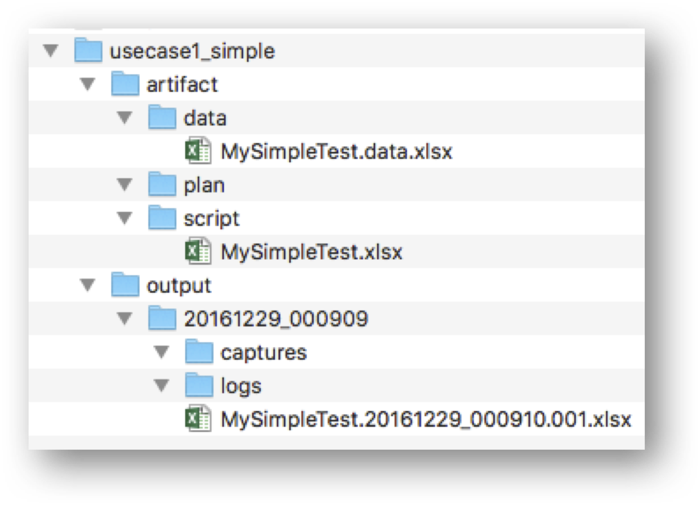



Below is the general directory/file structure of a Nexial project:

Things to note:
1. The `artifact` directory contains 3 sub-directories: `data`, `plan`, `script`. These are the directories are used 
   to store test scripts and test data.
   1. `artifact/script` \- this directory will store your test scripts.  The script files may be named to your 
   likings.  Generally they would reflect the functionality or time-bound work (such as a sprint) for a project.
   2. `artifact/data` \- this directory will store your test data.  Each data file must be named in correspondent to 
   the test script - `[TEST SCRIPT NAME].data.xlsx`.  It should contain the same number of data sheets (worksheets) as 
   its corresponding test script.  However It is possible to deviate from this.  
   Check [Nexial command](../commands/) for more details. 
   3. `artifact/plan` \- this directory will store all the test plan.  Each test plan may contain one or more test 
   script and data file.  It may contain test scripts and data files from a different project as well.  Check 
   [Nexial command](../commands/) for more details.

2. The `output` directory contains the output of each test execution named as a `run id`, which is simply the 
   timestamp of the start of a test execution.  The `captures` directory stores all the screenshots, the `logs` 
   directory stores all the log files, and the output is named similarly to the target test script - 
   `[TEST SCRIPT NAME].[START DATE/TIME].[ITERATION].xlsx`.

3. For convenience, use the `sentry-project.cmd` or `sentry-project.sh` to generate the project structure for you.

4. As a convention, it is recommended to use `C:\projects` as the top-level directory for all your Sentry projects.

5. For more information, check out [Understanding Sentry Excel templates](UnderstandingExcelTemplates).
