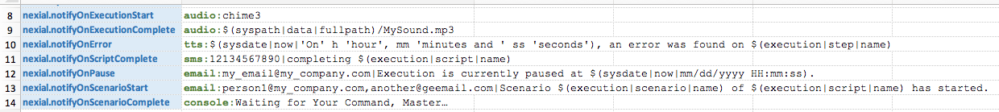

### <a href="https://github.com/nexiality/nexial-core/releases/tag/nexial-core-v1.2_0079" class="external-link" target="_nexial_target">Release 1.2</a>
2018-06-08

### General
- In order to improve security and performance, please update to Java (JRE or JDK) 1.8, Update 151 (JDK 8u151) or above.
  To download the latest version of Java 1,8, click <a href="http://www.oracle.com/technetwork/java/javase/downloads/jdk8-downloads-2133151.html" class="external-link" target="nexial_link">here</a>.
- Updated to Kotlin 1.2.41
- [`nexial.outputToCloud`](../systemvars/index#nexial.outputToCloud): fixed a few edge conditions to allow upload of 
  execution output to AWS S3.
- Fixes applied so that the data variables in the `#data` sheet of the output file reflect the values at the time of 
  execution (as opposed to the value as scripted in the data file).  
- The data variables in `#data` sheet are now sorted in alphabetical order.
- Fixed internal logic to handle the insertion of Excel rows that avoids the infamous "unreadable content" error. The
  underlying bug (in POI) is documented at <a href="https://bz.apache.org/bugzilla/show_bug.cgi?id=57423" class="externa-link" target="nexial_link">https://bz.apache.org/bugzilla/show_bug.cgi?id=57423</a>
- Update execution output style/color to distinguish different columns.
- Update execution output so that key columns are allocated with sufficient width (improve readability).
- Update execution output so that each row would be allocated sufficient height without appearing too "cramped".
- Update execution output so that "description" columns of [base &raquo; `macro(file,sheet,name)`](../commands/base/macro(file,sheet,name)), 
  [base &raquo; `section(steps)`](../commands/base/section(steps)) and [base &raquo; `repeatUntil(steps,maxWaitMs)`](../commands/base/repeatUntil(steps,maxWaitMs)) 
  now appear differently for better visual cues.
- Fixed Nexial email notification so that email settings can be configured either System properties (i.e. `-D`), 
  `project.properties` or data sheets.

#### Nexial Expression
- "tight-space" support: expression with no spaces between `[..]` and `=>` and the subsequent operations now supported.

#### Flow Controls
- [`Nexial Filter`](../flowcontrols/filter): `=` and `!=` comparators extended to support both text and numeric values.

#### Built-in Function
- [`$(execution)`](../functions/$(execution)): **NEW** built-in function to expose execution-time metadata. 
- Minor fix to `$(execution)` to handle situation when it is invoked during iteration/script completion (since command 
  and step information are not available at that time).
- [`$(array)`](../functions/$(array)): now handles scenario where `nexial.textDelim` is pipe (`|`), which conflicts 
  with function separator.
- [`$(date)`](../functions/$(date)): fix epoch-to-clock format so that we can properly format timestamp (ms) to 
  something like `HH:mm:ss` format.
- Code fixes to handle parsing of built-in function when `nexial.textDelim` is pipe (`|`), which is also the separator
  for built-in function parameter.

#### Nexial Utility and Batch Files
- [Nexial Setup](../userguide/BatchFiles#nexial-setup) now ready for use. This is a technique to 
  configure system-wide configurations (such as AWS credential, database connectivity) as a one-time activity and to 
  simplify distribution of such configuration across team or company. Checks documentation for usage details.
- Fixed NexialSetup to support longer secret key.
- Fixed NexialSetup to add more user-friendly messages.
- Updated [`bin/nexial-project.sh` or `bin/nexial-project.cmd`](../userguide/BatchFiles#nexial-project) 
  to allow new script/data files to be added to existing project.
- **Multi-plan support** now available. It is now possible to [specify multiple plan files](../userguide/BatchFiles#nexial) 
  per execution so that each execution can span across one or more plans. Currently not supporting multiple sheets per 
  plan file.

#### Event Notification
- Nexial now supports basic event notification so that significant execution events can trigger notification. Event 
  notification are configured as System variables, either in data file, [`project.properties`](../userguide/UnderstandingProjectStructure#artifactprojectproperties) 
  or `JAVA_OPT` environment variable. Currently these are the supported events: 
  
  | Event Name                 | System Variable                    |
  |:---------------------------|:-----------------------------------|
  | Start of an Execution      | `nexial.notifyOnExecutionStart`    |
  | Completion of an Execution | `nexial.notifyOnExecutionComplete` |
  | Start of a Script          | `nexial.notifyOnScriptStart`       |
  | Complete of a Script       | `nexial.notifyOnScriptComplete`    |
  | Start of a Scenario        | `nexial.notifyOnScenarioStart`     |
  | Completion of a Scenario   | `nexial.notifyOnScenarioComplete`  |
  | An Failure occurred        | `nexial.notifyOnError`             |
  | Execution is Paused        | `nexial.notifyOnPause`             |

- Nexial currently support 5 forms of notification, which can be applied to any of the above events.  Below is a list of 
  the support notification, and how to apply it to an event: 

   
  
  | Notify By      | Example | Explanation                                                                              |
  |:---------------|:--------|:-----------------------------------------------------------------------------------------|
  | Audio          | Row 8   | Play the predefined "chime3" sound at the start of an execution                          |
  | Audio          | Row 9   | Play the "MySound.mp3" file in the data directory when the current execution is complete |
  | Text-to-Speech | Row 10  | _Speak_ "On __ hour, __ minutes and __ seconds, an error was found on _[step position]_" |
  | SMS            | Row 11  | When a script completes, send a text message to `1(213)456-7890` informing the same      |
  | Email          | Row 12  | When current execution is paused (such as via `PauseAfter()` flow control), email  `my_email@my_company.com` of the same, along of current date/time |
  | Email          | Row 12  | When a scenario starts to execution, email `person1@my_company.com` and  `another@geemail.com` with a message "Scenario ___ of ____ has started. |
  | Console        | Row 13  | When a scenario is done, pause the execution with a message on the console:  "Waiting for Your Command, Master..." |

#### [base commands](../commands/base/index)
- [base &raquo; `section(steps)`](../commands/base/section(steps)): **NEW** command to capture macro steps so that 
  flow control can be expressed across the entire "macro step group" (or section), or individually per step.
- [base &raquo; `section(steps)`](../commands/base/section(steps)): fixed logic so that we can properly 'skipped' any
  enclosed [base &raquo; `repeatUntil(steps,maxWaitMs)`](../commands/base/repeatUntil(steps,maxWaitMs)) steps when
  the section command is 'skipped'. 
- [base &raquo; `macro(file,sheet,name)`](../commands/base/macro(file,sheet,name)): now merge with 
  [base &raquo; `section(steps)`](../commands/base/section(steps)) so that we can express additional flow control
  nuances.
- [base &raquo; `repeatUntil(steps,maxWaitMs)`](../commands/base/repeatUntil(steps,maxWaitMs)): fixed logic to skip 
  enclosed steps of a repeat-until loop within in a [section](../commands/base/section(steps))

#### [desktop commands](../commands/desktop/index)
- [desktop &raquo; `clickTextPane(name,criteria)`](../commands/desktop/clickTextPane(name,criteria)): improved performance by skipping all 
  rows that do not match the specified range. Also updated to using nexial-seeknow-1.0.jar
- [desktop &raquo; `sendKeysToTextBox(name,text1,text2,text3,text4)`](../commands/desktop/sendKeysToTextBox(name,text1,text2,text3,text4)): 
  **NEW** command to enter text into a text field. Shortcuts are also supported.  This command perform the same 
  function as the [desktop &raquo; `typeTextBox(name,text1,text2,text3,text4)`](../commands/desktop/typeTextBox(name,text1,text2,text3,text4)), 
  and should be treated as an alternative. Recommendation: use this command as a secondary option, only when any text 
  field in the desktop does not respond properly with [desktop &raquo; `typeTextBox(name,text1,text2,text3,text4)`](typeTextBox(name,text1,text2,text3,text4)) 
  command. 

#### [io commands](../commands/io/index)
- [io &raquo; `validate(var,profile,inputFile)`](../commands/io/validate(var,profile,inputFile)): now support the use 
  of [`Nexial Filter`](../flowcontrols/filter) to conditionally apply map functions. 

#### [rdbms commands](../commands/rdbms/index)
- [rdbms &raquo; `saveResults(db,sqls,outputDir)`](../commands/rdbms/saveResults(db,sqls,outputDir)): **NEW** command
  to execute a series of queries and save the results to CSV files.

#### [sms commands](../commands/sms/index)
- [sms &raquo; `sendText(phones,text)`](../commands/sms/sendText(phones,text)): **NEW** command to send SMS messages 
  to one or more phone numbers.  [AWS account setup](../commands/sms/index#one-time-setup) required.
- adding support for AWS SNS for SMS capability.

#### [sound commands](../commands/sound/index)
- new set of commands to generate digitalized sound and to generate text-to-speech
- [sound &raquo; `play(audio)`](../commands/sound/play(audio)): **NEW** command to play either one of the 
  [predefined digitized sounds](../commands/sound/play(audio)#example) or an audio file (WAV or MP3) of one's own 
  choosing.
- [sound &raquo; `speak(text)`](../commands/sound/speak(text)): **NEW** command to generate text-to-speech during 
  execution. TTS is currently limited to first 500 characters.
- [sound &raquo; `laser(repeats)`](../commands/sound/laser(repeats)): **NEW** command to generate digitized "laser" 
  sounds. One may use `repeats` to control the sound duration.

#### [web commands](../commands/web/index)
- upgrade to <a href="https://raw.githubusercontent.com/SeleniumHQ/selenium/master/java/CHANGELOG" class="external-link" target="nexial_target">Selenium 3.12.0</a>. 
  Most notably changes:
  - Added `User-Agent` request header from Selenium to give remote ends more visibility into distribution of clients
  - Implemented WebStorage in ChromeDriver and FirefoxDriver
- shipped with <a href="https://chromedriver.storage.googleapis.com/2.40/notes.txt" class="external-link" target="nexial_target">Chrome Driver v2.40</a>.
  - Supports Chrome v66-68
  - Fixed Chromedriver hang on open when user-data-dir is specified and exists
  - supports IPv6 on requests
  - `/session/:sessionId/send_command` and `/session/:sessionId/send_command_and_get_result` changed to proper 
    extension commands
- reduce [`nexial.pollWaitMs`](../systemvars/index#nexial.pollWaitMs) from 800 to 250ms as default. This should improve 
  performance (hopefully!)  If you are using older browsers (such as IE) you might want to switch this value back to the
  old `800` (millisecond) or higher value.

#### [ws commands](../commands/ws/index)
- refactored existing code to support asynchronous HTTP requests (context variables yet to be done to allow automation)

#### [ws.async commands](../commands/ws.async/index)
- **NEW** commands to support asynchronous web service or API invocation
- supports the following HTTP verbs: GET, POST, PATCH, PUT, HEAD, DELETE
- supports asynchronous download.
- see [`ws.async`](../commands/ws.async) for more details
