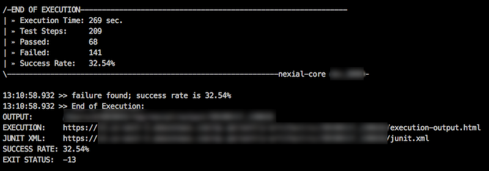
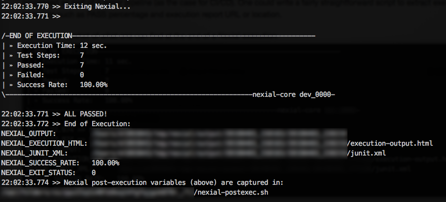
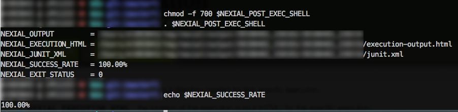

At the [end of execution](endofexecution), Nexial emits some information that might be useful for external or its parent
process. One may consider such information as execution metadata. The main idea is to provide information in a standard, 
consistent manner so that it may be further processed as part of a larger pipeline (as the case for CI/CD). One could 
write a fairly straightforward script to extract execution metadata such as PASS percentage and execution report URL or 
location.

Here's an snapshot of what one can find at the end of a Nexial execution:<br/>


Observe the following:

| `NEXIAL_OUTPUT`        | the output directory created for this specific execution.                |
| `NEXIAL_EXECUTION_HTML`| the location of the execution output (HTML) for this specific execution. |
| `NEXIAL_JUNIT_XML`     | the location of the JUnit XML generated for this specific execution.     |
| `NEXIAL_SUCCESS_RATE`  | the PASS percentage of this specific execution.                          |
| `NEXIAL_EXIT_STATUS`   | the [exit status](exitstatus) of this specific execution. Subsequently this will also be the exit status of `nexial.cmd` or `nexial.sh`.|

<br/>
The above metadata can help to provide a more engaging and meaningful automation experience. For example, one could 
use these information to dynamically generate an email with execution status and links. Or, one could execute different 
Nexial automation suite depending on the PASS percentage (`NEXIAL_SUCCESS_RATE`) of the current execution.

The above information can also be rendered as environment variables. Nexial detects the presence of an environment
variable named as `NEXIAL_POST_EXEC_SHELL`, which represents the location of a post-execution shell script, and write
the above execution metadata into the same shell script file at the end of an execution. Below is one plausible way to 
inject the execution metadata as environment variables of parent shell process:

1. Prior to running a Nexial execution, declare `NEXIAL_POST_EXEC_SHELL` environment variable with desired location
   of shell script that should be executed after Nexial execution.<br/>
   ```
   export NEXIAL_POST_EXEC_SHELL=${TMPDIR}/nexial-postexec.sh
   ```
2. Proceed to execute Nexial as planned.
   ```
   ${NEXIAL_HOME}/bin/nexial.sh -plan ... ... ...
   ```
3. Nexial detects the presents of `NEXIAL_POST_EXEC_SHELL` and writes the execution metadata to it.
   
4. After Nexial execution completes, adjust the target post-execution shell script for execution (*NIX only) and then 
   run (or _source_) the declared post-execution shell script.
   
6. Now the post-execution metadata are avaiable in current shell.
7. One may choose to delete the `NEXIAL_POST_EXEC_SHELL` script file.

By either parsing the execution output or specifying `NEXIAL_POST_EXEC_SHELL` (and then run it after Nexial execution),
one can create a more engaging automation execution and a more dynamic automation solution.
