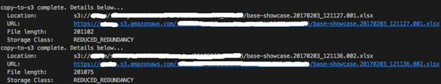
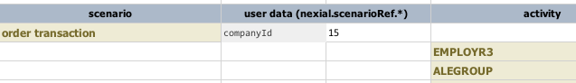
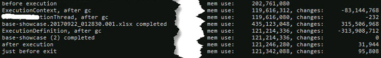
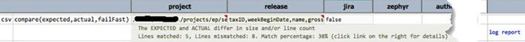

Nexial comes with a set of configuration parameters that control or affect test execution.  These configuration
parameters can be specified the same way as test data.  Many of them can be independently created per iteration
(except those starting with `nexial.scope.`). Many of them can also be specified via command line argument (i.e.
via `-D` option), which will override the same settings in data file.

Below are a list of configurable system variables.  During the test execution, Nexial may generates one or more
variables which maybe incorporated as part of your test script.

For standard System properties, see the section below titled as [Standard System Properties](#standard-system-properties).
 

<table class="sysvar" cellspacing="0" cellpadding="3">
    <tbody>
    <tr>
        <th nowrap="nowrap">configuration</th>
        <th nowrap="nowrap">data type</th>
        <th nowrap="nowrap">default</th>
        <th nowrap="nowrap">read only?</th>
        <th nowrap="nowrap">description</th>
    </tr>
    <tr>
        <td nowrap="nowrap" class="varname"><a name="nexial.runID"/><code>nexial.runID</code></td>
        <td>text</td>
        <td>&nbsp;</td>
        <td class="highlight-red">true </td>
        <td>
            The unique identifier for each test execution, derived at the beginning of the execution. Generally this is the
            start of execution in the form of&nbsp;<code>yyyyMMdd_HHmmss</code>.
        </td>
    </tr>
    <tr>
        <td nowrap="nowrap" class="varname"><a name="nexial.runID.prefix"/><code>nexial.runID.prefix</code></td>
        <td>text</td>
        <td>&nbsp; </td>
        <td class="highlight-red">true </td>
        <td>
            Optional prefix to the system-generated <code>nexial.runID</code>, which is based on the timestamp of the start of
            an execution. This will directly impact the output directory, in that both the prefix and the autogenerated runID
            will represent the output directory name. 
             
            The purpose of using a <em>prefix</em> has manifolds. Read on... 
             
            <u><strong>Organize your output better</strong></u> 
            Surely you can see how this: 
             
            ... is more organized and informative than: 
             
            <u><strong>Create multiple summarization of your execution output</strong></u> 
            Using the prefix, we can render multiple execution summary output (HTML) so that output of the same prefix can be
            summarized together. For example, 
             
            Using the above summarization, one can track the change in execution over time - total steps, pass % and execution
            duration. 
             
            <u><strong>NOTE: this System variable MUST be specified during execution. Specifying it in a data file will have
                no effect</strong></u>. For example, 
             
            <blockquote>
                set JAVA_OPT=-Dnexial.runID.prefix=Sprint14 -Dnexial.outputToCloud=true 
                ... ... 
                nexial.cmd -plan ... ... 
            </blockquote>
        </td>
    </tr>
    <tr>
        <td nowrap="nowrap" class="varname"><a name="nexial.lenientStringCompare"/><code>nexial.lenientStringCompare</code></td>
        <td>boolean</td>
        <td>true</td>
        <td>false</td>
        <td>
            Determine if string comparison should be "<em>forgiving"</em>&nbsp;by converting newline and carriage return
            characters to space BEFORE comparison starts. &nbsp;This is generally needed for Internet Explorer based automation.
            &nbsp;It is usually safe to leave this at default value.
        </td>
    </tr>
    <tr>
        <td nowrap="nowrap" class="varname"><a name="nexial.verbose"/><code>nexial.verbose</code></td>
        <td>boolean</td>
        <td>false</td>
        <td>false</td>
        <td>
            Determine if additional log information should be captured in the output. The additional log information differs
            from command to command, and will be displayed in the subsequent row (i.e. below the test step).
        </td>
    </tr>
    <tr>
        <td nowrap="nowrap" class="varname"><a name="nexial.elapsedTimeSLA"/><code>nexial.elapsedTimeSLA</code></td>
        <td>millisecond</td>
        <td>&nbsp;</td>
        <td>false&nbsp;</td>
        <td>
            Determine the elapsed time of any test step to be considered as out of compliance (outside of SLA). Such test
            step would be marked as <strong>FAIL</strong>&nbsp;with explanation
            in the <code>result</code>&nbsp;column.
        </td>
    </tr>
    <tr>
        <td nowrap="nowrap" class="varname"><a name="nexial.delayBetweenStepsMs"/><code>nexial.delayBetweenStepsMs</code></td>
        <td>millisecond</td>
        <td>600</td>
        <td>false</td>
        <td>The wait time between test steps, in milliseconds.</td>
    </tr>
    <tr>
        <td nowrap="nowrap" class="varname"><a name="nexial.textDelim"/><code>nexial.textDelim</code></td>
        <td>text</td>
        <td><code>,</code></td>
        <td>false</td>
        <td>
            The delimiter character to split a string of characters into array.  
             
            For example, <code>Apple,Banana,Orange</code>&nbsp;would be split into an array of 3 elements:
            <code>Apple</code>, <code>Banana</code>&nbsp;and <code>Orange</code>.  
             
            However, using the default comma might not always be the best option. Overriding this configuration provides the
            flexibility needed to transform a single text string into an array of text.
        </td>
    </tr>
    <tr>
        <td nowrap="nowrap" class="varname"><a name="nexial.nullValue"/><code>nexial.nullValue</code></td>
        <td>text</td>
        <td><code>(null)</code></td>
        <td>false</td>
        <td>
            Change the default representation of a null value. Leaving a cell empty can be confusing - is it
            <code>null</code>, <code>empty</code>, <code>blank</code>?  
            To improve readability and maintainability, Nexial uses the following as reserved word: 
            <ul style="margin: 10px 0px 0px; list-style-type: square; padding-left: 22px;">
                <li><code>(null)</code>&nbsp;- null; meaning no value whatsoever.</li>
                <li><code>(empty)</code>&nbsp;- empty string; meaning text that is zero in length.</li>
                <li><code>(blank)</code>&nbsp;- 1 space; 1 blank space.</li>
                <li><code>(tab)</code>&nbsp;- 1 tab character.</li>
            </ul>
        </td>
    </tr>
    <tr>
        <td nowrap="nowrap" class="varname"><a name="nexial.outputToCloud"/><code>nexial.outputToCloud</code></td>
        <td>boolean</td>
        <td>true</td>
        <td>false</td>
        <td>
            Determine if execution output (report, screenshots, etc.) should be saved to cloud storage so that they may be
            retrieved remotely. When such configuration is turned on, the console log will indicate as such: 
             
             
            Note that cloud storage support is not enabled by default (it's not free). One can enable such capability
            by adding the following configuration for S3 connectivity (in addition to setting 
            <code>nexial.outputToCloud</code> as <code>true</code>: 
             
            <table cellpadding="0" cellspacing="0">
            <tr><th align="left">otc.region</th><td>The desire <a href="https://docs.aws.amazon.com/AmazonRDS/latest/UserGuide/Concepts.RegionsAndAvailabilityZones.html" class="external-link" target="nexial_target">AWS region</a>. Default is <code>us-west-2</code>.</td></tr> 
            <tr><th align="left">otc.accessKey</th><td>The <a href="https://docs.aws.amazon.com/general/latest/gr/aws-sec-cred-types.html#access-keys-and-secret-access-keys" class="external-link" target="nexial_target">AWS access key</a> to access the target S3 service.</td></tr> 
            <tr><th align="left">otc.secretKey</th><td>The <a href="https://docs.aws.amazon.com/general/latest/gr/aws-sec-cred-types.html#access-keys-and-secret-access-keys" class="external-link" target="nexial_target">AWS secret key</a> to access the target S3 service.</td></tr> 
            <tr><th align="left">nexial.outputCloudBase</th><td>The target bucket and path to use for storing execution output.</td></tr> 
            </table> 
        </td>
    </tr>
    <tr>
        <td nowrap="nowrap" class="varname"><a name="nexial.enableEmail"/><code>nexial.enableEmail</code></td>
        <td>boolean</td>
        <td>false</td>
        <td>false</td>
        <td>
            Enable email notification at the end of an execution.  By default this is not enabled as using email to communicate
            execution status carries a variety of possible side issues.  Nonetheless, email notification is supported in Nexial.
            Here are the steps:<ol>
            <li>Enable this system variable</li>
            <li>Define the mail server connectivity details:
                <ul>
                    <li>mail.smtp.host=&lt;the hostname or DNS name of your mail server&gt;</li>
                    <li>mail.smtp.port=25 (or whatever the configured SMTP port is)</li>
                    <li>mail.smtp.from=&lt;the FROM email address&gt;</li>
                    <li>mail.smtp.auth=true|false</li>
                    <li>mail.smtp.username=&lt;username only needed if mail.smtp.auth is set to true&gt;</li>
                    <li>mail.smtp.password=&lt;password only needed if mail.smtp.auth is set to true&gt;</li>
                </ul>
            </li>
            <li>Define the recepient email or list via the <code>nexial.scope.mailTo</code> system variable.</li>
        </ol>
             
            All these settings can be added via command line (i.e. <code>-D...</code>),
            <a href="../userguide/UnderstandingProjectStructure#projectproperties"><code>project.properties</code></a> or
            the appropriate data file.  For example, from command line: 
            <code>
                set JAVA_OPT=-Dnexial.enableEmail=true -Dmail.smtp.host=mail.mycompany.com -Dmail.smtp.auth=false -Dnexial.scope.mail=my_and_myself@mycompany.com 
                 
                nexial.cmd -script ... ...
            </code>
        </td>
    </tr>
    <tr>
        <td nowrap="nowrap" class="varname"><a name="nexial.assistantMode"/><code>nexial.assistantMode</code></td>
        <td>boolean</td>
        <td>false</td>
        <td>false</td>
        <td>
            Determine if Nexial should automatically open the output in Excel after each iteration. This could be a 
            timesaver since one would not have to manually search for the output file. 
             
            For readability's sake, there's another System variable - <code>nexial.openResult</code> - that would
            provide the same functionality.  It's your choice to use either one of these 2 System variables.  However,
            please note that for backward compatibility reasons, 
            <code>nexial.assistantMode</code> will overrides <code>nexial.openResult</code>. 
             
            This configuration is forcefully turned off during remote execution.
        </td>
    </tr>
    <tr>
        <td nowrap="nowrap" class="varname"><a name="nexial.openResult"/><code>nexial.openResult</code></td>
        <td>boolean</td>
        <td>false</td>
        <td>false</td>
        <td>
            Determine if Nexial should automatically open the output in Excel after each iteration. This could be a 
            timesaver since one would not have to manually search for the output file. 
             
            This System variable provides the same functionality as <code>nexial.assistantMode</code>, albeit perhaps
            more readable. It's your choice to use either one of these 2 System variables.  However, please note that 
            for backward compatibility reasons, 
            <code>nexial.assistantMode</code> will overrides <code>nexial.openResult</code>. 
             
            This configuration is forcefully turned off during remote execution.
        </td>
    </tr>
    <tr>
        <td nowrap="nowrap" class="varname"><a name="nexial.spreadsheet.program"/><code>nexial.spreadsheet.program</code></td>
        <td>text</td>
        <td><code>excel</code></td>
        <td class="highlight-red">true</td>
        <td>
            Configure the full path, including the executable name, of the program to use when opening Nexial output at the
            end of an execution run. This is only applicable when <code>nexial.assistantMode</code> is enabled. By default,
            Nexial will invoke Microsoft Excel to open the execution output in context. 
             
            However, should you choose to use another program, such as WPS, specify this variable in your data sheet. For
            example, 
             
            Alternatively, one can simply specify <code>wps</code>, which will enable Nexial to automatically resolve the
            correct location of WPS (latest version preferred). For example, 
            
        </td>
    </tr>
    <tr>
        <td nowrap="nowrap" class="varname"><a name="nexial.scriptRef"/><code>nexial.scriptRef.&ast;</code></td>
        <td>text</td>
        <td>&nbsp;</td>
        <td>false</td>
        <td>
            This configuration does not modify the behavior or outcome of a test execution. Instead it is used to
            create reference information, which may change over iteration, to improve the readability of the execution output.
            For example, 
             
            Adding these information - while one may reference them within script - do not necessarily change the execution
            or behavior of related script(s). However, the output would look something like this: 
             
            As such, the output provides contextual information about the execution such as:
            <ul>
                <li><i>"Against which build was the test executed"</i></li>
                <li><i>"On which environment was the test run"</i>, and</li>
                <li><i>"What is the primary business data used for this execution"</i>.</li>
            </ul>
        </td>
    </tr>
    <tr>
        <td nowrap="nowrap" class="varname"><a name="nexial.scenarioRef"/><code>nexial.scenarioRef.&ast;</code></td>
        <td>text</td>
        <td>&nbsp;</td>
        <td>false</td>
        <td>
            This configuration has a similar purpose as that of <code>nexial.scriptRef.&ast;</code>, except it applies to the
            scenario level (not script). As such, one can provide context information at the scenario level, which can
            possible change over iterations. Example: 
             
             
            Here the <code>companyId</code> is changing from <code>15</code> to <code>1602</code> between iteration 1 and 2.
            The output would reflect as such: 
             
            
        </td>
    </tr>
    <tr>
        <td nowrap="nowrap" class="varname"><a name="nexial.stepByStep"/><code>nexial.stepByStep</code></td>
        <td>boolean</td>
        <td>false</td>
        <td>false</td>
        <td>
            Determine if Nexial to pause after each test step. When set to true, Nexial will pause test execution after each
            step. User will need to press <code>Enter</code> on the console to resume the next step.
        </td>
    </tr>
    <tr>
        <td nowrap="nowrap" class="varname"><a name="nexial.inspectOnPause"/><code>nexial.inspectOnPause</code></td>
        <td>boolean</td>
        <td>false</td>
        <td>false</td>
        <td>
            During <a href="../flowcontrols/#pausebefore--pauseafter">PauseBefore() or PauseAfter()</a>, it is possible
            to interact with Nexial to inquire of the state of a data variable, a built-in function or a Nexial expression.
            For more details, visit this page.
        </td>
    </tr>
    <tr>
        <td nowrap="nowrap" class="varname"><a name="nexial.failFast"/><code>nexial.failFast</code></td>
        <td>boolean</td>
        <td>false</td>
        <td>false</td>
        <td>
            Determine how Nexial should handle the test execution when a failure is found. Failure could either be an
            unexpected outcome of an action, or the undesired result of a validation. If set to true, Nexial will terminate
            the test execution after the first occurrence of a failure. Otherwise, Nexial will continue to the subsequent test
            step. In either case, failure will be reported accordingly.
        </td>
    </tr>
    <tr>
        <td nowrap="nowrap" class="varname"><a name="nexial.resetFailFast"/><code>nexial.resetFailFast</code></td>
        <td>boolean</td>
        <td>false</td>
        <td>false</td>
        <td>
            Determine if the failure condition of one script should cascade down to subsequent scripts. Only applicable when
            using test plan. 
             
            The typical use case for using such system variable would be something such as: 
            <ul style="margin: 10px 0px 0px; padding-left: 22px;">
                <li>You have some scripts declared in a test plan that must execute regardless of the status of preceding
                    scripts - such as clean up scripts or notification scripts</li>
                <li>You have some scripts that can react to the failure of preceding script, and therefore must execute
                    regardless of the preceding success/failure status</li>
            </ul>
        </td>
    </tr>
    <tr>
        <td nowrap="nowrap" class="varname"><a name="nexial.failImmediate"/><code>nexial.failImmediate</code></td>
        <td>boolean</td>
        <td>false</td>
        <td>false</td>
        <td>
            Determine if Nexial should terminate execution at the next failure. This configuration can be useful to signify
            the intent of "<em>after this point, failure will not be tolerated</em>". For example, 
            <table cellspacing="0" cellpadding="3">
                <thead>
                <tr>
                    <th>steps</th>
                    <th>design intent</th>
                </tr>
                </thead>
                <tbody>
                <tr>
                    <td nowrap="nowrap">set <code>nexial.failFast</code> to false</td>
                    <td>At this time, errors may be tolerated. Perhaps we are dealing with a new functionality.</td>
                </tr>
                <tr>
                    <td nowrap="nowrap">more test steps here ...</td>
                    <td>Test proceed as scripted. When failure found, we'll continue to subsequent test steps.</td>
                </tr>
                <tr>
                    <td nowrap="nowrap"><strong>set <code>nexial.failImmediate</code> to true</strong></td>
                    <td>
                        Now that we've gone passed the "less confident" portion of the test, we want insist that the test execution
                        from this point onward must be 100% successfully. This will be effective beyond current iteration and script.
                    </td>
                </tr>
                <tr>
                    <td nowrap="nowrap">more test steps here ...</td>
                    <td>Here are the test steps that are known to be stable.</td>
                </tr>
                <tr>
                    <td>...</td>
                    <td>...</td>
                </tr>
                </tbody>
            </table>
        </td>
    </tr>
    <tr>
        <td nowrap="nowrap" class="varname"><a name="nexial.screenshotOnError"/><code>nexial.screenshotOnError</code></td>
        <td>boolean</td>
        <td>false</td>
        <td>false</td>
        <td>
            Only application to <code>web</code>, <code>desktop</code> commands.  Set to <code>true</code> for Nexial
            to capture the screenshot when a failure occurred.
        </td>
    </tr>
    <tr>
        <td nowrap="nowrap" class="varname"><a name="nexial.lastScreenshot"/><code>nexial.lastScreenshot</code></td>
        <td>text</td>
        <td>&nbsp;</td>
        <td class="highlight-red">true</td>
        <td>The file name of the last screenshot taken.</td>
    </tr>
    <tr>
        <td nowrap="nowrap" class="varname"><a name="nexial.lastOutcome"/><code>nexial.lastOutcome</code></td>
        <td>boolean</td>
        <td>&nbsp;</td>
        <td class="highlight-red">true</td>
        <td>
            A <code>true</code> or <code>false</code> to indicate the outcome of the last command. This can be useful when
            used as flow control condition. For example, 
             
            Since <code>myNumber</code> is not <code>6</code>, the assertion (2nd line) will fail. Now using the
            <code>${nexial.lastOutcome}</code> as the condition, we can fail the entire execution when a
            <em>critical error</em> is found.
        </td>
    </tr>
    <tr>
        <td nowrap="nowrap" class="varname"><a name="nexial.lastPlanStep"/><code>nexial.lastPlanStep</code></td>
        <td>boolean</td>
        <td>false</td>
        <td>false</td>
        <td>
            A <code>true</code> or <code>false</code>, indicate to stop or continue the execution after the script.
            This can be useful when one wants to interrupt/stop execution flow immediate after completion of the script.
            This would be last step in the plan executions. This is only applicable while running a plan as only plan will have
            multiple scripts. It should be set in respective data file of the script.
        </td>
    </tr>
    <tr>
        <td nowrap="nowrap" class="varname"><a name="nexial.manageMemory"/><code>nexial.manageMemory</code></td>
        <td>boolean</td>
        <td>false</td>
        <td>true</td>
        <td>
            <strong>MUST BE SET AS A ENVIRONMENT VARIABLE VIA THE STANDARD <code>-D</code> ARGUMENT.</strong> 
            To turn on this variable, one must set the <code>-D</code> environment variable prior to executing a test run.
            For example: 
            

                [on Windows]: 
                 
                 
                [on OSX]: 
                 
            

            The purpose of this environment variable is to instruct Nexial to enable aggressive memory management. When enabled
            (<code>nexial.manageMemory=true</code>), Nexial will conduct garbage collection (GC) to reclaim any unused heap
            memory after the completion of each test script execution. You will see something similar as the following,
            which show that GC was executed and the memory footprint changes between the GC. 
             
            At the end of the entire execution, Nexial also print out a summary of the memory usage between different test
            scenarios: 
            
        </td>
    </tr>
    <tr>
        <td nowrap="nowrap" class="varname"><a name="nexial.failAfter"/><code>nexial.failAfter</code></td>
        <td>integer</td>
        <td>&nbsp;</td>
        <td>false</td>
        <td>
            Determine the number of failure that can be tolerated before Nexial forcefully terminates the test execution.
            This must not be used in conjunction with <code>nexial.failFast</code>, as <code>nexial.failFast</code> will
            always take precedence. In addition, the failure count in this case is execution-bound – meaning, the count will
            be considered from a single step to its scenario, across multiple test script within a single test plan. 
            By default, Nexial will not fail the test execution regardless of the number of failure, if
            <code>nexial.failFast</code> is not set to <code>true</code>.
        </td>
    </tr>
    <tr>
        <td nowrap="nowrap" class="varname"><a name="nexial.minExecSuccessRate"/><code>nexial.minExecSuccessRate</code></td>
        <td>decimal</td>
        <td>100</td>
        <td class="highlight-red">true</td>
        <td>
            By default, only an execution with 100% PASS rate would be considered as a <em>SUCCESS</em>. Well, from time to
            time, success isn't always that straightforward. There might be valid and one-off reason as to why the criteria of
            SUCCESS would be more lenient. Using this system property, one can tune the minimium rate of PASS(es) in order for
            an execution to be considered as SUCCESS. An SUCCESS will in turn yield a exit status of <code>0</code>, which
            is the equivalent in scripting of "everything's fine, proceed on!". This can be very useful
            (and indeed necessary) for CI/CD environment, or when a Nexial execution is part of a bigger scripting effort. 
             
            By default, this system variable has a value of <code>100</code> (as in 100%). Specifying a number lower than 100,
            such as <code>95.51</code> to fine tune the criteria for a SUCCESSful execution. Misconfigured value
            (less than 0 or greater than 100) will be ignored. 
             
            <strong>NOTE</strong>: this system variable is <strong>NOT</strong> read from data file, and
            <strong><u>MUST</u> </strong>be specified via command line. For example, 
            <blockquote style="margin: 10px 0px 0px 19px; border-left-color: rgb(46, 61, 84); padding: 10px 20px;">
                <code>set JAVA_OPT=-Dnexial.minExecSuccessRate=97.55 -Dnexial.assistantMode=true</code>
                <code>... ...</code>
                <code>nexial.cmd -plan C:\projects\... ... ...</code>
            </blockquote>
             
            At the end of an execution, one may observe a printout of the SUCCESS evaluation due to this system variable.
            For example, 
            
        </td>
    </tr>
    <tr>
        <td nowrap="nowrap" class="varname"><a name="nexial.recordingEnabled"/><code>nexial.recordingEnabled</code></td>
        <td>boolean</td>
        <td>true</td>
        <td>false</td>
        <td>
            Determine if the screen recording is enabled or not during test Execution. This system variable
            <strong>CAN</strong> be read from data file,&nbsp;specified via command line or via <code>project.properties</code>.
            This can be useful when toggling between environments where screen recording is not ideal (such as CI/CD). 
             
            <strong>NOTE</strong>: by default if no system variable defined, recording is set to true (enabled) by
            <strong>default</strong>
        </td>
    </tr>
    <tr>
        <td nowrap="nowrap" class="varname"><a name="nexial.screenRecorder"/><code>nexial.screenRecorder</code></td>
        <td>String</td>
        <td>mp4</td>
        <td class="highlight-red">true</td>
        <td>
            Determine format of the recording file need to be created. Currently supported screen recording files to be
            <code>mp4</code> (default) or <code>avi</code> 
            

                Specify recorder type to <strong><code>mp4</code></strong>: 
                <code>set JAVA_OPT=-Dnexial.screenRecorder=mp4</code>
                 
                 
                Specify recorder type to <strong><code>avi</code></strong>: 
                <code>set JAVA_OPT=-Dnexial.screenRecorder=avi</code>
            

             
            <strong>NOTE</strong>: by default if no system variable defined, screen recording is created as <strong>mp4</strong>
        </td>
    </tr>
    <tr>
        <td class="highlight-green" colspan="5">For iteration-based testing only.</td>
    </tr>
    <tr>
        <td nowrap="nowrap" class="varname"><a name="nexial.scope.iteration"/><code>nexial.scope.iteration</code></td>
        <td>ranges</td>
        <td>1</td>
        <td class="highlight-red">true</td>
        <td>
            Specify the iteration or iteration range to execute. This can expressed as number (each represent the iteration
            index) or a number range. For example, 
            <table cellspacing="0" cellpadding="3">
                <thead>
                <tr>
                    <th><code>nexial.scope.iteration</code></th>
                    <th>meaning</th>
                </tr>
                </thead>
                <tbody>
                <tr>
                    <td>1</td>
                    <td>execute the first iteration</td>
                </tr>
                <tr>
                    <td>1,3,5,7</td>
                    <td>execute the first, the third, the fifth and the seventh iteration</td>
                </tr>
                <tr>
                    <td>1-10,14,99</td>
                    <td>execute iteration 1 through 10, then iteration 14 and then iteration 99.</td>
                </tr>
                <tr>
                    <td>1,1,1,2-5,5-3</td>
                    <td>
                        execute iteration 1 three times, then iteration 2 through 5, then iteration 5, iteration 4, iteration 3. 
                        IOW, execution iteration 1, 1, 1, 2, 3, 4, 5, 5, 4, 3. 
                    </td>
                </tr>
                <tr>
                    <td>B-D,Z-AA,C-19</td>
                    <td>
                        execute: 
                        <ul style="margin: 10px 0 0; padding-left: 22px;">
                            <li>iteration 1 (Column B) through 3 (Column D),</li>
                            <li>then iteration 25 (Column Z) through iteration 26 (Column AA),</li>
                            <li>then iteration 2 (Column C) through iteration 19 (would be Column T).</li>
                        </ul>
                    </td>
                </tr>
                </tbody>
            </table>
        </td>
    </tr>
    <tr>
        <td nowrap="nowrap" class="varname"><a name="nexial.scope.fallbackToPrevious"/><code>nexial.scope.fallbackToPrevious</code></td>
        <td>boolean</td>
        <td>true</td>
        <td class="highlight-red">true</td>
        <td>
            Specify the desired behavior when specific data is not defined. Set this to true means to traverse backward (in
            iteration) until the data is found in previous iteration. Setting it to false would enforce null to be used.
        </td>
    </tr>
    <tr>
        <td nowrap="nowrap" class="varname"><a name="nexial.scope.currentIteration"/><code>nexial.scope.currentIteration</code></td>
        <td>integer</td>
        <td>&nbsp;</td>
        <td class="highlight-red">true</td>
        <td>
            The index (1-base) of the iterations being executed. Note that this is not an indication that a specific iteration
            has completed or succeeded.
        </td>
    </tr>
    <tr>
        <td nowrap="nowrap" class="varname"><a name="nexial.scope.lastIteration"/><code>nexial.scope.lastIteration</code></td>
        <td>integer</td>
        <td>&nbsp;</td>
        <td class="highlight-red">true</td>
        <td>
            The index (1-base) of the last completed iteration. This does not indicate whether the last iteration was
            completed with or without any failure.
        </td>
    </tr>
    <tr>
        <td class="highlight-green" colspan="5">For <code>io</code> or <code>csv</code> content comparison only.</td>
    </tr>
    <tr>
        <td nowrap="nowrap" class="varname"><a name="nexial.compare.textReport"/><code>nexial.compare.textReport</code></td>
        <td>boolean</td>
        <td>true</td>
        <td>false</td>
        <td>
            If true, content comparison will produce a text-based comparison report at the end. The report is stored in the
            output directory (along with other test output) or in the cloud (if <code>nexial.outputToCloud</code> is true) and
            will be downloadable via the test output: 
            
             
            By default, this system variable is <code>true</code>. See
            <a href="../commands/io/compare(expected,actual,failFast)">io &raquo; <code>compare(expected,actual,failFast)</code></a>
            for details.
        </td>
    </tr>
    <tr>
        <td nowrap="nowrap" class="varname"><a name="nexial.compare.jsonReport"/><code>nexial.compare.jsonReport</code></td>
        <td>boolean</td>
        <td>false</td>
        <td>false</td>
        <td>
            If true, content comparison will produce a JSON-based comparison report at the end. The report is stored in the
            output directory (along with other test output) or in the cloud (if <code>nexial.outputToCloud</code> is true) and
            will be downloadable ia the test output: 
            
             
            By default, this system variable is <code>false</code>. See
            <a href="../commands/io/compare(expected,actual,failFast)">io &raquo; <code>compare(expected,actual,failFast)</code></a>
            for details.
        </td>
    </tr>
    <tr>
        <td nowrap="nowrap" class="varname"><a name="nexial.compare.reportMatch"/><code>nexial.compare.reportMatch</code></td>
        <td>boolean</td>
        <td>false</td>
        <td>false</td>
        <td>
            If true, content comparison will report each matching lines, in addition to reporting all mismatched incidents.
            This can make the comparison report too tedious when comparing large files. See
            <a href="../commands/io/compare(expected,actual,failFast)">io &raquo; <code>compare(expected,actual,failFast)</code></a>
            for details.
        </td>
    </tr>
    <tr>
        <td class="highlight-green" colspan="5">
            For <a href="../commands/external/"><code>external</code></a> testing only. 
        </td>
    </tr>
    <tr>
        <td nowrap="nowrap" class="varname"><a name="nexial.external.output"/><code>nexial.external.output</code></td>
        <td>text</td>
        <td></td>
        <td class="highlight-red">true</td>
        <td>
            This system variable reflects the filename of the output generated as a result of executing a
            <a href="../commands/external/runProgram(programPathAndParms)">external &raquo; <code>runProgram(programPathAndParms)</code></a>
            command. 
            When executing the <a href="../commands/external/runProgram(programPathAndParms)">external &raquo; <code>runProgram(programPathAndParms)</code></a>
            command, Nexial also captures the output (<i>standard out</i>) created by target external program.  The captured
            output is then stored to the output directory (as in <code>$(syspath|output|fullPath)</code>) and linked to the
            execution output. 
            With the captured output filename derivable via this system variable, one can further the automation with regards
            the captured output.
        </td>
    </tr>
    <tr>
        <td class="highlight-green" colspan="5">For browser-based testing only. </td>
    </tr>
    <tr>
        <td nowrap="nowrap" class="varname"><a name="nexial.browser"/><code>nexial.browser</code></td>
        <td>text</td>
        <td>firefox</td>
        <td>false</td>
        <td>
            Determine the browser to use for test execution. The possible values are: 
            <ul style="margin: 10px 0px 0px; list-style-type: square; padding-left: 22px;">
                <li><code>firefox</code></li>
                <li><code>firefox.headless</code></li>
                <li><code>chrome</code></li>
                <li><code>chrome.headless</code></li>
                <li><code>safari</code></li>
                <li><code>ie</code></li>
                <li><code>browserstack</code> (see below for <code>nexial.browserstack.&ast;</code> system variables)</li>
            </ul>
        </td>
    </tr>
    <tr>
        <td nowrap="nowrap" class="varname"><a name="nexial.browser.windowSize"/><code>nexial.browser.windowSize</code></td>
        <td>text</td>
        <td>&nbsp;</td>
        <td class="highlight-red">true</td>
        <td>
            Specify the initial browser window size to be opened during test execution. Generally if windows size is not
            provided, the driver uses either previously-set or self-determined <code>width/height</code> during runtime.
            In order to have a consistency, it is recommmed to define browser height and width as desired initial browser
            window size. 
             
            For headless (<code><strong>chrome.headless and firefox.headless</strong></code>) this is a <strong>MUST</strong>.
            <u><strong>If no window size is provided, Nexial will default the window size for the headless browser to
                1200x900</strong></u>. 
             
            For regular UI browser if window size not provided, it will execute whatever window size determined by the target
            browser found during execution.   
             
            Dimension format as follows:
            <ul>
                <li>Expects lowercase "x" is allowed between width and height. (e.g <code>1048<strong>x</strong>900</code>).</li>
                <li>Neither height nor width can be set to a value less than 100.</li>
            </ul>
            
        </td>
    </tr>
    <tr>
        <td nowrap="nowrap" class="varname"><a name="nexial.delayBrowser"/><code>nexial.delayBrowser</code></td>
        <td>boolean</td>
        <td>false</td>
        <td class="highlight-red">true</td>
        <td>
            Delay the initialization of web browser until the first command of
            <a href="../commands/web/open(url)">web &raquo; <code>open()</code></a> is invoked.
            Generally one would not need to worry about this. Change this <strong>ONLY IF YOU KNOW WHAT YOU ARE DOING!</strong>
        </td>
    </tr>
    <tr>
        <td nowrap="nowrap" class="varname"><a name="nexial.browser.ie.requireWindowFocus"/><code>nexial.browser.ie.requireWindowFocus</code></td>
        <td><code>boolean</code></td>
        <td>false</td>
        <td class="highlight-red">true</td>
        <td>
            <strong>Applicable only for Internet Explorer Browser.</strong> 
            <ul>
                <li>Specify IE browser window focus before performing any user interaction operations (mouse or keyboard events).</li>
                <li>This capability is false by default, but delivers much more accurate native events interactions.</li>
                <li>But for any user Interaction testing (mouse hovering etc), it is recommended to set this variable to
                    <code>true</code> using working with IE Browser.</li>
            </ul>
            
        </td>
    </tr>
    <tr>
        <td nowrap="nowrap" class="varname"><a name="nexial.enforcePageSourceStability"/><code>nexial.enforcePageSourceStability</code></td>
        <td><code>boolean</code></td>
        <td><code>true</code></td>
        <td>false</td>
        <td>
            Determine the browser page stability during test execution. Generally most of the modern web applications are rich
            in interactivity which require some background proceed to be completed when page gets loaded. But older or simpler
            web applications do not have such requirement. For such case, one can use this system variable to speed up test
            automation. 
             
            By default the value is set to <code>true</code> and will ensure that the web page in question is stablized before
            proceeding to next command. If this system variable is set to <code>false</code>, this enforcement will be omitted.
            For example: 
            
        </td>
    </tr>
    <tr>
        <td nowrap="nowrap" class="varname"><a name="nexial.pollWaitMs"/><code>nexial.pollWaitMs</code></td>
        <td>milliseconds</td>
        <td>30000</td>
        <td>false</td>
        <td>
            The time to wait for the impact caused by an action (such as click) to subside. In modern web-based application,
            esp. those implemented with AJAX, not all the resulting elements (DOM, resource, etc.) are available at
            the same time. As the browser concurrently downloads and renders each component, the position and
            hierarchical order of these components might change as well. One should consider this configuration as a
            "max wait time" – meaning that if the rendered content has settled or expected element is reachable
            prior to this time, then Nexial will stop waiting and resume execution.
        </td>
    </tr>
    <tr>
        <td nowrap="nowrap" class="varname"><a name="nexial.uiRenderWaitMs"/><code>nexial.uiRenderWaitMs</code></td>
        <td>milliseconds</td>
        <td>3000</td>
        <td>false</td>
        <td>
            The number of milliseconds to wait before taking a screenshot on current browser. &nbsp;This would allow the UI
            elements to "<em>settle down</em>".
        </td>
    </tr>
    <tr>
        <td nowrap="nowrap" class="varname"><a name="nexial.waitSpeed"/><code>nexial.waitSpeed</code></td>
        <td>integer</td>
        <td>3</td>
        <td>false</td>
        <td>
            Determine the much time to wait for a dynamic page/response to stabilize before proceeding to next test step.
            This is set at a 400ms increment.
        </td>
    </tr>
    <tr>
        <td nowrap="nowrap" class="varname"><a name="nexial.browser.postCloseWaitMs"/><code>nexial.browser.postCloseWaitMs</code></td>
        <td>integer</td>
        <td>3000</td>
        <td>false</td>
        <td>
            Time allotted, in millisecond, to allow the system is settled down and process any <em>clean up</em> after a
            browser instance is closed. The default for this is <code>3000</code>, which means the execution of
            <a href="../commands/web/close()">web &raquo; <code>close()</code></a> will add 3 seconds by default to the overall
            execution time.
        </td>
    </tr>
    <tr>
        <td nowrap="nowrap" class="varname"><a name="nexial.web.alwaysWait"/><code>nexial.web.alwaysWait</code></td>
        <td>boolean</td>
        <td>false</td>
        <td>false</td>
        <td>
            Enable auto-continuation mode so that browser will wait for requested element with 10 ms poll. This technique
            can help reduce the use of implict or explicit wait.
        </td>
    </tr>
    <tr>
        <td nowrap="nowrap" class="varname"><a name="nexial.ignoreBrowserAlert"/><code>nexial.ignoreBrowserAlert</code></td>
        <td>boolean</td>
        <td>false</td>
        <td class="highlight-red">true</td>
        <td>
            For browser-based testing only. Determine the behavior to used if an unexpected Alert is found. If set to true,
            unexpected alert will be ignored.
        </td>
    </tr>
    <tr>
        <td nowrap="nowrap" class="varname"><a name="nexial.lastAlertText"/><code>nexial.lastAlertText</code></td>
        <td>string</td>
        <td>&nbsp;</td>
        <td class="highlight-red">true</td>
        <td>
            (<strong><code>webalert</code></strong> commands only). The text of the last javascript alert found during test
            execution. For example: 
            
        </td>
    </tr>
    <tr>
        <td nowrap="nowrap" class="varname"><a name="nexial.web.preemptiveAlertCheck"/><code>nexial.web.preemptiveAlertCheck</code></td>
        <td>boolean</td>
        <td>true</td>
        <td class="highlight-red">false</td>
        <td>
            (<strong><code>web</code></strong> commands only). By default, Nexial checks for the presence of JavaScript 
            alert/confirm/prompt dialog after a web command (such as click or type). If found, Nexial will harvest the 
            text of the JavaScript dialog as <code>nexial.lastAlertText</code>, which effectively <i>dismiss</i> the 
            dialog box as well, before proceeding on.  
            While this default behavior provides convenience, it is not without performance overhead. In order for
            Nexial to dismiss JavaScript dialog, it has to inquire via the underlying web driver against the browser in
            automation. Depending on the browser, this could take a few milliseconds to roughly half a second. From the 
            perspective of the entire automation, this time overhead could be significant.  
            By default, this System variable is set as <code>true</code>, which means Nexial will proactively check and
            dismiss JavaScript dialog after a web command (e.g. click or type). If your AUT does not emit JavaScript 
            dialog (such as <code>alert('...')</code>), it could be a good idea to turn off this feature by setting 
            <code>nexial.web.preemptiveAlertCheck</code> as <code>false</code>. Our rudimentary tests show
            a 12 - 20% time improvement when this feature is turned off, most noticeably when running under IE.
        </td>
    </tr>
    <tr>
        <td nowrap="nowrap" class="varname"><a name="nexial.highlight"/><code>nexial.highlight</code></td>
        <td>boolean</td>
        <td>false</td>
        <td>false</td>
        <td>
            Highlight each web form element as an automation action is performed on it. These automation actions are
            typically some form of click or type. Mouseover will not trigger such highlighting. Currently the
            highlight style is set to <strong><code>background:#faf557</code></strong> for a period of <strong>250ms</strong>;
            this currently cannot be changed. The "<em>flashing yellow effect</em>" is meant as a visual indicator
            of a test execution in progress. Here's an example (where the field <code>Joe</code> is
            highlighted): 
            
        </td>
    </tr>
    <tr>
        <td nowrap="nowrap" class="varname"><a name="nexial.browser.incognito"/><code>nexial.browser.incognito</code></td>
        <td>boolean</td>
        <td>true</td>
        <td class="highlight-red">true</td>
        <td>
            Determine if the target browser should be initialized by Nexial in incognito/private mode. The common
            practice is to <u>ALWAYS</u> run browser in such mode to avoid residual side-effects to the browser between tests.
            The default is <strong><code>true</code></strong>. 
             
            <strong>Due to a
                <a href="https://bugs.chromium.org/p/chromedriver/issues/detail?id=504" class="external-link" target="_nexial_external">known/unresolved
                    issue with chrome</a>, if your tests requires resizing or maximizing target browser, the recommendation is to set
                this variable to <code>false</code>.</strong>
        </td>
    </tr>
    <tr>
        <td nowrap="nowrap" class="varname"><a name="nexial.browserstack.username"/><code>nexial.browserstack.username</code></td>
        <td>text</td>
        <td>&nbsp;</td>
        <td>false</td>
        <td>
    <strong>Applicable only when <code>nexial.browser</code> is set to
    <code>browserstack</code>. </strong><strong>Required in order for BrowserStack integration to work.</strong>
             
            This is the username as found in
            <a href="https://www.browserstack.com/accounts/settings" class="external-link" target="_nexial_external">https://www.browserstack.com/accounts/settings</a>
            (login required).
        </td>
    </tr>
    <tr>
        <td nowrap="nowrap" class="varname"><a name="nexial.browserstack.automatekey"/><code>nexial.browserstack.automatekey</code></td>
        <td>text</td>
        <td>&nbsp;</td>
        <td>false</td>
        <td>
    <strong>Applicable only when <code>nexial.browser</code> is set to
    <code>browserstack</code>. Required in order for BrowserStack integration to work.</strong>
             
            This is the access key as found in
            <a href="https://www.browserstack.com/accounts/settings" class="external-link" target="_nexial_external">https://www.browserstack.com/accounts/settings</a>
            (login required).
        </td>
    </tr>
    <tr>
        <td nowrap="nowrap" class="varname"><a name="nexial.browserstack.browser"/><code>nexial.browserstack.browser</code></td>
        <td>text</td>
        <td>chrome</td>
        <td>false</td>
        <td>
    <strong>Applicable only when <code>nexial.browser</code> is set to
    <code>browserstack</code>.</strong> 
            Specify the browser to use when executing browser-based automation on
    BrowserStack. Valid value would be limited to what
    <a href="https://www.browserstack.com/list-of-browsers-and-platforms?product=automate" class="external-link" target="_nexial_external">
    BrowserStack can support</a>. For example, <code>Firefox, Safari, IE, Chrome, Opera, Edge</code>.
        </td>
    </tr>
    <tr>
        <td nowrap="nowrap" class="varname"><a name="nexial.browserstack.browser.version"/><code>nexial.browserstack.browser.version</code></td>
        <td>text</td>
        <td>latest stable</td>
        <td>false</td>
        <td>
    <strong>Applicable only when <code>nexial.browser</code> is set to
    <code>browserstack</code>.</strong> 
            Specify the browser version to use when executing browser-based automation on BrowserStack. Valid value would be
            limited to <a href="https://www.browserstack.com/list-of-browsers-and-platforms?product=automate" class="external-link" target="_nexial_external">
            what BrowserStack can support</a>.
        </td>
    </tr>
    <tr>
        <td nowrap="nowrap" class="varname"><a name="nexial.browserstack.debug"/><code>nexial.browserstack.debug</code></td>
        <td>boolean</td>
        <td>true</td>
        <td>false</td>
        <td>
    <strong>Applicable only when <code>nexial.browser</code> is set to
    <code>browserstack</code>.</strong> 
            As per BrowserStack documentation: Required if you want to generate screenshots at various steps in your test.
        </td>
    </tr>
    <tr>
        <td nowrap="nowrap" class="varname"><a name="nexial.browserstack.resolution"/><code>nexial.browserstack.resolution</code></td>
        <td>text</td>
        <td>1024x768</td>
        <td>false</td>
        <td>
    <strong>Applicable only when <code>nexial.browser</code> is set to
    <code>browserstack</code>.</strong> 
            Set the resolution of target VM before beginning of your automation. Below is what BrowserStack supports: 
            <strong>Windows (XP,7):</strong> <code>800x600, 1024x768, 1280x800, 1280x1024, 1366x768, 1440x900, 1680x1050,
            1600x1200, 1920x1200, 1920x1080, 2048x1536</code> 
            <strong>Windows (8,8.1,10):</strong> <code>1024x768, 1280x800, 1280x1024, 1366x768, 1440x900, 1680x1050,
            1600x1200, 1920x1200, 1920x1080, 2048x1536</code> 
            <strong>OS X:</strong> <code>1024x768, 1280x960, 1280x1024, 1600x1200, 1920x1080</code> 
            <strong>Default:</strong> <code>1024x768</code>
        </td>
    </tr>
    <tr>
        <td nowrap="nowrap" class="varname"><a name="nexial.browserstack.app.buildnumber"/><code>nexial.browserstack.app.buildnumber</code></td>
        <td>text</td>
        <td>&nbsp;</td>
        <td>false</td>
        <td>
    <strong>Applicable only when <code>nexial.browser</code> is set to
    <code>browserstack</code>.</strong> 
            Allow user to group a set of automations under a specific label that would represent a specific AUT build.
        </td>
    </tr>
    <tr>
        <td nowrap="nowrap" class="varname"><a name="nexial.browserstack.enablelocal"/><code>nexial.browserstack.enablelocal</code></td>
        <td>boolean</td>
        <td>false</td>
        <td>false</td>
        <td>
    <strong>Applicable only when <code>nexial.browser</code> is set to
    <code>browserstack</code>.</strong> 
            Required if you are testing against internal/local servers. Make sure you have download and started the
            <a href="https://www.browserstack.com/local-testing#command-line" class="external-link" target="_nexial_external">
                appropriate BrowserStackLocal binary</a> before executing your tests.
        </td>
    </tr>
    <tr>
        <td nowrap="nowrap" class="varname"><a name="nexial.browserstack.os"/><code>nexial.browserstack.os</code></td>
        <td>text</td>
        <td>&nbsp;</td>
        <td>false</td>
        <td>
    <strong>Applicable only when <code>nexial.browser</code> is set to
    <code>browserstack</code>.</strong> 
            OS you want to test. For example: <code>WINDOWS, OS X</code>
        </td>
    </tr>
    <tr>
        <td nowrap="nowrap" class="varname"><a name="nexial.browserstack.os.version"/><code>nexial.browserstack.os.version</code></td>
        <td>text</td>
        <td>&nbsp;
        </td>
        <td>false</td>
        <td>
    <strong>Applicable only when <code>nexial.browser</code> is set to
    <code>browserstack</code>.</strong> 
            OS version you want to test. For example: Windows: <code>XP, 7, 8, 8.1 and 10</code> OS X:
            <code>Snow Leopard, Lion, Mountain Lion, Mavericks, Yosemite, El Capitan, Sierra</code>
        </td>
    </tr>
    <tr>
        <td nowrap="nowrap" class="varname"><a name="nexial.safari.cleanSession"/><code>nexial.browser.safari.cleanSession</code></td>
        <td>boolean</td>
        <td>false</td>
        <td>true</td>
        <td>
            <strong>Applicable only when <code>nexial.browser</code> is set to <code>safari</code>.</strong> 
            Instruct Nexial to delete all existing session data when starting a new browser session. This includes browser
            history, cache, cookies, HTML5 local storage, and HTML5 databases. Setting this to true is some times necessary in
            order to simulate a "<em>brand new browser</em>" or "<em>first visit</em>" experience. 
            <strong>Warning</strong>: Since Safari uses a single profile for the current user, enabling this will
            <strong>permanently erase any existing session data.</strong>
        </td>
    </tr>
    <tr>
        <td nowrap="nowrap" class="varname"><a name="nexial.safari.useTechPreview"/><code>nexial.browser.safari.useTechPreview</code></td>
        <td>boolean</td>
        <td>false</td>
        <td>true</td>
        <td>
            <strong>Applicable only when <code>nexial.browser</code> is set to <code>safari</code>.</strong> 
            Instruct Nexial to use the <a href="https://developer.apple.com/safari/technology-preview/" class="external-link" target="_nexial_external">
            Safari Technology Preview</a> if this system variable is set to <code>true</code>, otherwise use the release
            version of Safari (default). Set this system variable to <code>true</code> <strong>ONLY</strong> the executing
            host has <a href="https://developer.apple.com/safari/technology-preview/" class="external-link" target="_nexial_external">Safari
            Technology Preview</a> properly installed.
        </td>
    </tr>
    <tr>
        <td nowrap="nowrap" class="varname"><a name="nexial.forceIE32"/><code>nexial.forceIE32</code></td>
        <td>boolean</td>
        <td>false</td>
        <td class="highlight-red">true</td>
        <td>
            <strong>Applicable only for automating Internet Explorer.</strong> 
            This system variable instructs Nexial on which version of <strong>IEDriverServer</strong> to use for Internet
            Explorer. <strong>IEDriverServer</strong> is a resident program that translates Selenium
            commands (sent through Nexial) into automation events on Internet Explorer. Setting this system
            variable to <code>true</code> (default) would force the use the 32-bit version of
            IEDriverServer; <code>false</code> would instruct Nexial to use the 32-bit version for the
            32-bit Windows OS and 64-bit version for 64-bit Windows OS. 
             
            It has come to light that Internet Explorer in pre-Windows10 installation are NOT truely 64-bit. The Internet
            Explorer "shell" program is a 64-bit process - meaning the main window, the address bar, navigation buttons, menu,
            etc.). However the individual tabs - where the web page content is rendered - are still 32-bit
            process. As such, if we use the 64-bit IEDriverServer process, each interaction to the web page
            would cause an additional execution buffering and translation between the 64-bit and 32-bit
            instructions. This means that using the 64-bit IEDriverServer on pre-Windows10 Internet Explorer <strong>WILL
            BE SLOWER</strong>, in fact, much slower, than using 32-bit IEDriverServer. For this reason,
            this system variable can help by forcing the use of the 32-bit IEDriverServer to circumvent the
            additional processing needed to toggle between 32-bit and 64-bit instructions. 
             
            By default, this system variable is set to <code>false</code> since it appears that the latest version of
            IEDriverServer (3.5.1.1, as of 2017/09/01) has corrected the 'bit' issue. 
             
            This system variable is marked as <code>read-only</code> because it is only read once during startup. Further
            changes to this system variable during execution would have no impact to the execution.
        </td>
    </tr>
    <tr>
        <td nowrap="nowrap" class="varname"><a name="webdriver.ie.driver"/><code>webdriver.ie.driver</code></td>
        <td>string</td>
        <td>&nbsp;</td>
        <td class="highlight-red">true</td>
        <td>
            <strong>Applicable only for automating Internet Explorer.</strong> 
            The location of the IE driver binary (ie IEDriverServer). By default, Nexial will determine the appropriate version
            of IEDriverServer to use, from one of the ones distributed as part of Nexial distribution. However, if for some
            reason you see the need to use a different <code>IEDriverServer.exe</code>, then use this system variable to force
            the use of a out-of-distribution IEDriverServer. 
             
            For more detail, see <a href="https://github.com/SeleniumHQ/selenium/wiki/InternetExplorerDriver" class="external-link" target="_nexial_external">
            https://github.com/SeleniumHQ/selenium/wiki/InternetExplorerDriver</a> 
             
            This system variable is marked as <code>read-only</code> because it is only read once during startup. Further
            changes to this system variable during execution would have no impact to the execution.
        </td>
    </tr>
    <tr>
        <td nowrap="nowrap" class="varname"><a name="webdriver.ie.driver.loglevel"/><code>webdriver.ie.driver.loglevel</code></td>
        <td>string</td>
        <td>FATAL</td>
        <td class="highlight-red">true</td>
        <td>
            <strong>Applicable only for automating Internet Explorer.</strong> 
            Specifies the level at which logging messages are output. Valid values are <code>FATAL</code>, <code>ERROR</code>,
            <code>WARN</code>, <code>INFO</code>, <code>DEBUG</code>, and <code>TRACE</code>. Defaults to <code>FATAL</code>. 
             
            For more detail, see <a href="https://github.com/SeleniumHQ/selenium/wiki/InternetExplorerDriver" class="external-link" target="_nexial_external">
            https://github.com/SeleniumHQ/selenium/wiki/InternetExplorerDriver</a> 
             
            This system variable is marked as <code>read-only</code> because it is only read once during startup. Further
            changes to this system variable during execution would have no impact to the execution.
        </td>
    </tr>
    <tr>
        <td nowrap="nowrap" class="varname"><a name="webdriver.ie.driver.logfile"/><code>webdriver.ie.driver.logfile</code></td>
        <td>string</td>
        <td>&nbsp;</td>
        <td class="highlight-red">true</td>
        <td>
            <strong>Applicable only for automating Internet Explorer.</strong>
            Specifies the full path and file name of the log file. 
             
            For more detail, see <a href="https://github.com/SeleniumHQ/selenium/wiki/InternetExplorerDriver" class="external-link" target="_nexial_external">
            https://github.com/SeleniumHQ/selenium/wiki/InternetExplorerDriver</a> 
             
            This system variable is marked as <code>read-only</code> because it is only read once during startup. Further
            changes to this system variable during execution would have no impact to the execution.
        </td>
    </tr>
    <tr>
        <td nowrap="nowrap" class="varname"><a name="webdriver.ie.driver.silent"/><code>webdriver.ie.driver.silent</code></td>
        <td>boolean</td>
        <td>false</td>
        <td class="highlight-red">true</td>
        <td>
            <strong>Applicable only for automating Internet Explorer.</strong> 
            Suppresses diagnostic output when the IE driver is started. 
             
            For more detail, see
            <a href="https://github.com/SeleniumHQ/selenium/wiki/InternetExplorerDriver" class="external-link" target="_nexial_external">
                https://github.com/SeleniumHQ/selenium/wiki/InternetExplorerDriver</a> 
             
            This system variable is marked as <code>read-only</code> because it is only read once during startup. Further
            changes to this system variable during execution would have no impact to the execution.
        </td>
    </tr>
    <tr>
        <td class="highlight-green" colspan="5">For image-based testing (<code>image</code> commands) only.</td>
    </tr>
    <tr>
        <td nowrap="nowrap" class="varname"><a name="nexial.imageTolerance"/><code>nexial.imageTolerance</code></td>
        <td>float</td>
        <td>0</td>
        <td>false</td>
        <td>
            For <code>image</code> commands only. Determine the amount of tolerance (0..100) when comparing two image
            artifact. 0 means "zero-tolerance".
        </td>
    </tr>
    <tr>
        <td class="highlight-green" colspan="5">For <code>ws</code> commands only.</td>
    </tr>
    <tr>
        <td nowrap="nowrap" class="varname"><a name="nexial.ws.connectionTimeout"/><code>nexial.ws.connectionTimeout</code></td>
        <td>milliseconds</td>
        <td><code>300000</code></td>
        <td>false</td>
        <td>
            Determine the connection timeout value (in milliseconds) until a connection is established. A timeout value of
            zero is interpreted as an infinite timeout. Default is 5 minutes.
        </td>
    </tr>
    <tr>
        <td nowrap="nowrap" class="varname"><a name="nexial.ws.readTimeout"/><code>nexial.ws.readTimeout</code></td>
        <td>milliseconds</td>
        <td><code>300000</code></td>
        <td>false</td>
        <td>
            Determine the socket timeout value when reading response payload from either a reused or new connection. Default
            is 5 minutes.
        </td>
    </tr>
    <tr>
        <td nowrap="nowrap" class="varname"><a name="nexial.ws.enableRedirects"/><code>nexial.ws.enableRedirects</code></td>
        <td>boolean</td>
        <td>false</td>
        <td>false</td>
        <td>Determines whether redirects should be handled automatically.</td>
    </tr>
    <tr>
        <td nowrap="nowrap" class="varname"><a name="nexial.ws.enabledExpectContinue"/><code>nexial.ws.enabledExpectContinue</code></td>
        <td>boolean</td>
        <td>false</td>
        <td>false</td>
        <td>
            Determines whether the '<code>Expect: 100-Continue</code>' handshake is enabled for HTTP methods with
            payload body (such as POST and PUT). The purpose of the '<code>Expect: 100-Continue</code>' handshake is
            to allow a client that is sending a request message with a request body to determine if the origin
            server is willing to accept the request (based on the request headers) before the client sends the
            request body. 
             
            The use of the '<code>Expect: 100-continue</code>' handshake can result in a noticeable performance improvement
            for entity enclosing requests (such as POST and PUT) that require the target server's authentication. 
             
            '<code>Expect: 100-continue</code>' handshake should be used with caution, as it may cause problems with HTTP
            servers and proxies that do not support HTTP/1.1 protocol.
        </td>
    </tr>
    <tr>
        <td nowrap="nowrap" class="varname"><a name="nexial.ws.allowCircularRedirects"/><code>nexial.ws.allowCircularRedirects</code></td>
        <td>boolean</td>
        <td>false</td>
        <td>false</td>
        <td>
            Determines whether circular redirects (redirects to the same location) should be allowed. The HTTP specification
            is not sufficiently clear whether circular redirects are permitted, therefore they can be optionally enabled.
        </td>
    </tr>
    <tr>
        <td nowrap="nowrap" class="varname"><a name="nexial.ws.allowRelativeRedirects"/><code>nexial.ws.allowRelativeRedirects</code></td>
        <td>boolean</td>
        <td>false</td>
        <td>false</td>
        <td>
            Determines whether relative redirects should be rejected. An older HTTP 1.1 specification requires the location
            value be an absolute URI. But since most browsers tolerates relative URI,
            <a href="https://en.wikipedia.org/wiki/HTTP_location" class="external-link" target="_nexial_external">the said HTTP specification hence
                relaxed such restriction</a>. Set this configuration to <code>true</code> to simulate modern browsers' default
            behavior.
        </td>
    </tr>
    <tr>
        <td nowrap="nowrap" class="varname"><a name="nexial.ws.requestPayloadCompact"/><code>nexial.ws.requestPayloadCompact</code></td>
        <td>boolean</td>
        <td>false</td>
        <td>false</td>
        <td>
            Determine if request query string or request body should be trimmed (beginning and ending spaces removed) prior
            to it being sent to target URI.
        </td>
    </tr>
    <tr>
        <td nowrap="nowrap" class="varname"><a name="nexial.ws.header"/><code>nexial.ws.header.&ast;</code></td>
        <td>text</td>
        <td>&nbsp;</td>
        <td>false</td>
        <td>
            Execution-bound HTTP header(s) to be used for each HTTP request (regardless of method). This is a
            convenience mechanism since one would only need to define a set of common HTTP headers in the data file
            for them to take effect for all HTTP requests issued within the same test execution. For example, one
            may specify a list of common HTTP headers in the data file like this: 
            <table cellspacing="0" cellpadding="3">
                <tbody>
                <tr>
                    <td class="highlight-yellow"><code>nexial.ws.header.Authorization</code></td>
                    <td class="highlight-yellow"><code>Basic VkzhFGRpbjp2crVuIHNlc29tDn==</code></td>
                </tr>
                <tr>
                    <td class="highlight-yellow"><code>nexial.ws.header.If-Modified-Since</code></td>
                    <td class="highlight-yellow"><code>Sat, 29 Oct 1994 19:43:31 GMT</code></td>
                </tr>
                <tr>
                    <td class="highlight-yellow"><code>nexial.ws.header.User-Agent</code></td>
                    <td class="highlight-yellow"><code>My super-duper browser called Nexial</code></td>
                </tr>
                </tbody>
            </table>
             
            For a list of common/standard HTTP header names and related information, consult
            <a href="https://en.wikipedia.org/wiki/List_of_HTTP_header_fields" class="external-link" target="_nexial_external">this link</a>.
        </td>
    </tr>
    <tr>
        <td nowrap="nowrap" class="varname"><a name="nexial.ws.digest.user"/><code>nexial.ws.digest.user</code></td>
        <td>text</td>
        <td>&nbsp;</td>
        <td>false</td>
        <td rowspan="4">
            Authenticate HTTP interaction via the digest authentication scheme as defined in RFC 2617. All but
            <code>nexial.ws.digest.nouce</code> are required configuration parameters to activate such authentication. Any
            required configuration missing would not triggered such authentication.
        </td>
    </tr>
    <tr>
        <td nowrap="nowrap" class="varname"><a name="nexial.ws.digest.password"/><code>nexial.ws.digest.password</code></td>
        <td>text</td>
        <td>&nbsp;</td>
        <td>false</td>
    </tr>
    <tr>
        <td nowrap="nowrap" class="varname"><a name="nexial.ws.digest.realm"/><code>nexial.ws.digest.realm</code></td>
        <td>text</td>
        <td>&nbsp;</td>
        <td>false</td>
    </tr>
    <tr>
        <td nowrap="nowrap" class="varname"><a name="nexial.ws.digest.nouce"/><code>nexial.ws.digest.nouce</code></td>
        <td>text</td>
        <td>&nbsp;</td>
        <td>false</td>
    </tr>
    <tr>
        <td nowrap="nowrap" class="varname"><a name="nexial.ws.basic.user"/><code>nexial.ws.basic.user</code></td>
        <td>text</td>
        <td>&nbsp;</td>
        <td>false</td>
        <td rowspan="2">
            Authentication HTTP interaction via the basic authentication scheme as defined in RFC 2617. This authentication
            scheme is insecure, as the credentials are transmitted in clear text.&nbsp;Both of these parameters are required
            to trigger such authentication.
        </td>
    </tr>
    <tr>
        <td nowrap="nowrap" class="varname"><a name="nexial.ws.basic.password"/><code>nexial.ws.basic.password</code></td>
        <td>text</td>
        <td>&nbsp;</td>
        <td>false</td>
    </tr>
    <tr>
        <td class="highlight-green" colspan="5">For <a href="../commands/ws.async"><code>ws.async</code></a> commands only.</td>
    </tr>
    <tr>
        <td nowrap="nowrap" class="varname"><a name="nexial.ws.async.shutdownWaitMs"/><code>nexial.ws.async.shutdownWaitMs</code></td>
        <td>millisecond</td>
        <td>180000</td>
        <td>false</td>
        <td>
        In order to support the download to file that might potentially take longer than the execution time, Nexial will
        attempt to wait for the asynchronous HTTP invocations (if any) to complete before shutting down.  The amount of 
        such wait time is by default set to 180000 (3 minutes). One may override the default with another value, in 
        millisecond, to possible speed up or prolong the shutdown event.
        </td>
    </tr>
    <tr>
        <td class="highlight-green" colspan="5">For desktop-based (<code>desktop</code> commands) testing only.</td>
    </tr>
    <tr>
        <td nowrap="nowrap" class="varname"><a name="nexial.desktopNotifyWaitMs"/><code>nexial.desktopNotifyWaitMs</code></td>
        <td>millisecond</td>
        <td>3000</td>
        <td>false</td>
        <td>
            Specify the time to allow for a taskbar-based notification to stay visible. Such notification would display log
            information as issued by the <code>desktop</code> commands, and they are displayed as a
            <a href="https://www.groovypost.com/wp-content/uploads/2011/10/image252.png" class="external-link" target="_nexial_external">"ballon".</a>
        </td>
    </tr>
    <tr>
        <td nowrap="nowrap" class="varname"><a name="nexial.desktop.fullScreenCapture"/><code>nexial.desktop.fullScreenCapture</code></td>
        <td>boolean</td>
        <td>false</td>
        <td>false</td>
        <td>
            Specify if screenshot should be taken for the entire desktop or only limit to the target AUT.
            If <code>true</code>, the screen capture will capture the entire desktop, possibly including other
            applications and windows. If <code>false</code>, the screen capture will limit to the dimension of
            the target AUT. 
            If configuration can be useful when an application generates alert or modal dialog boxes that should be captured
            as test artifact. If such is the case, set this configuration to <code>true</code>.
        </td>
    </tr>
    <tr>
        <td nowrap="nowrap" class="varname"><a name="nexial.desktop.dialogLookup"/><code>nexial.desktop.dialogLookup</code></td>
        <td>boolean</td>
        <td>false</td>
        <td>false</td>
        <td>
            Specify if any uncertainty of showing up of dialog boxes while editing the desktop table cells. If any such
            dialog box comes up, Nexial will stop further editing the table cells and the step will be failed.
        </td>
    </tr>
    <tr>
        <td nowrap="nowrap" class="varname"><a name="nexial.winiumJoinExisting"/><code>nexial.winiumJoinExisting</code></td>
        <td>boolean</td>
        <td>false</td>
        <td>false</td>
        <td>
            Determine if Nexial should "join session" with an existing Winium instance or create its own (i.e. new). This
            configuration would only make sense to be set to true if <code>nexial.winiumPort</code> is also specified
            (to the existing running Winium instance). Using both these configurations together can create an
            efficient way to script development. By attaching to another active Winium instance (and thus a running
            instance of the application under test), one could test out a sequence of test steps without restarting
            the application each time.
        </td>
    </tr>
    <tr>
        <td nowrap="nowrap" class="varname"><a name="nexial.winiumPort"/><code>nexial.winiumPort</code></td>
        <td>number</td>
        <td>&nbsp;</td>
        <td class="highlight-red">true</td>
        <td>
            Specify the port to use (by Winium driver) when automating against a desktop application. Winium uses this port
            to communicate between Nexial and the Winium command processor. If none specified, Nexial will search for a
            random open port that is above 1024.
        </td>
    </tr>
    <tr>
        <td nowrap="nowrap" class="varname"><a name="nexial.winiumSoloMode"/><code>nexial.winiumSoloMode</code></td>
        <td>boolean</td>
        <td>true</td>
        <td>false</td>
        <td>
            Determine if Nexial should run the current AUT exe in "Solo" mode (default) - which means to reuse
            existing instances if found. This means that one could forcefully configure the AUT to run as a single
            instance, even when multiple <a href="../commands/desktop/useApp(appId)">desktop &raquo; <code>useApp(appId)</code></a>
            command was invoked. This is especially useful when dealing with an application that requires additional time
            and resources to "startup". When subsequent
            <a href="../commands/desktop/useApp(appId)">desktop &raquo; <code>useApp(appId)</code></a> command is invoked,
            Nexial will simply reuse the existing running instance and thus save time. 
             
            However, it is important to note that
            <a href="../commands/desktop/closeApplication()">desktop &raquo; <code>closeApplication()</code></a> command will
            effectively be ignored. One would set this system variable to <code>false</code> in order to terminate the
            running AUT instance. Example: 
             
             
            
        </td>
    </tr>
    <tr>
        <td class="highlight-green" colspan="5">For database (<code>rdbms</code> commands) testing only.</td>
    </tr>
    <tr>
        <td nowrap="nowrap" class="varname"><a name="nexial.rdbms.packSingleRow"/><code>nexial.rdbms.packSingleRow</code></td>
        <td>boolean</td>
        <td>false</td>
        <td>false</td>
        <td>
            Specify in the scenario where a single row is returned as a result of executing a SQL statement, whether Nexial
            should pack the result set (i.e.the single row) by removing all <code>NULL</code> columns. 
             
            This system variable is automatically disabled when there are more than 1 row found in the resultset.
        </td>
    </tr>
    </tbody>
</table>
 
 

### Standard System Properties
As a Java application, Nexial supports a set of standard System properties that are common across operation systems.
These properties are managed and exposed by the Java runtime, which might increase in number over time. Nexial, in
turn, expose these properties so that they may be used as part of automation.

For example, should one do such in a Nexial script: 

This will print out the user ID that executed the script.

One can considered these System properties as reflection of the current test harness (where Nexial runs).  Below is the
list of available System properties:

<table class="sysvar" cellspacing="0" cellpadding="3">
    <tbody>
    <tr>
        <th nowrap="nowrap">property name</th>
        <th nowrap="nowrap">explanation</th>
        <th nowrap="nowrap">example</th>
    </tr>
    <tr>
        <td nowrap="nowrap" class="varname"><a name="file.separator"/><code>file.separator</code></td>
        <td>The character used to separate files and directory. On Windows, this is usually <code>\</code>. On *NIX and OSX, this would be <code>/</code></td>
        <td>&nbsp;</td>
    </tr>
    <tr>
        <td nowrap="nowrap" class="varname"><a name="java.home"/><code>java.home</code></td>
        <td>Where the current Java runtime is installed</td>
        <td>&nbsp;</td>
    </tr>
    <tr>
        <td nowrap="nowrap" class="varname"><a name="java.io.tmpdir"/><code>java.io.tmpdir</code></td>
        <td>Current temp directory. The actual directory differs from host to host, depending on how each machine is set up</td>
        <td>&nbsp;</td>
    </tr>
    <tr>
        <td nowrap="nowrap" class="varname"><a name="java.version"/><code>java.version</code></td>
        <td>The version of the current Java runtime, include the minor and patch number</td>
        <td><code>1.8.0_152</code></td>
    </tr>
    <tr>
        <td nowrap="nowrap" class="varname"><a name="line.separator"/><code>line.separator</code></td>
        <td>The character(s) used as line separator. On Windows this is commonly implemented as the \r\n, while in *NIX and OSX it's the \n character</td>
        <td>&nbsp;</td>
    </tr>
    <tr>
        <td nowrap="nowrap" class="varname"><a name="os.arch"/><code>os.arch</code></td>
        <td>The operating system architecture of the current host</td>
        <td><code>x86_64</code></td>
    </tr>
    <tr>
        <td nowrap="nowrap" class="varname"><a name="os.name"/><code>os.name</code></td>
        <td>The short name of the current operating system</td>
        <td>
            <code>Mac OS X</code> 
            <code>Windows</code>
        </td>
    </tr>
    <tr>
        <td nowrap="nowrap" class="varname"><a name="os.version"/><code>os.version</code></td>
        <td>The operating system version</td>
        <td><code>10.12.6</code></td>
    </tr>
    <tr>
        <td nowrap="nowrap" class="varname"><a name="user.country"/><code>user.country</code></td>
        <td>The country or region code of the user that executed Nexial</td>
        <td><code>US</code></td>
    </tr>
    <tr>
        <td nowrap="nowrap" class="varname"><a name="user.dir"/><code>user.dir</code></td>
        <td>a.k.a. Current working directory 
            This is the directory where Nexial - ultimately Java - was run. In most cases this would be <code>${NEXIAL_HOME}/bin</code></td>
        <td>&nbsp;</td>
    </tr>
    <tr>
        <td nowrap="nowrap" class="varname"><a name="user.home"/><code>user.home</code></td>
        <td>User home directory</td>
        <td>
            <code>C:\Users\Administrator</code> 
            <code>/Users/admin</code>
        </td>
    </tr>
    <tr>
        <td nowrap="nowrap" class="varname"><a name="user.language"/><code>user.language</code></td>
        <td>The language code of the user that executed Nexial</td>
        <td><code>en</code></td>
    </tr>
    <tr>
        <td nowrap="nowrap" class="varname"><a name="user.name"/><code>user.name</code></td>
        <td>The user ID of the user that executed Nexial.</td>
        <td>&nbsp;</td>
    </tr>
    <tr>
        <td nowrap="nowrap" class="varname"><a name="user.timezone"/><code>user.timezone</code></td>
        <td>The timezone of the operation system that executed Nexial</td>
        <td><code>America/Los_Angeles</code></td>
    </tr>
    </tbody>
</table>
 

Example: 
Script (note that `${whoami}` is defined as data variable with the value of `${user.name}`): 

Output: 

