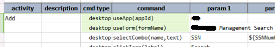
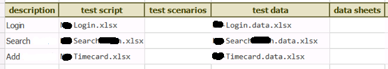
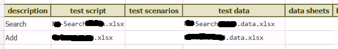

### Automating running desktop application (i.e. speed up script development)
The common approach to develop your automation script is to simulate the entire interaction flow between a persona 
and the target application, from beginning to end.  In other words, the typical steps one would develop the script to:
1.  Start the application,
2.  Authenticate (if needed),
3.  Navigate to the appropriate UI screen/form,
4.  Perform the intended business transactions, and
5.  Finally terminate the application.
 
This seems reasonable enough. However it is not always most efficient to execute all these steps during automation 
script development.  Imagine you are developing on a specific, and perhaps intricate, sequence of steps.  Each time 
you made a change or a correction, you would need to simulate all the steps leading up to it.  Perhaps you are 
working on the last scenario of a fairly tedious test case with lots of screens and steps leading up to it.  For more 
complicated scenarios and over time, this certainly add up to a fairly sizable amount of time.  It would be great if 
you can just test the portion of your script you are actively working on and only re-run the entire automation 
scripts when you are done with the entire thing.
 
*Well, you can.*
 
For desktop automation, Nexial provides a mechanism to *"attach"* to a running instance of the target AUT via the 
corresponding `application.json`, like this:
 
**application.json**
```json
{
   "aut": {
      "path": "C:\\MyApplication\\Release15.02",
      "exe": "MyApp.exe",
      "dotnetConfig": "MyApp.exe.config",
      "args": "",
      "terminateExisting": false
   },
 
   "defaultWaitMs": 500,
   "appStartupWaitMs": 90000,
 
   "app": {
      "xpath": "/*[@AutomationId='MyApplicationClient']",
 
      "components": {
        ... ...
        ... ...
      }

      ... ...
   }
```
 
Observe at line 7, `**"terminatingExisting": false**.` This property instructs Nexial to consider a running instance 
of the AUT (in this case, `MyApp.exe`) for automation instead of starting a new instance.  Of course if there isn't 
any running instance, then Nexial will start one as expected.  But if any running instance of the AUT is found, then 
**`"terminatingExisting":false`** flag would have Nexial utilize that running instance for automation.

As such, you can take advantage of that by executing the script or scenario that corresponds to the current state of 
the application.

Before we look at an example, a few critical things to keep in mind:
1. **While the application could an running instance, Nexial is not.**  
   When executing your script, Nexial is always running as a brand new instance.  As such, it needs to be aware of 
   the application it is targeting, and the UI context of such application.  It is paramount to put 
   [desktop &raquo; `useApp(appId)`](../commands/desktop/useApp(appId)) and 
   [desktop &raquo; `useForm(formName)`](../commands/desktop/useForm(formName)) in your script.  For example,  
     

2. **While you can selectively run a portion of your scripts, Nexial must start from the beginning of a 
   Test Scenario (i.e. worksheet).**
   Make sure that the Test Scenario you want to run matches with the current state of the application.  For example, 
   if the first command in your scenario is to click on a button of a dialog box but the application does not display 
   any dialog box.  Naturally such script will fail.  Generally speaking, your test scenario should match the 
   "starting point" of a UI form or screen.  Designing your scenarios this way as the added benefit to improve 
   maintainability and modularity.  We should always strife to reuse, and organizing your script as such will help 
   in the long run.

3. **Always test the entire execution when all the test steps are developed.**  
   This technique should be treated as a way to save some time and to speed up script development.  But it's no 
   substitute for ensuring that all the scripts and scenarios are working in the expect sequence.


### Example
Suppose you have the following test plan:<br/>


This test plan assumes that we will start the application and log into it (Login), then search for certain business 
information (Search), and lastly add additional data via the application (Add).
 
Now, with the target application already running and appropriately authenticated, we could remove the first script:<br/>


Similarly one could do the same at the script (workbook) or scenario (worksheet) level.
