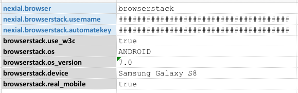
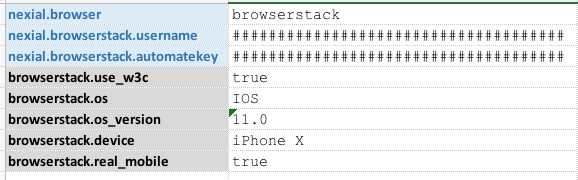

### Description
<a href="https://www.browserstack.com/" class="external-link" target="_nexial_link">BrowserStack</a> is a cloud-based 
cross-browser testing tool that enables web testing across various browsers on different operating systems and mobile 
devices, without requiring users to install virtual machines, devices or emulators.  It is particularly useful when 
testing of older OS or browser is required. In addition, being a cloud-based solution, executing tests on BrowserStack 
would incur much less computing resources within the enterprise.

Nexial can integrate with BrowserStack by pushing the test steps and commands to BrowserStack. The output will still 
be recorded in the same format, just like local browser testing.  The steps to integrate with BrowserStack is 
straightforward:

1. Sign up for the appropriate BrowserStack account - be sure to select 
   <a href="https://www.browserstack.com/accounts/subscriptions" class="external-link" target="_nexial_link">one of the 
   Automate plans</a>. (_ya, it's not free..._)

2. Note the username and access key in the <a href="https://www.browserstack.com/accounts/settings" 
   class="external-link" target="_nexial_link">Settings page</a>.

3. Define the following data value in your test data sheet:
   - `nexial.browser` = `browserstack`
   - `nexial.browserstack.username`: the username specified in <a href="https://www.browserstack.com/accounts/settings" 
     class="external-link" target="_nexial_link">Settings page</a>
   - `nexial.browserstack.automatekey`: the access key specified in <a href="https://www.browserstack.com/accounts/settings" 
     class="external-link" target="_nexial_link">Settings page</a>

   The above data values are the minimum required for BrowserStack integration. In almost all cases, more data variables
   will be needed to specify browser and/or OS. For more options, navigate to System Variables and look for 
   [`nexial.browserstack.*`](../systemvars/index#nexial.browserstack.username) variables.
   
   Also, Nexial supports the direct use of BrowserStack-specific configuration as data variables.  Check BrowserStacks'
   <a href="https://www.browserstack.com/automate/capabilities#" class="external-link" target="_nexial_link">Capabilities</a>
   page (under the Capabilities Reference section) for more details. To use any of these configurations (or capabilities),
   simply include them in your datasheet with the prefix `browserstack.`.

4. If you are testing a website/webpage that can only be accessed within local network or intranet, be sure to enable
   BrowserStack "local" testing by setting `nexial.browserstack.enablelocal` or `browserstack.local` to `true`. Nexial
   will automatically download the appropriate BrowserStackLocal executable and run it behind the scene.  When the 
   execution is complete, Nexial will also attempt to terminate the BrowserStackLocal executable.
   
   For more details about local testing via BrowserStack, visit 
   <a href="https://www.browserstack.com/question/506" class="external-link" target="_nexial_link">What is Local 
   Testing and why should I use it?</a>

5. Nexial also supports the automation of mobile web browser. One can configure Nexial to run against an Android device
   or a iOS device such as IPhone or IPad. To see the variety of mobile devices BrowserStack supports, visit the 
   <a href="https://www.browserstack.com/automate/capabilities#" class="external-link" target="_nexial_link">
   Capabilities Generator</a> page.

   For example, to enable web automation on a Samsung Galaxy 8 device, one would set up the following data variables: 
    
   
   To automate against IPhone: 
    

6. Nexial also supports execution status update on BrowserStack's <a href="https://automate.browserstack.com/" 
   class="external-link" target="_nexial_link">Automate Dashboard</a>. The execution status update can be performed at 
   one of 3 possible scopes via the `nexial.browserstack.reportStatus` data variable:
   1. `nexial.browserstack.reportStatus` = `iteration`: instructs Nexial to update execution status at the end of each 
      iteration. Any failed step within the same iteration would mark the execution status as `Failed` on BrowserStack. 
      This is most suitable when different browser (on BrowserStack) is specified for each iteration. 
   2. `nexial.browserstack.reportStatus` = `script`: instructs Nexial to update execution status at the end of each 
      script (after all iterations of such script is complete). This is suitable when the same browser (on BrowserStack) 
      is used throughout the execution of a script, regardless of iterations.
   3. `nexial.browserstack.reportStatus` = `execution`: instructs Nexial to update execution status at the end of the 
      execution. Any failed step within such execution would mark the execution status as `Failed` on BrowserStack. 

   When updating execution status, Nexial also provide a summary of the execution relevant to the specified "scope". 

7. That's it!  Run your test as you normally would.  With BrowserStack, the automation is performed remotely.  Hence 
   you won't see any browser being launched locally.  However all the screenshots will be captured in the same way as 
   with local browser testing.

### See Also
- <a href="https://www.browserstack.com/accounts/subscriptions" class="external-link" target="_nexial_link">BrowserStack sign up page</a>
- <a href="https://www.browserstack.com/list-of-browsers-and-platforms?product=automate" class="external-link" target="_nexial_link">BrowserStack OS and browser support</a>
- <a href="https://www.browserstack.com/local-testing#command-line" class="external-link" target="_nexial_link">BrowserStackLocal</a>
- <a href="https://www.browserstack.com/local-testing#modifiers" class="external-link" target="_nexial_link">BrowserStackLocal binary arguments</a>
- <a href="https://www.browserstack.com/automate/capabilities" class="external-link" target="_nexial_link">BrowserStack Capabilities Generator</a>
- <a href="https://www.browserstack.com/local-testing#supported" class="external-link" target="_nexial_link">BrowserStackLocal limitation</a>
- [System Variables](../systemvars)
