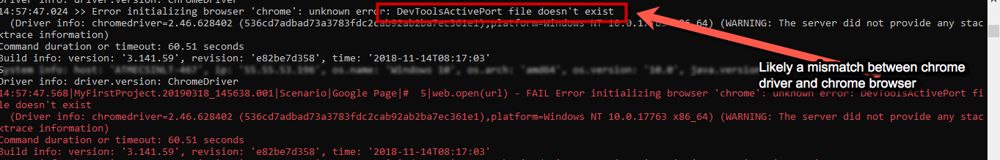
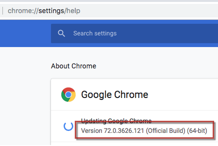
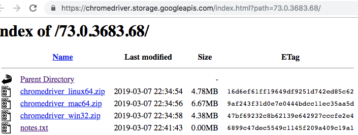

### Description
Around the advent of Chrome v72 (around February/March 2019), the chromedriver project team started to split out their 
driver releases to match the target browser. One can observe the same from the project's 
<a href="http://chromedriver.chromium.org/downloads" class="external-link" target="_nexial_link">Download page</a>:

Each major release of Chrome browser seems to be matched by a corresponding chromedriver. As such specific chromedriver
needs to be used to match the target Chrome browser. As one upgrades or downgrades one's Chrome browser, one would need
to download the corresponding chromedriver. More explanation can be found in the 
<a href="http://chromedriver.chromium.org/downloads/version-selection" class="external-link" target="_nexial_link">
Version Selection</a> page.

What's described above is a fairly recent change on the part of the chromedriver team. Nexial currently downloads the 
chromedriver automatically but without the consideration of the target Chrome browser. This could potentially lead to 
the wrong version of chromedriver being loaded and causing further issue - namely the
_infamous_ "`DevToolsActivePort: file doesn't exist`" error:

We are working on Nexial to improve the chromedriver download automation - _stay tuned!_ In the meanwhile, please do
the following to fix the above issue:

1. Check the version of your Chrome browser by type `chrome://settings/help` into the Location bar:
   
2. Open [`http://chromedriver.chromium.org/downloads`](http://chromedriver.chromium.org/downloads) and search for
   the matching version to download. For example,
   
   The above shows the available download for Chrome version 73.0.3683.68. Click on the link most appropriate to your
   operation system. If there isn't a matching chromedriver available to download, find the one closest to your browser. 
3. Unzip the downloaded chromedriver ZIP file. You should find the chromedriver file inside this zip file. Copy or move
   the chromedriver file to `$USER_HOME/.nexial/chrome` (for *NIX or MacOSX) or `%USER_HOME%\.nexial\chrome` (for 
   Windows). `USER_HOME` refers to your HOME directory.
   - Make sure Nexial is running and no instances of `chromedriver` is running at this time. Otherwise the file-copy
     operation might fail.
4. After this, you may restart Nexial execution.

