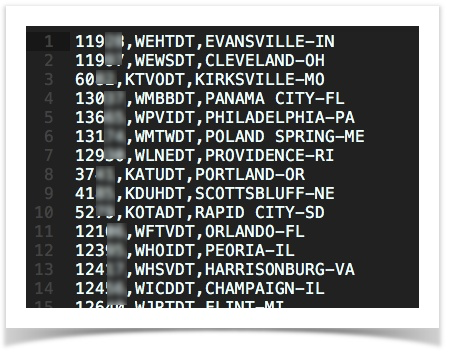
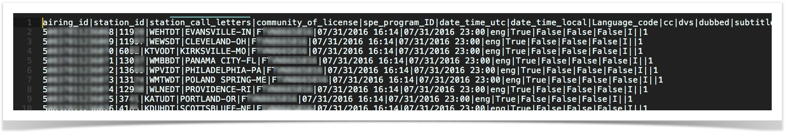
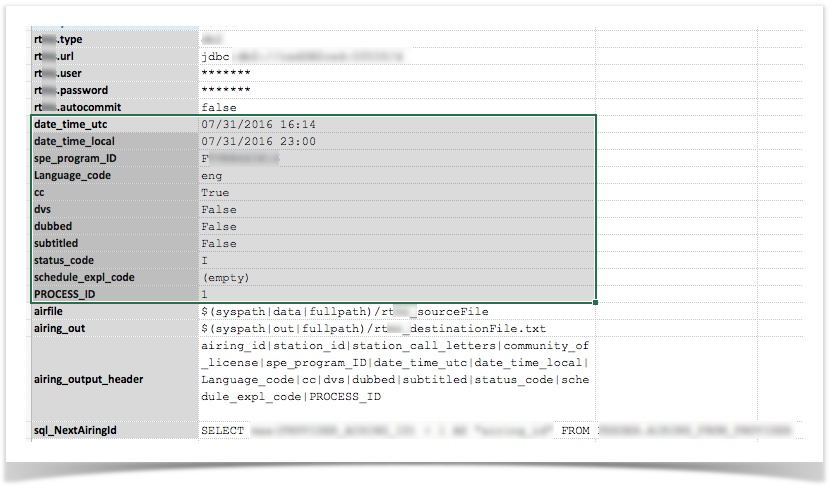
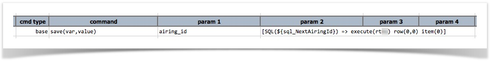
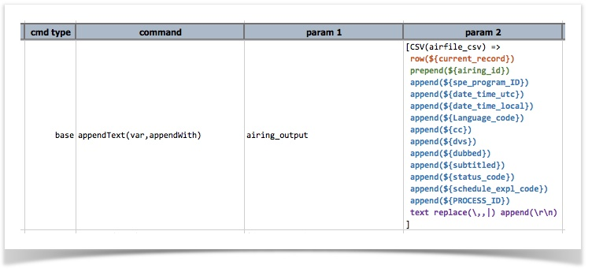
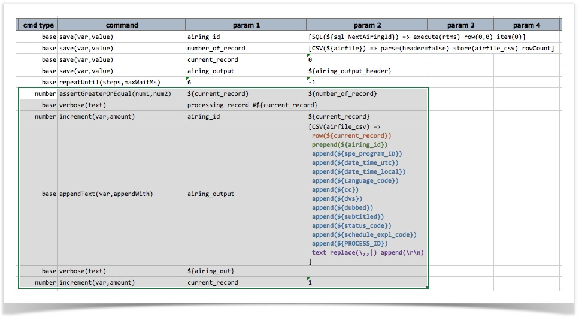
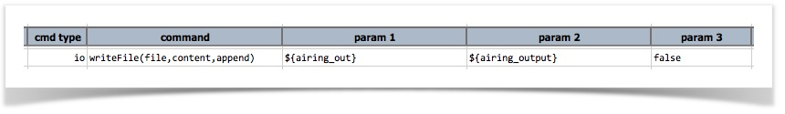

It is not uncommon that one may need to generate a CSV file - or any text file - based on the content of another file 
(seeding file). In the context of integration testing or cross-system testing, often the data you need are dispersed 
amongst multiple sources. Having a technique to transform or merge data of multiple sources can be very useful.

In this page, we'll describe a technique to generate a CSV file from (1) the content of another CSV file (seeding file) 
and (2) some data from database. Here's the backdrop:

1. The resulting (final) CSV file is pipe-delimited, with the first line as column header.
2. The seeding (first) file is a CSV file. Its content will be part of the final CSV file. However this file does not 
   have headers.
3. The final CSV file should also contain some data from database.
4. The final CSV file also has a number of columns with static data.

So basically, we want to turn something like this (data irrelevant to this page are masked): 

... into something like this (additional columns derived from database): 

With Nexial, this amounts to roughly 4 steps:
1. Data Setup
2. Merge each line of the seeding file with the appropriate SQL query result and static data
3. Append the merge (Step #2) to another variable
4. Write final content of the variable (Step #3) into the target output file.

Let's walk through the details of these steps.

### Data Setup
This step is mostly setting up data in a Nexial data file, like this: 

Shown above, there are a few different categories of data referenced here:
1. database connection - these are the first 5 data variables prefixed with `rt`  They are used for 
   [`establishing connectivity to target database`](../commands/rdbms/index.html).
2. `airfile` - this one refers to the seeding file (the first image above), which is a CSV file with 3 columns.
3. `airing_out` - this one refers to the final CSV (the second image above), which will be a pipe-delimited file 
   with 15 columns.
4. `airing_output_header` - this is the column header to be added to the start of the final CSV file.
5. `sql_NextAiringId` - the query to find the next "airing id", which is to be added as the first column in the final 
   CSV file.
6. static content - this is the highlighted section in the middle of the screenshot above. For our case, these data 
   values are static.

### Merge content
Before we can merge content, we want to retrieve some value from database and use it as part of the final CSV file. To 
do this, we use Nexial Expression, like so: 

The above expression executes a SQL query, `${sql_NextAiringId}`, and retrieve the first column of the first row as 
`${airing_id}`. 

Since the intention is a combination of the seeding content and static data values, we can also use Nexial Expression 
here to transform each row of the seeding file into the target format. Below show this intention realized via Nexial 
Expression, like this: 

The above screenshot is action-packed. To help dissect this, one should read it as follows:

> 1. take one row from the CSV file (`airfile_csv`); this row is represented by `${current_record}` as its index.
> 2. insert to the beginning of this row the `${airing_id}` (which is derived via query),
> 3. add to the end of this row with `${spe_program_id}`, `${date_time_utc}`, `${date_time_local}`, `${Language_code}`, etc.
> 4. convert this row to text, replace each comma (`,`) with pipe (`|`), and then add `CRLF` (carriage return) to the end of it.

The above can also be achieved through multiple commands. But hopefully it is clear that Nexial Expression is more 
concise and perhaps more readable than using multiple commands. The above would require around 15 - 17 commands to 
achieve the same.

### Append new content with existing one
Putting all these together, we need to loop through the number of rows found in the seeding file (`airfile_csv`). To do 
that, we use the [base &raquo; repeatUntil(steps,maxWaitMs)](../commands/base/repeatUntil(steps,maxWaitMs)) command. 
Within the loop, we will append each merged row of data into a variable (`airing_output`): 

The highlighted portion is the loop body (6 steps):
- The `verbose` steps are optional, and are to be used for debugging purpose. 
- The first and last step of the loop body is important.
  - The first step is to check if the loop should terminate or not: "_is `${current_record}` greater or equal to the 
    `${number_of_record}`?_". 
  - The last step increments `${current_record}` so that it will eventually be as large as the `${number_of_record}` 
    and force the loop to terminate.
- The third step increment `${airing_id}` so that each row (record) would be unique.
- The fourth step is the heavylifting of merge seeding data, database record and static data together as describe in 
  the [Merging content](#merge-content) section above.

### Write final output
Finally we write the value of `${airing_output}` to a file of our choice: 

Hopefully you'll find this useful and that it gives you some idea how to use Nexial Expression to expedite your 
automation authoring... Until next time...
