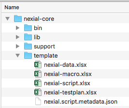



### When you want to create a new test script, how would you get a blank script to start with?
If you navigate to your Nexial installation directory, you should see a `template` directory underneath it, like this:

This template contains a few files – templates to get you starting a new test automation effort.  Let's have a closer 
look:

The `template` directory contains 4 files:
- **nexial-data.xlsx**: contains formatting rules to help differentiate between Nexial-specific data element and 
  application-specific / custom data element.  Technically one wouldn't need this template per se.  But it is 
  recommended to use this template for your new data file for consistency sake.
- **nexial-macro.xlsx**: contains the basic template of a Nexial macro script (reusable steps).
- **nexial-script.xlsx**: the basic template of a test script.
- **nexial-testplan.xlsx**: the basic template of a test plan.

Once you copy one of these template to your project directory, remember to (1) place it in the designated location 
(`script/` for scripts, `data/` for data, etc.), and (2) rename according to 
[convention](../quickstart/UnderstandingProjectStructure.md).

Lastly, the templates are shipped with each build.  They already contain the latest set of commands available as per 
the associated build.
