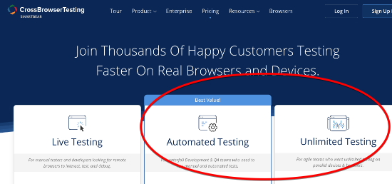
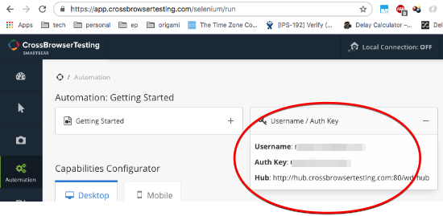
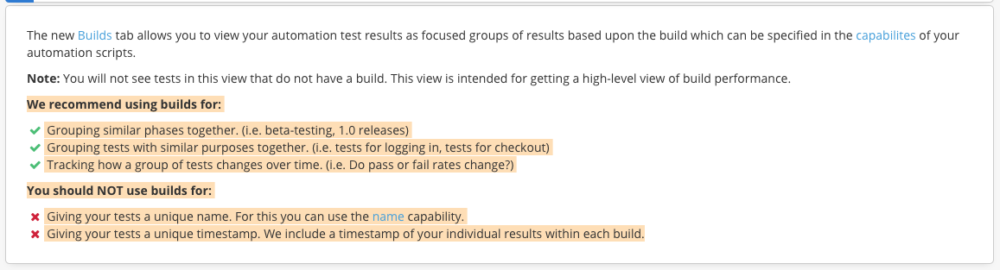
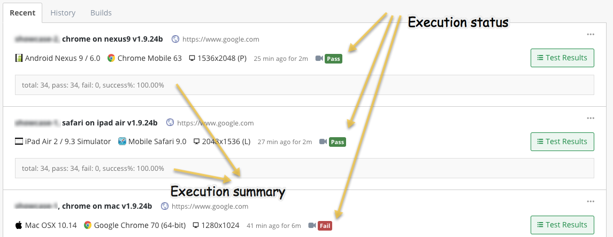
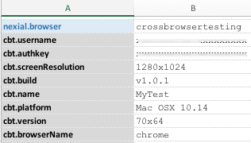
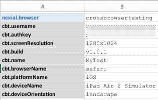
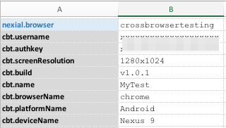

### Description
<a href="https://www.crossbrowsertesting.com/" class="external-link" target="_nexial_link">CrossBrowserTesting</a> 
(CBT hereafter) is a cloud-based cross-browser testing tool that enables web testing across various browsers on 
different operating systems and mobile devices, without requiring users to install virtual machines, devices or 
emulators. Its product offering includes <a href="https://crossbrowsertesting.com/live-testing" class="external-link" 
target="_nexial_link">Live Testing </a>, <a href="https://crossbrowsertesting.com/visual-testing" class="external-link" 
target="_nexial_link">Visual Testing</a>, <a href="https://crossbrowsertesting.com/automated-testing" 
class="external-link" target="_nexial_link"> Automated Testing</a>, and 
<a href="https://crossbrowsertesting.com/record-and-replay" class="external-link" target="_nexial_link">Record & 
Play</a>, as well as additional <a href="https://crossbrowsertesting.com/enterprise" class="external-link" 
target="_nexial_link">Enterprise-focused features</a>. Nexial (since version 1.8) has extended support to integrate 
CBT on-demand test automation capabilities, making it possible (_and easy too!_) to run your Nexial 
scripts on CBT.

Similar to the [BrowserStack support](BrowserStackIntegration), executing test automation on CBT via Nexial preserves 
the way execution result and output are generated. The steps to integration with CBT is straightforward:

1. Sign up for the appropriate CBT account. Be sure to select either 
   <a href="https://crossbrowsertesting.com/pricing" class="external-link" target="_nexial_link">the "Automated Testing" 
   or "Unlimited Testing" plan</a> in order to execute test automation. (_ya, it's not free..._) 
   

2. Note the Username and Auth Key in the <a href="https://app.crossbrowsertesting.com/selenium/run" class="external-link" 
   link="_nexial_link">Automation: Getting Started</a> page. 
   

3. Define the following data value in your test data sheet:

   |name                   |value                                                           |
   |-----------------------|----------------------------------------------------------------|
   |`nexial.browser`       |(**REQUIRED**) `crossbrowsertesting`                            |
   |`cbt.username`         |(**REQUIRED**) Your CBT username, as noted from Step 2 above.   |
   |`cbt.authkey`          |(**REQUIRED**) Your CBT Auth Key, as noted from Step 2 above.   |
   |`cbt.browserName`      |(**REQUIRED**) The name of the browser to test.                 |
   |`cbt.screenResolution` |(_OPTIONAL_) The preferred resolution of the OS for automated testing. The default is `1366x768`. Only applicable for desktop browser.|
   |`cbt.version`          |(_OPTIONAL_) The browser version to test. Default is `latest`.  |
   |`cbt.platform`         |(**REQUIRED** for desktop browser) OS for the target browser.   |
   |`cbt.deviceName`       |(**REQUIRED** for mobile browser) The target mobile device name.|
   |`cbt.deviceOrientation`|`landscape` or `portrait` (default)                             |

    
   Note that the last 2 data variables are needed only for mobile browser testing. For a list of supported OSes, device
   names and browsers please check 
   <a href="https://help.crossbrowsertesting.com/selenium-testing/tutorials/crossbrowsertesting-automation-capabilities/" 
   class="external-link" target="_nexial_link">CBT's Automation Capabilities page</a> for more details. CBT allows its 
   configuration values to be case-insensitive or spacing-independent.
   
   Additionally, for a more complete and formal definition of browser/OS supports, please check the following link, 
   which will render the listing as JSON: <a href="http://crossbrowsertesting.com/api/v3/selenium/browsers" 
   class="external-link" target="_nexial_link">http://crossbrowsertesting.com/api/v3/selenium/browsers</a>

4. If you are testing a website/webpage that can only be accessed within local network or intranet, be sure to enable
   CBT's <a href="https://help.crossbrowsertesting.com/local-connection/" class="external-link" target="_nexial_link">
   Local Connection</a> by setting `cbt.enablelocal` to `true`. Nexial will automatically download the OS-appropriate 
   CBT local connection tool (a.k.a. `cbt_tunnels`) and run it behind the scene. When the execution is complete, Nexial 
   will also attempt to terminate the CBT local connection tool.

   For more details about local testing via CBT, visit its 
   <a href="https://help.crossbrowsertesting.com/local-connection/general/local-tunnel-overview/#enabling-local-connection" 
   class="external-link" target="_nexial_link">Local Connection Overview</a> page.

5. In addition to the CBT-specific data variable as shown above, there are a few more data variables one can use to 
   enhance the test automation experience:
   
   |name                   |value                                                                              |
   |-----------------------|-----------------------------------------------------------------------------------|
   |`cbt.build`            |(_OPTIONAL_) free-form description of the build version of the target application. |
   |`cbt.name`             |(_OPTIONAL_) free-form description of your test.                                   |
   |`cbt.record_video`     |(_OPTIONAL_) `true` (default) to start video recording of the target browser during test (max length 10 minutes). |
   |`cbt.record_network`   |(_OPTIONAL_) `true` to record the network packages incurred by the test automation.|
   |`cbt.max_duration`     |(_OPTIONAL_) maximum test length in seconds. Use to refrain from timing out during long tests. Default is 30 minutes.|
   |`cbt.timezone`         |(_OPTIONAL_) timezone set on the browser.                                          |
   
    
   Check CBT's <a href="https://help.crossbrowsertesting.com/selenium-testing/tutorials/crossbrowsertesting-automation-capabilities/" 
   class="external-link" target="_nexial_link">Selenium Automation Capabilities</a> for more details.
   
   According to CBT documentation, `cbt.build` and `cbt.name` carry different connotations:
   

6. Nexial also supports execution status update on CBT's <a href="https://app.crossbrowsertesting.com/selenium/results" 
   class="external-link" target="_nexial_link">Test Center</a>. The execution status update can be performed at one of
   3 possible scopes via the `cbt.reportStatus` data variable:
   1. `cbt.reportStatus` = `iteration`: instructs Nexial to update execution status at the end of each iteration. Any 
      failed step within the same iteration would mark the execution status as `Fail` on CBT. This is most suitable
      when different browser (on CBT) is specified for each iteration. 
   2. `cbt.reportStatus` = `script`: instructs Nexial to update execution status at the end of each script (after all 
      iterations of such script is complete). This is suitable when the same browser (on CBT) is used throughout the
      execution of a script, regardless of iterations.
   3. `cbt.reportStatus` = `execution`: instructs Nexial to update execution status at the end of the execution. Any
      failed step within such execution would mark the execution status as `Fail` on CBT. 

   When updating execution status, Nexial also provide a summary of the execution relevant to the specified "scope". 
   Below is an example of how the execution status and corresponding summary appear in CBT:
   

7. That's it!  Run your test as you normally would. With CBT, the automation is performed remotely. You can watch the 
   execution in action via CBT's <a href="https://app.crossbrowsertesting.com/selenium/results" class="external-link" 
   target="_nexial_link">Test Center</a>. You won't see any browser being launched locally. However all the screenshots 
   are captured in the same way as with local browser testing.

#### Examples

- Enable web automation on Chrome v70 x64 on MacOS 10.14 (Mojave): 
  
- Enable web automation on Safari on iPad Air 2: 
  
- Enable web automation on the latest Chrome on Nexus 9: 
  
  

### See Also
- [System Variables](../systemvars)
