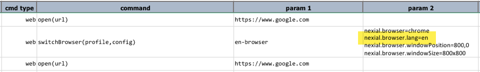
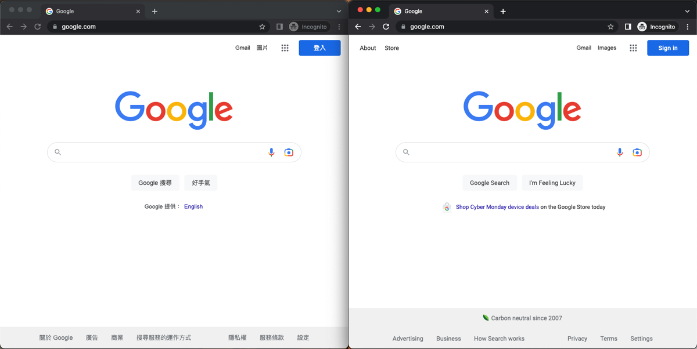
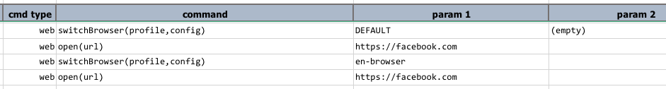
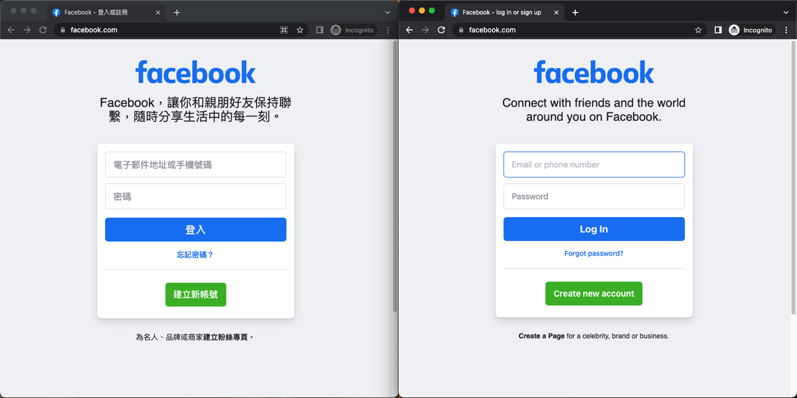

<style>
table {
	width: 950px;
	margin: 15px 0;
	font-size: 10pt;
	font-family: Tahoma, serif;
}

table th {
	font-weight: bold;
}

table td code {
	background-color: transparent;
	border: none;
	font-family: Consolas, monospace;
}

</style>

### Introduction
Multilingual websites deserve additional tests - namely language-related UX such as content layout and form submission.
Generally speaking, such type of testings are a subset of internationalization (i18n) testing.  With Nexial, we can 
automate some od the i18n testing within a single execution with the help of 2 specific features:
- [web &raquo; switchBrowser(profile,config)](../commands/web/switchBrowser(profile,config))
- System variable [`nexial.browser.lang`](../systemvars/index.html#nexial.browser.lang)

Read on to learn more.


### Configure the language
By default, web browser aligns to the language setting of its underlying operating system. For multilingual website 
testing, it is not always practical to change the language setting of the operating system in order to test the same
website rendered in another language. With Nexial, we can accomplish this by simply using the System variable 
[`nexial.browser.lang`](../systemvars/index.html#nexial.browser.lang).

One can pin this System variable via the appropriate data file, 
[`project.properties`](../userguide/UnderstandingProjectStructure.html#artifactprojectproperties), or command line for
just-in-time override. Here's an example how one could set this System variable via command line:

```shell
cd ~/projects/nexial-core/bin
./nexial.sh \
	-override nexial.browser.lang=es \
	-script ~/projects/MyProject/artifact/script/MyScript.xlsx \
	... ...
```
As a result, navigating to a language-aware website, such as Google Search, will render its content in Spanish (if the 
website supports Spanish).

For a good listing of all possible languages, check out the
<a href="https://en.wikipedia.org/wiki/List_of_ISO_639-1_codes" target="_nexial_link">List of ISO 639-1 codes</a>.


### Switching between multiple independent browsers
In addition to the ability to change browser language, Nexial also provides a way to open up multiple independent 
browsers - and possibly in different language setting. To accomplish this, we would use the
[web &raquo; switchBrowser(profile,config)](../commands/web/switchBrowser(profile,config)) command. With this command
we can switch between multiple independent browsers -- browsers that do not share cache or cookies -- and each browser
instance with different settings.

Let's see an example below:<br/>


Here, we are instructing Nexial to open `https://www.google.com` on one browser instance (the default browser instance), 
and then "switching" to another browser (new browser instance). Notice that the second 
argument of the `switchBrowser` command contains a series of settings:

```
nexial.browser=chrome
nexial.browser.lang=en
nexial.browser.windowPosition=800,0
nexial.browser.windowSize=800x800
```

... which effectively reads:

> create a new browser instance, named as `en-browser`, that is: 
>  - a Chrome browser,
>  - with browser language set to English
>  - with browser window position set to x-position 800, y-position 0
>  - with browser window size set to 800x800

The third command (`open(url)`) then opens `https://www.google.com` on the new browser instance.

We can execute the above script with the command line overrides to change the browser language to Chinese (`zh-TW`) and 
the browser window size to `800x800`:

```shell
cd ~/projects/nexial-core/bin
./nexial.sh \
	-override nexial.browser.lang=zh-TW \
	-override nexial.browser.windowSize=800x800 \
	-script ~/projects/MyProject/artifact/script/MyScript.xlsx \
	... ...
```

The end results looks like this:<br/>


Notice that the browsers are laid out side-by-side because of the `nexial.browser.windowPosition` configuration 
specified as part of the `switchBrowser()` command. Notice also that Google Search does not look the same when 
rendered in English and Chinese. Clearly more i18n testing is needed here!

We can now switch between these 2 browser instances using the same `switchBrowser()` command. For example, we can
open up another website on both browsers to test out the content layout under different language rendering:<br/>

<br/>

Note that the default browser instance has a "profile" name as `DEFAULT`.

Here are how they look side-by-side:<br/>


