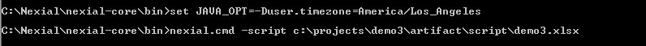
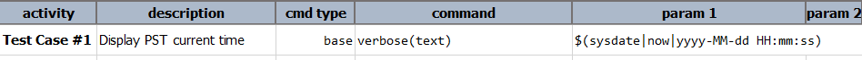
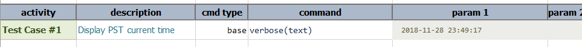

### Description
Nexial supports the rendering of date/time information in specified timezones via the setting of System property 
**BEFORE** execution. The timezone change will impact the entire execution, but it may be altered or remove before 
executions. Note that specifying such System property in the data file will have no effect.  One can specify
this from command line like following:<br/>
```
set JAVA_OPT=-Duser.timezone=America/Los_Angeles
```

... where `America/Los_Angeles` is desired timezone ID. For all the timezone IDs, please refer to 
<a href="https://garygregory.wordpress.com/2013/06/18/what-are-the-java-timezone-ids/" class="external-link" 
target="_nexial_link">Java Timezone IDs</a>.

**This will not change the timezone of your local or remote workstation. It will only change the timezone within 
Nexial during that execution.**


### Example
Execute scripts through command line like this:<br/>


Script:<br/>


Output:<br/>


