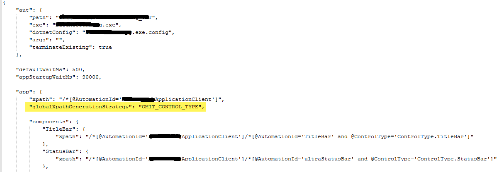

### XPath for better desktop automation performance
Nexial auto scans the desktop elements by using `XPATH`, that is being provided through `application.json` file for 
the respective form. Providing an efficient `XPATH` for the desktop components and an additional info in 
`application.json` file as mentioned below, would improve the performance in accessing the desktop elements during 
script execution.

### How to make an efficient `XPATH`?  The below steps may help
- If the desktop component has `@AutomationId` attribute and the value is consistent, use only this attribute to find 
  the component and no need to combine with other attributes like `@ControlType`.
- Nexial uses this as parent `XPATH` and auto scans all the child elements for that form. So, all the child elements 
  will have the `XPATH` until the parent element same as that was provided in application.json file.
- If you want to omit adding `@ControlType` attribute, for all the child elements that are auto scanned, specify 
  `"globalXpathGenerationStrategy": "OMIT_CONTROL_TYPE"` in the `"app"` section of `application.json`. This will be 
  applied to all the components.
- By providing this, it will omit adding the **`@ControlType`** of the element while creating cache json file for all 
  the elements.
- It is an optional information that user needs to provide if the XPATH to be generated omitting `@ControlType`.
  

### How to convert the existing json files? Use the tool included in Nexial
- `XPATH`s used in `application.json` file (including cache json files) for all the desktop components, could be 
  modified to achieve optimized `XPATH`s which means avoiding `@ControlType` when `@AutomationId` is provided.
- `nexial-desktop-xpath-update.cmd` is able to convert the `XPATH`s for the existing json files.
- Converting XPATHs in the existing json files
	 1.  From command line, run `nexial-desktop-xpath-update.cmd -t <filePath>`
	 2.  file path can be a folder location where all the json files exists or can be a specific json file
	 3.  A backup folder will be created with timestamp to save all the existing json files before conversion.
