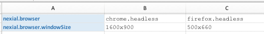

### Execute Scripts in Headless Browser
**Note: Refer to [System Variables](../systemvars) page for more details.  Search for for `nexial.browser` and 
`nexial.browser.windowSize`**

In order to execute your Web automation in headless browser, do the following:
- In the corresponding data file, set `nexial.browser` as `chrome.headless` or `firefox.headless`.
- In the same data file, set `nexial.browser.windowSize` to desired width/height.  Note that both width and height must 
  be greater than 100 (pixels).

For example: 

