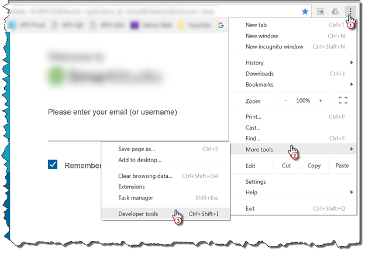
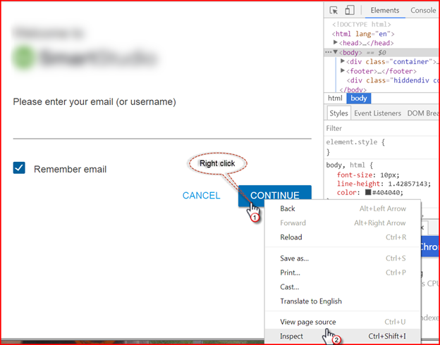
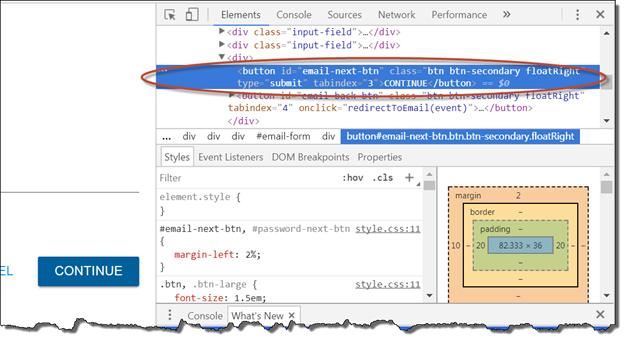
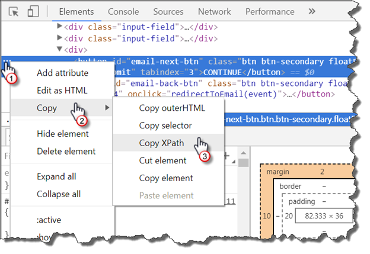
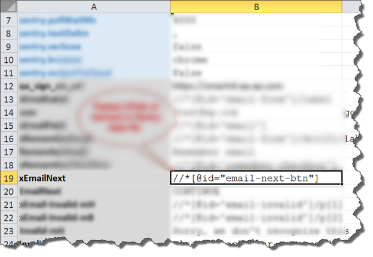
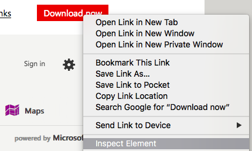
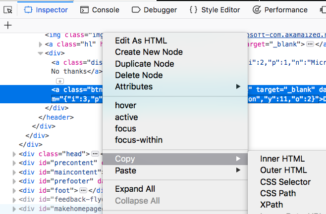

This page illustrates how one can get properly formatted XPaths right from the browser - Chrome and Firefox - for use 
within a Nexial script. 

## Chrome
Chrome includes <a href="https://developers.google.com/web/tools/chrome-devtools/" class="external-link" 
target="_nexial_link">Developer Tools (or DevTools)</a> which enables the inspection of web content. This enables us to
inspect web element and retrieve the corresponding locator.

With Chrome browser is opened:
1. Navigate to the page of interest.
2. Open the Developer tools window in Chrome. 
   
3. Next, right click over the desired element on the web page and select Inspect from the dialog box. 
   
4. The upper right pane of develop tools window will highlight the element in blue. 
   
5. Click the ellipsis in the left of the highlighted area and select **Copy -> Copy XPath** from the dialog box that 
   appears. 
   
6. Paste the XPath into your data script. 
   

## Firefox
Similar capability exists with Firefox as well. Check Firefox documentation for details. With Firefox browser opened:
1. Navigate to the page of interest.
2. Right-click on the web element of choice. Then select Inspect Element. 
   
3. The Web Developer Tool will open, most likely at the bottom of the Firefox browser.
4. The corresponding HTML of the select web element should now be highlighted under the Inspector tab.
5. Right-click on the highlighted HTML and select Copy -> XPath.<br/
   
6. Paste the XPath into your data script.

Note that the pasted XPath uses double quotes to qualified ID. Both double quotes and single quotes are acceptable, 
and certainly the case for Nexial. Moreover, one should be able to do the same for CSS Selector as well.

