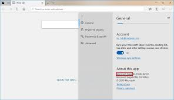
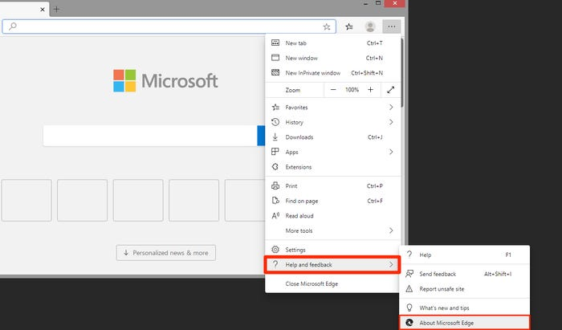
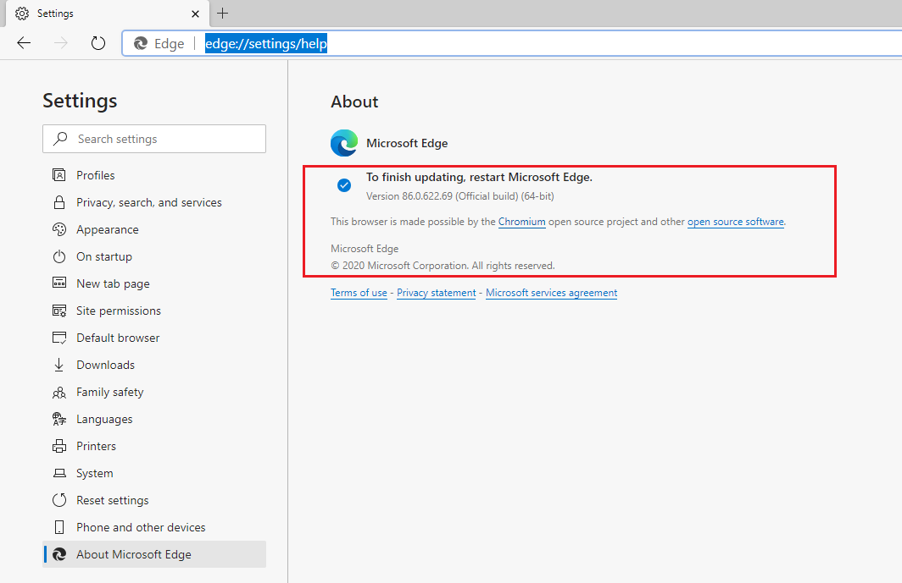

### Description
Edge was initially built with Microsoft's own proprietary browser engine EdgeHTML. Microsoft rebuild browser 
based on Chromium open source project to create better web compatibility for users and less fragmentation for developers.
So, the original version of Edge is now officially called the “Legacy” version of Edge. 
You can still download the new Edge `chromium-based` from [`Microsoft’s website`](https://www.microsoft.com/en-us/edge) 
After installation, it will replace the old Edge browser with the new version. Also, it will be automatically upgraded to 
latest version.
To ensure PCs don’t automatically download and install the new Edge, Microsoft offers a 
[Chromium Edge update blocker toolkit](https://docs.microsoft.com/en-us/deployedge/microsoft-edge-blocker-toolkit)

### Check Edge Legacy Browser Version
To find out which edge legacy browser version is available on PC, please go through following steps.
1. Open Microsoft Edge Legacy, 
2. Select `Settings and more` at the top right corner of the window, then select Settings .
3. Scroll down and look for your version under `about this app`. 

### Check Edge Chromium-Based Browser Version
To find out which new edge browser(chromium based) version is available on PC, please go through following steps. 
1. Open the new Microsoft Edge, select `Settings and more` at the top of the window, 
2. Then, select `Help And feedback` from menu bar.
3. Click on `About Microsoft Edge`. 

3. Alternatively, direct search `edge://settings/help` in new Edge Browser url window. 
In the following image, you can see latest version made by `chromium` open source project. 

