### Description
Currently Nexial automatically downloads and installs the latest webdriver in accordance to the target browser specified
for an execution. This might result in a slight delay during the initial execution when the corresponding webdriver
is not yet installed. However the overall benefits are a smaller Nexial distribution to download (or to update), a 
smaller footprint on the test harness (the compute resource where the execution is conducted), and a simpler way to
manage webdriver updates. Webdriver development are maintained by separate third-party teams, often open-source teams.
As such, one needs to stay up-to-date with their development progress in order to obtain the appropriate webdriver
suitable for one's automation needs. Nexial simplifies this via periodic, automatic webdriver updates.

As of now, below is the webdriver update schedule in Nexial:

#### Webdriver Update Schedule

| Browser             | WebDriver                | Update Frequency                          | Update From             |
|+--------------------|+-------------------------|+------------------------------------------|+------------------------|
| Firefox             | `geckodriver`            | Bi-weekly                                 |[https://github.com/mozilla/geckodriver/releases](https://github.com/mozilla/geckodriver/releases) |
| Chrome              | `chromedriver`           | Bi-weekly                                 |[https://chromedriver.chromium.org/downloads](https://chromedriver.chromium.org/downloads) |
| Electron            | a fork of `chromedriver` | Bi-weekly                                 |[https://github.com/electron/electron/releases](https://github.com/electron/electron/releases) |
| Internet Explorer   | `IEDriverServer`         | Bi-weekly                                 |[http://selenium-release.storage.googleapis.com/index.html](http://selenium-release.storage.googleapis.com/index.html) |
| Microsoft Edge      | `MicrosoftWebDriver`     | None; pre-installed as part of Windows 10 ||
| BrowserStack        | `BrowserStackLocal`      | Monthly                                   |[https://www.browserstack.com/local-testing/automate](https://www.browserstack.com/local-testing/automate) |
| CrossBrowserTesting | `cbt_tunnels`            | Monthly                                   |[https://github.com/crossbrowsertesting/cbt-tunnel-nodejs/releases](https://github.com/crossbrowsertesting/cbt-tunnel-nodejs/releases) |

 

#### How does Nexial update the webdriver
As part of the webdriver installation, Nexial creates a `.manifest` file in the same directory of the webdriver. This 
`.manifest` file contains the "last check timestamp" such that Nexial can use it to determine the next "check for 
update". During execution, if Nexial determines that the corresponding webdriver is due for a "check for update", it 
will automate the checking process (against the appropriate webdriver website). If a newer webdriver is found, the 
download and installation process will occur immediately. Subsequently the "last check timestamp" will be updated to
the corresponding `.manifest` file. Webdrivers are installed to the `$HOME/.nexial/{webdriver}` directory. Below is an 
example of such directory, along with the `.manifest` file: 

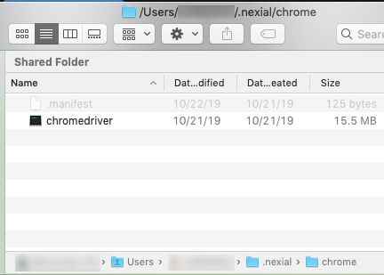   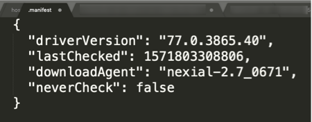

The checking and update process are largely transparent to Nexial user, albeit a slight delay during installation 
process. However the benefits, as stated above, easily outweigh the infrequent and small delays.
 
#### But...
There are two possible issues that might arise:
1. The target browser has been updated on your test harness between 2 consecutive "check for update" 
   intervals (e.g. browser is updated a few days after the last check).
   - In this case, one can force Nexial to install the latest webdriver. See 
     [Forcefully update webdriver](#forcefully-update-webdriver) section below for details.

2. The target browser is older than the corresponding webdriver - perhaps one might have good reason to retain an older
   version of the browser.
   - In such case, one can manually download the appropriate webdriver (if need be) and reconfigure the 
     corresponding `.manifest` file to omit any webdriver checks (and hence no updates). See 
     [Forcefully omit webdriver update](#forcefully-omit-webdriver-update) section below for details.

### Forcefully update webdriver

    <ul class="tab-links tabs-collapsed">
        <li class="active"><a href="#tab1">Windows</a></li>
        <li><a href="#tab2">Mac OSX</a></li>
    </ul>
    

        

        <ol>
            <li>
              Open Windows Explorer and go to <code>C:\Users\%USER_ID%\.nexial</code> directory. %USER_ID% refers to 
              your user ID. 
              Or simply, open the <code>Run</code> dialog via <b><code>WINDOWS+r</code></b>, type <code>.nexial</code> 
              and then click the <b><code>OK</code></b> button. 
              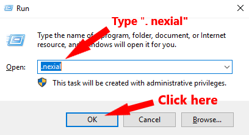
            </li>
			<li>
              Then, find the sub-directory under <code>C:\Users\%USER_ID%\.nexial</code> that corresponds to the 
              webdriver to be updated. Simply delete that directory. 
              For example, if <code>chromedriver</code> needs to be updated, simple delete the <code>chrome</code> 
              folder. 
              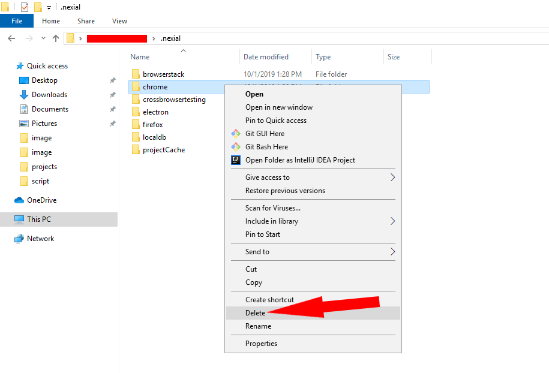
			</li>
			<li>
              Nexial will install the latest webdriver as part of the next execution.
			</li>
        </ol>
        

        

        <ol>
            <li>
              Open Finder.app via Spotlight: 
              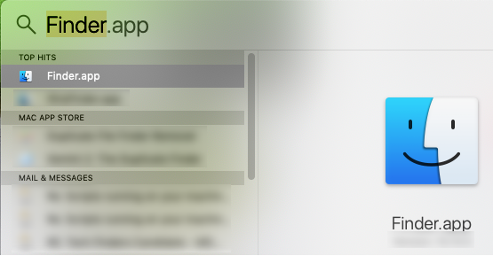 
            </li>
			<li>
              From Finder, open to the <code>.nexial</code> directory under your HOME directory via 
              <code>COMMAND-SHIFT-G</code> and then type in <code>~/.nexial</code>: 
              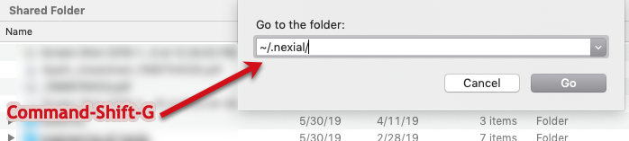 
              Note: the <code>~/</code> characters means your HOME directory.
			</li>
			<li>
			  Locate the sub-directory under <code>.nexial</code> directory that corresponds to the webdriver to be
			  updated. Simply delete that directory.  
              For example, if <code>chromedriver</code> needs to be updated, simple delete the <code>chrome</code> 
              folder. 
              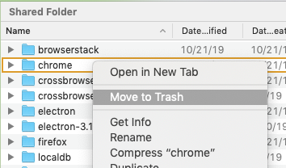
			</li>
			<li>
			    Nexial will install the latest webdriver as part of the next execution.
			</li>
        </ol>
        

    

 

### Forcefully omit webdriver update

    <ul class="tab-links tabs-collapsed">
        <li class="active"><a href="#tab1">Windows</a></li>
        <li><a href="#tab2">Mac OSX</a></li>
    </ul>
    

        

        <ol>
            <li>
              Open Windows Explorer and go to <code>C:\Users\%USER_ID%\.nexial</code> directory. %USER_ID% refers to 
              your user ID. 
              Or simply, open the <code>Run</code> dialog via <b><code>WINDOWS+r</code></b>, type <code>.nexial</code> 
              and then click the <b><code>OK</code></b> button. 
              
            </li>
			<li>
              Open the corresponding sub-directory for the webdriver in question. 
              For example, if user wants to omit update for <code>chromedriver</code> open the <code>chrome</code> 
              directory. 
              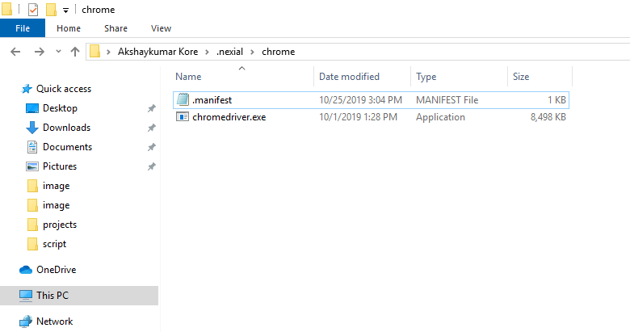
			</li>
			<li>
              Open the <code>.manifest</code> file with a text editor. 
              
            </li>
			<li>
			    Set <code>"neverCheck"</code> to <code>true</code> and save the file 
                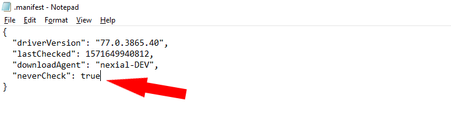			    
			</li>
			<li>
			  You might need to download the appropriate webdriver and place it this sub-directory. Use the 
			  <a href="#webdriver-update-schedule">Webdriver Update Schedule</a> above to download the appropriate 
			  webdriver, which should be unzipped/copied to the same sub-directory. In other words it should override 
			  existing webdriver file.
			</li>
			<li>
			    Start your execution on Nexial.
			</li>
        </ol>
        

        

        <ol>
            <li>
              Open Finder.app via Spotlight: 
               
            </li>
			<li>
              From Finder, open to the <code>.nexial</code> directory under your HOME directory via 
              <code>COMMAND-SHIFT-G</code> and then type in <code>~/.nexial</code>: 
               
              Note: the <code>~/</code> characters means your HOME directory.
			</li>
			<li>
              Open the corresponding sub-directory for the webdriver in question. 
              For example, if user wants to omit update for <code>chromedriver</code> open the <code>chrome</code> 
              directory. 
              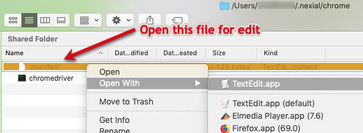
			</li>
			<li>
              Open the <code>.manifest</code> file with a text editor. Set <code>"neverCheck"</code> to 
              <code>true</code> and save the file. 
              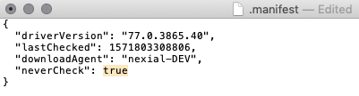
            </li>
			<li>
			  You might need to download the appropriate webdriver and place it this sub-directory. Use the 
			  <a href="#webdriver-update-schedule">Webdriver Update Schedule</a> above to download the appropriate 
			  webdriver, which should be unzipped/copied to the same sub-directory. In other words it should override 
			  existing webdriver file.
			</li>
			<li>
			    Start your execution on Nexial.
			</li>
        </ol>
        

    

