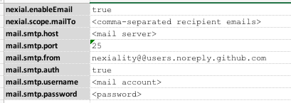

### Introduction
Nexial supports email notification and sent-mail automation via the [mail](../commands/mail/index) automation.  But
with some mail servers, setting things up can be a bit tricker.  In general, Nexial would need the following information
in order to send out email notification:

1. Turn on email notification by setting the System variable [`nexial.enableEmail`](../systemvars/index#nexia.enableEmail) 
   to `true`.
2. Define the recepient(s) for the email notification.  Multiple email addresses should be separated by comma (`,`).
3. Email host
4. Email port (typically port 25)
5. Is authentication required to send email?
   - If YES, then indicate as such and also provide email address and password.

Setting up the above information can be done via command line, `project.properties` and, in _some cases_, the data
file. Once it is set up, one can use it for one or more scripts or projects.

Let's see how we can set things up to enable email notification.

### Via Command Line

(on *NIX/MacOS):<br/>
```bash
export JAVA_OPT="-Dnexial.enableEmail=true -Dnexial.mailTo=<recipients> "
export JAVA_OPT="$JAVA_OPT -Dmail.smtp.host=<mail server> -Dmail.smtp.port=25 "
export JAVA_OPT="$JAVA_OPT -Dmail.smtp.from=nexiality@@users.noreply.github.com "
export JAVA_OPT="$JAVA_OPT -Dmail.smtp.auth=true -Dmail.smtp.username=<email> -Dmail.smtp.password=<password>"
... ...
./nexial.sh -script ~/projects/... ...
```

<br/>

(on Windows):<br/>
```batch
set JAVA_OPT=-Dnexial.enableEmail=true -Dnexial.mailTo=<recipients> 
set JAVA_OPT=%JAVA_OPT% -Dmail.smtp.host=<email server> -Dmail.smtp.port=25 
set JAVA_OPT=%JAVA_OPT% -Dmail.smtp.from=nexiality@@users.noreply.github.com  
set JAVA_OPT=%JAVA_OPT% -Dmail.smtp.auth=true -Dmail.smtp.username=<email> -Dmail.smtp.password=<password>   
... ...
nexial.cmd -script C:\projects\... ...
```

<br/>

### Via project.properties
The `project.properties` is expected to be found under the `artifact/` directory.

```properties
nexial.enableEmail=true
nexial.scope.mailTo=<comma-separated recipient emails>

mail.smtp.host=<mail server>
mail.smtp.port=25
mail.smtp.from=nexiality@@users.noreply.github.com
mail.smtp.auth=true
mail.smtp.username=<mail account>
mail.smtp.password=<password>

```


### Via data sheet
<br/>
<br/>

### Combining to Improve Flexibility
It is important to note that it is entirely possible to mix up the above 3 techniques to improve flexibiltiy.  For 
example, one might have a series of scripts configured to send email notification to `email_1` and `email_2`,
but when these scripts are executed in the Jenkins environment, email notification should be sent to `email_3` and
`email_4`.  There wouldn't be a need to modify existing scripts or `project.properties`.  Instead, one can specify
the new email recipients via System variable, like this:

```bash
export JAVA_OPT=-Dnexial.mailTo=<email_3,email_4>
... ...
./nexial.sh -script ... ...

```

Only the `nexial.mailTo` System variable is needed here.  The rest of the mail settings can remained in data sheets or
`project.properties`.  Hence one would only add the "changed" setting in System properties as and when needed.


### Email Notification via Gmail
Since Gmail is a very popular email solution, it's worth the effort to provide Gmail-specific settings here.

```properties
nexial.enableEmail=true
nexial.mailTo=<recipients>
mail.smtp.host=smtp.gmail.com
mail.smtp.port=587
mail.smtp.from=nexial-noreply@gmail.com
mail.smtp.starttls.enable=true
mail.smtp.auth=true
mail.smtp.username=<email>
mail.smtp.password=<password>
```

Note that `mail.smtp.starttls.enable` is **REQUIRED** to be `true` for Gmail.  Same for `mail.smtp.auth` and the 
target email and password for authentication.


