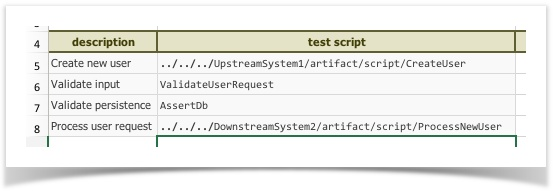
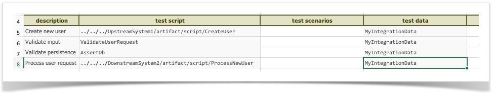

At times, one finds the need to use the test artifact from another projects – this is a good thing.  The ability to 
re-use (or borrow) test artifacts from another team/project provide us the ability, not only to capitalize each other's 
effort, but also to integrate two or more project's test cases to fulfill a more complete test scenario, or a test 
scenario that reaches a wider scope.  This is, by and large, the meaning and purpose of Integration Testing.  By 
chaining test scripts (or test plan) from separate but related projects, one can simulate more closely the intended 
user activities and business workflow, and how the affected systems react accordingly.

There are a few things to note when implementing Integration Testing.  We'll add more as and when relevant information 
is available.

1.  **Effective mechanism to invoke "external" scripts**
    1.  Make sure you have checked out all the relevant projects and put them under `C:\projects\` (Windows) or 
        `/Users/[user_id]/projects/` (OSX).  For example, 
         
         **Multiple projects under C:\projects**
        
            C:\projects  
               +-- nexial-core  
                   ... ...  
               +-- MyProject  
                   +-- artifact  
                       +-- data  
                       +-- plan  
                       +-- script  
               +-- MyOtherProject  
                   +-- artifact  
                       +-- data  
                       +-- plan  
                       +-- script  
                   +-- UpstreamSystem1  
                       +-- artifact  
                           +-- data  
                           +-- plan  
                           +-- script  
               +-- DownstreamSystem2  
                   +-- artifact  
                       +-- plan  
                       +-- script  
                       +-- data
        
    2.  If the dependent projects are under the same directory (such as `C:\projects\`), we can use _relative path_ 
        to reference them.  Essentially, use the `..` syntax to navigate to parent directory:  
        
        
        Note the use of `..` in the first script (Row 5) and last script (Row 8).  The `..` notation means the 
        parent directory.  In this case, the starting point is the script directory of the current project 
        (i.e. `C:\projects\MyProject\artifact\script`).  Hence,
        
        `../../../UpstreamSystem1/artifact/scrip/CreateUser`  would be:
                
	           |  |  |  
	           \-------\>  C:\projects\MyProject\artifact (referenced by the 1st set of ..)  
	              |  |  
	              \----\>  C:\projects\MyProject (referenced by the 2nd set of ..)  
	                 |  
	                 \->  C:\projects (referenced by the 3rd set of ..)
        
        By using this technique, we can reference "external" project without using "fully qualified path" 
        (such as `C:\projects\TheOtherProject`).  Also, using `/` (instead of `\`) will ensure cross-platform 
        compatibility.  The same technique is applicable for the data files.  

2.  **Effective mechanism to control and unify test data**  
    Instead of using the data file from the source projects - i.e. use data file from 
    `C:\projects\DownstreamSystem2\artifact\data` or from `C:\projects\UpstreamSystem1\artifact\data`- combine the 
    test data into another data and house it within your project.  Consider this:  
      
    
    By using the same test data file, one has more control to adjust and fine-tune what's needed for Integration Testing  
      
3.  **Effective mechanism to group the test output**  
    1. Use `nexial.runID.prefix` to so that output directory can appropriately reflect the intent of your 
       Integration Testing.  See **[`this`](../systemvars/index.html)** for more info.
    2. Use `nexial.scriptRef.*` or `nexial.scenarioRef.*` to annotate your execution output.  Often in Integration 
       Testing, it is useful to provide some form of contextual information, such as `Company Name`, `Environment`, 
       `Client ID`, etc. so that reader of your execution output can easily associate an execution output to its 
       intent.  Using `nexial.scriptRef.*` we can provide contextual information about a script or iteration.  Using 
       `nexial.scenarioRef.*` we would contextualize a test scenario.  See **[`System Variables`](../systemvars/index.html)** 
       for more details.
    3. Make use of Nexial Execution Dashboard to provide a visual summary of your Integration Testing, both the 
       latest and those completed in the past.

