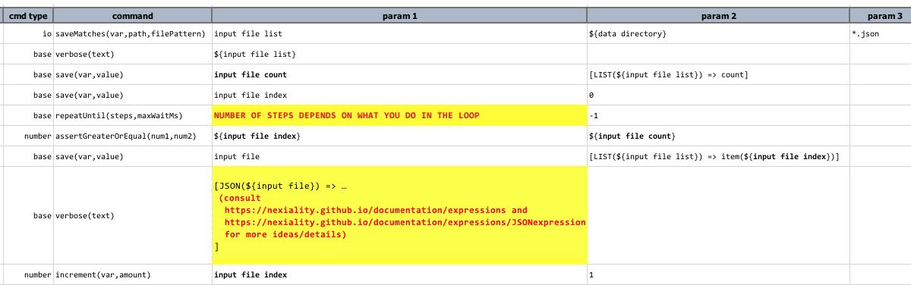

### Context
You have a set of files to be processed in the same way, but the number of files is dynamic.

### Solution
A combination of [io &raquo; `saveMatches(var,path,filePattern)`](../commands/io/saveMatches(var,path,filePattern)) 
and [base &raquo; `repeatUntil(steps,maxWaitMs)`](../commands/base/repeatUntil(steps,maxWaitMs)) would like do the 
job.  Here's an example: 

Let's walk through the steps: 
1. Using [io &raquo; `saveMatches(var,path,filePattern)`](../commands/io/saveMatches(var,path,filePattern)) to gather 
   a list of JSON files from `${data directory}`, which can be a local or network directory.  Note that `filePattern` 
   can be used to filter by file name pattern, such as `2017Q4*.json`, `project*.json`, `myFile.*`.
2. The list of matching files is saved to `input file list`, which is an array (or list).  To find the number of 
   matches found, we can use [`Nexial Expression`](../expressions) like this:  
   `     LIST(${**input file list**}) => count]`      
    Check out [`LIST` expression](../expressions/LISTexpression) for more of what you can do with array/list via 
    [Nexial Expression](../expressions).
3. Next, we iterate through the list of matched files so that these files can be processed one at a time.  To do so, 
   we need:
   1. The number of matches found – **input file count** (see above, Row 7)
   2. The starting index of the matched file list – **input file index** (see above, Row 8)
   3. The number of steps to perform within one iteration (see above, Row 9)
   4. The condition to which the iterate would end – this usually involves some form of assertion to compare the 
      current file index against total number of file (see above, Row 10)
4. During the iteration, each file is identified via a file index (**`input file index`** in this case).  As a 
   convenience, one can save such file to another variable (see above, Row 11) before further processing
5. In this example, the file processing is omitted for brevity (Row 12).  While any number of steps is possible, be 
   sure to update the `steps` parameter in the enclosing 
   [base &raquo; `repeatUntil`](../commands/base/repeatUntil(steps,maxWaitMs)) command (Row 9).
6. Finally, don't forget to increment the file index (**`input file index`**) within the iteration in order to 
   forward to subsequent file (Row 13).
