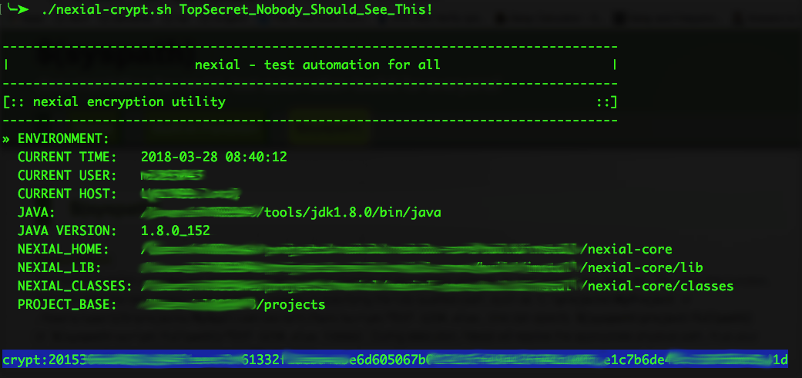

### Description

For sensitive information such as password, it may be important to store them encrypted at rest to avoid tampering or 
misuse.  Nexial ships with an utility to support this.  At a high level, this is how it works:

1. A Nexial user uses the nexial-crypt utility to encrypt the sensitive information.
2. The nexial-crypt utility provides the encrypted form back to the Nexial user.
3. Nexial user then copy the encrypted data into the appropriate data file.
4. During automation, Nexial will dynamically decrypt the encrypt data as and when it is referenced within the 
   corresponding Nexial script.
5. However, Nexial will not convert the encrypted form to its original form in the Nexial output file(s).

It should be considered as best practice to encrypt information that would otherwise be misused.  In a team setting 
where automation scripts are made available (e.g. via SCM), this is especially important.  This utility can be found 
in the `bin` directory of `${NEXIAL_HOME}`:

### Usage
1.  Open a console and point it to `${NEXIAL_HOME}/bin`
2.  Run `nexial-crypt.cmd` (Windows) or `./nexial-crypt.sh` (*NIX, OSX) with the target sensitive data as an argument:  
    
3.   The script will encrypt the argument and provide the encrypted form:  
    
4.  Copy the highlighted encrypted data to data file:  
    
5.  That's it! Now you can reference this data via its name, as is `${TopSecret}`.

### Notes:

1. At times, using command line console (especially on Windows) can present some challenges when encrypting special 
   characters such as pipe (`|`), percent (`%`), ampersand (`&`) or question mark (`?`).  When dealing with special 
   character, be sure to surround the entire input parameter with double quote.  For example, 
   `nexial-crypt.cmd "ab&c"`
   
   `nexial-crypt.cmd "ab|c"`  
2. If the intent input contains double quote (`"`), then one would need to surround the entire input with double 
   quote, and also prepend the double quote with another double quote.  For example, 
   `nexial-crypt.cmd "ab""c"`

