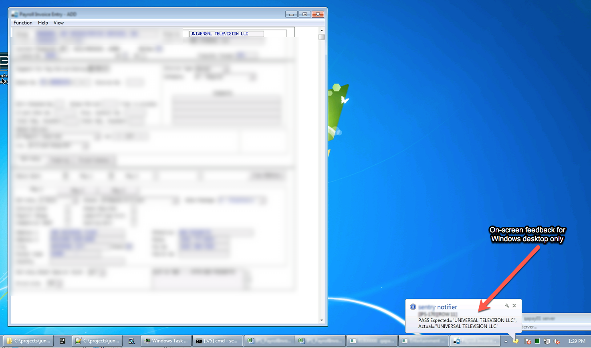
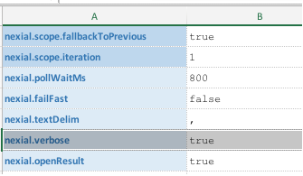

### Description

Nexial supports on-screen feedback during automation so that Nexial user can be better informed of the progress of 
the automation. This is especially useful when a specific step or a series of commands do not result in some form of 
visual changes in the target application. Consider the following example test automation script:

    1.  Open application `X`.
    2.  Open form `Y`.
    3.  Fill in form `Y` to pull up desired record.
    4.  Validate that `Field 1` has the expected value.
    5.  Validate that `Field 2` has the expected value.
    6.  Validate that `Field 3` has the expected value.
    7.  Validate that `Field 4` has the expected value.
    8.  Validate that `Field 5` has the expected value.
    9.  Validate that `Field 6` has the expected value.
    10.  Validate that `Field 7` has the expected value.
    11.  Validate that `Field 8` has the expected value.
    12.  Validate that `Field 9` has the expected value.
    13.  Validate that `Field 10` has the expected value.
    14.  Close form, close app.

A simple automation as it would seemed.  However, it is unlikely that there are any visual changes to the application 
during Step 4 through 13.  In order that Nexial user can stay informed and a better sense of what's going on, Nexial 
can optionally _flash _on-screen feedback of the command as each of them are being executed.  For example,

The above screenshot shows a "_balloon_" being displayed at the bottom-right corner of the desktop.  This is the 
on-screen feedback that is integrated into Nexial.  As each command is executed, a new feedback is generated.

Note that the on-screen feedback will automatically hide after 5 seconds.  The on-screen feedback feature is optional.  
Next section will explain how to enable this feature.

### How to Enable On-Screen Feedback
1.  Enable `nexial.verbose` system variable, like this:  
      
    For more details about this or any system variable, visit the [`System Variable page`](../systemvars/index.html).
2.  That's it!  Run your test as you normally would.

### See Also
-  [Record/playback a Nexial automation run](RecordPlayback)