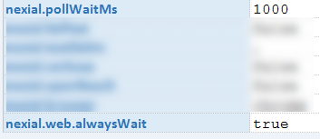
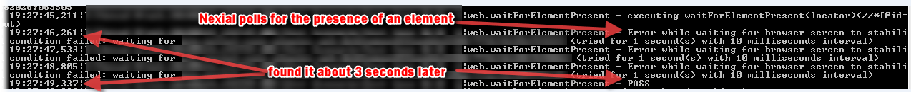

**Note: This page reference two [System variables](../systemvars/index): 
[`nexial.pollWaitMs`](../systemvars/index#nexial.pollWaitMs) and 
[`nexial.web.alwaysWait`](../systemvars/index#nexial.web.alwaysWait)**

### Problem

As with most web applications, any given web page will take certain time to load all its elements and resources. The 
amount of time required to completely load all the referenced elements and resources (so called the 
"total page load time") is often unpredictable and inconsistent due to the asynchronous nature of modern day browser 
architecture and web application framework. In addition, the dynamic change in network usage plays a part in this as 
well. However for web automation, it is often desirable, if not necessary, to wait for this "total page load time" 
before proceeding to further page interaction, such as clicking a button, input to a text box, check a checkbox, etc.
Without proper wait time, our web automation script could fail or produce undesirable results, leading to something 
commonly known as **test flakiness**.

This article describes two possible wait strategies to help overcome **test flakiness** in your web automation.

### Understanding the use of `nexial.pollWaitMs`

Nexial uses Selenium behind the scene. As such Selenium locators (xpath, id, css, etc.) are needed to reference web
elements. In addition, one could use labels or HTML attributes with certain Nexial commands (Nexial derives the 
appropriate locators behind the scene). Nexial allows one to reference a web element through many ways like 
locator, label, attributes, text content, etc. Refer to the following commands for more information:-
- [waitForElementPresent(locator)](../commands/web/waitForElementPresent(locator))
- [assertElementPresent(locator)](../commands/web/assertElementPresent(locator))
- [assertElementNotPresent(locator)](../commands/web/assertElementNotPresent(locator))
- [assertElementByAttributes(nameValues)](../commands/web/assertElementByAttributes(nameValues))
- [assertLinkByLabel(label)](../commands/web/assertLinkByLabel(label))
- [assertTextPresent(text)](../commands/web/assertTextPresent(text))

By default Nexial will query for the specified locator/attribute/label etc. until the time as specified by 
[`nexial.pollWaitMs`](../systemvars/index#nexial.pollWaitMs) (default is **30000ms**, or 30 seconds) has passed. One 
could modify this [`nexial.pollWaitMs`](../systemvars/index#nexial.pollWaitMs) System variable with a shorter "poll"
time to reduce the amount of wait. In most cases, this should work fairly well for Intranet web applications or
web applications that are not too data intensive and do not heavily rely on AJAX (most modern day web frameworks do).

### Understanding the use of `nexial.web.alwaysWait`

To accommodate for different response time throughout the user interaction, one would likely need to set 
[`nexial.pollWaitMs`](../systemvars/index#nexial.pollWaitMs) to fit the slowest time (or keep adjusting it throughout 
the automation). This can be time consuming, error prone and inefficient. Instead, one can use another System variable 
called [`nexial.web.alwaysWait`](../systemvars/index#nexial.web.alwaysWait) to tackle this total page load time problem. 
When this System variable is set to `true`, Nexial will activate 
<a href="https://seleniumhq.github.io/selenium/docs/api/java/org/openqa/selenium/support/ui/FluentWait.html" class="external-link" target="_nexial_link">Selenium 3' FluentWait</a>
as a strategy to poll the target web element _until_ a specified time. In other words, we can instruct Nexial to 
"return _that_element as soon as it is available, but not more than x amount of time". This is much more efficient
and flexible as we can specific a "max" wait for the entire application but not impose that same "max" wait uniformly 
and implicitly for each element. Here are the steps to enable this wait strategy:
- Set [`nexial.web.alwaysWait`](../systemvars/index#nexial.web.alwaysWait) to `true`
- Set [`nexial.pollWaitMs`](../systemvars/index#nexial.pollWaitMs) to the maximum tolerable wait time (in millisecond), 
  like 30000 (30 seconds).
- Nexial will poll for the target locator every 10ms, until the specified value of 
  [`nexial.pollWaitMs`](../systemvars/index#nexial.pollWaitMs). As soon as the web element is found, Nexial will 
  proceed with the rest of the command so there’s very little time wasted here.

### Example
**Script**: 

**Output**: 

## Additional Notes 
The use of [`nexial.pollWaitMs`](../systemvars/index#nexial.pollWaitMs) can be further considered as a simplistic way to 
check for application responsiveness. One might want to consider the cases where a web element was not loaded within 
specified time as a form of "violation". Thus incidents of slow responses can be captured for further investigation.

Another technique is to set [`nexial.elapsedTimeSLA`](../systemvars/index#nexial.elapsedTimeSLA) to the desired 
tolerable time (in millisecond). However, this would apply to every steps, not just those associated with web 
automation.

These are rudimentary approaches for slowness detection that more suited for in-sprint automation. This does not replace 
the need for performance testing.

