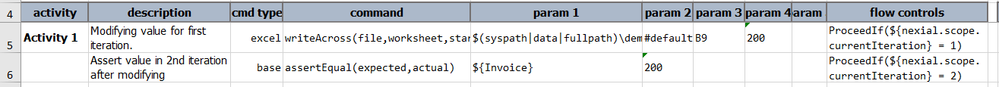
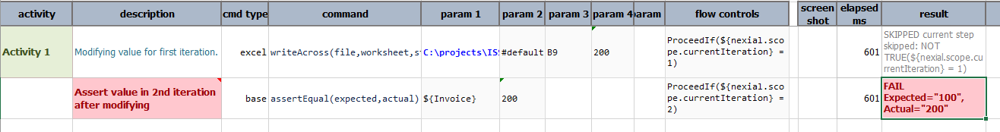
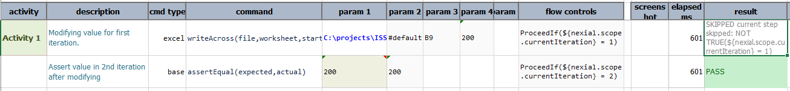

### Context
Nexial reads the data sheet at the start of each iteration. It is little bit slower but user will get latest data each time.
It is needed when preceding scripts modifies the data for subsequent iterations. So Nexial must read new data file to get latest data.

Now Nexial provides feature to turn off re-fetching the data between iterations. The variable is 
**`nexial.scope.refetchDataFile`**.  
Default value for this system variable is `true`. So that it will refetch data between iteration as stated above.
Setting this variable to `false` allow Nexial to read data file only in the beginning of scripts and it will use the same
data every iteration until end of script execution.

**Note:** Value for `nexial.scope.refetchDataFile` **WILL NOT** persist across scripts just like other scope variables.

### Example
In following example, we are modifying the value of one variable(`Invoice`) in first iteration and asserting it in next iteration.
User can use it in the subsequent iteration or script. 

Script: 
In first step modifying `Invoice` value to 200. Second iteration asserting the same variable value.

Data: 

Output: 
Setting `nexial.scope.refetchDataFile` to `false`. We will not get latest value since we are fetching data file once before script execution.

Setting `nexial.scope.refetchDataFile` to `true`. Here we are getting latest value since we are fetching data file per iteration.

