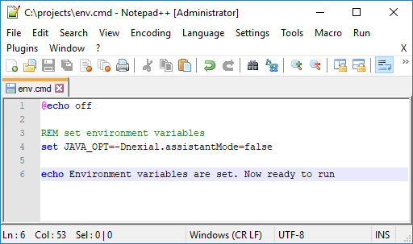
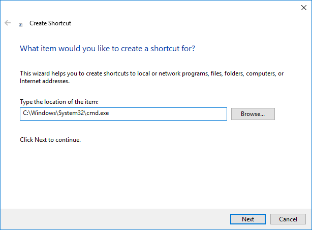
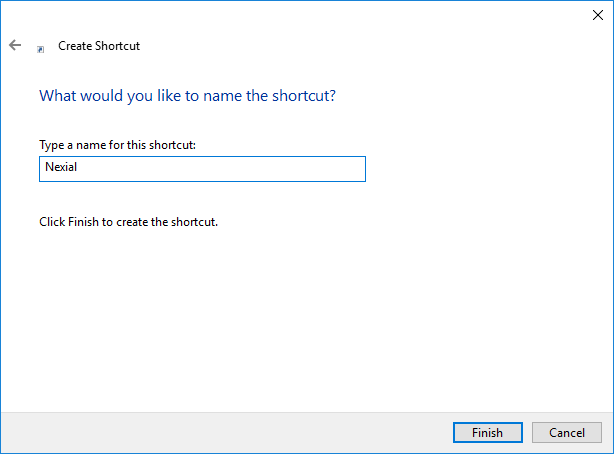
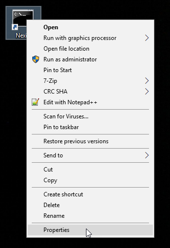
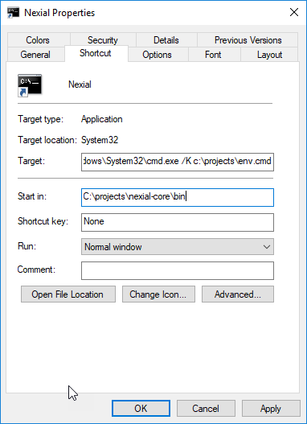

Use the below steps to create a batch file to setup the desired environment variables. And create a shortcut icon on desktop
to open up Nexial command prompt quickly. This one time setup will help in saving time in setting up the environment 
repeatedly whenever you run the scripts.

### Setup the environment variables
- Create a batch file named `env.cmd` in projects home directory, generally it would be `c:\projects`.
- Set the environment variables that are generally used for running the scripts. Below is the sample file: 

 

### Create a shortcut icon on desktop
- Create a shortcut on desktop. Use `C:\Windows\System32\cmd.exe` as location. 

 

- Give the shortcut name as you wish 

 

- Once the icon is created on desktop, right-click on it and select Properties 

 

- Change the `Target` value to run `env.cmd` file. For e.g. `C:\Windows\System32\cmd.exe /K c:\projects\env.cmd`.
- Change the `Start in` value to your Nexial bin directory path. For e.g. `C:\projects\nexial-core\bin`. 

