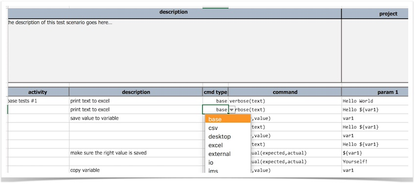
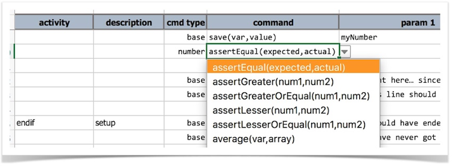
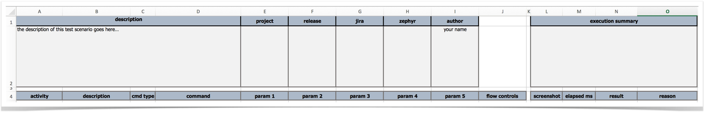
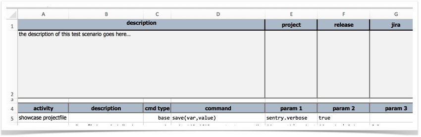

## Why isn't Nexial executing my scenario (worksheet)?!
There could be multiple reasons for this.  Most of them are related to the format and structure of your failed scenario. 
We will continue to add more details here from time to time.

1. **Missing command dropdown**  
   For example:  
     
     

   You find yourself missing the dropdown (like above) for **`cmd type`** and **`command`** columns.

2. **Missing or incorrect Scenario header**  
   The standard scenario header, as shown below, is required in its entirety  
   


3. **First command must start from Row 5**  
   The first command is assume to start from Row 5.  If there's no command at Row 5, Nexial will consider such
   worksheet an invalid scenario.  
  


For issue #1 and #2 above, it is likely have a corrupted worksheet (or workbook) or you create the Excel file manually 
instead of using the template XLSX file provided as part of Nexial distribution.  To remedy, copy the template file, 
`${nexial.home}/template/nexial-script.xlsx`, to your project. You'll need to copy the file to your project directory 
and then rename it accordingly. Simply copying just the worksheet to yours won't work. 

Alternatively - and possibly simpler as well - you can run the 
[`nexial-project.(sh|cmd)` script](../userguide/BatchFiles#nexial-project) to generate new 
script/data files. For example:

On *NIX/MacOS:
```bash
cd ~/projects/nexial-core/bin
./nexial-project.sh ~/projects/<MY_PROJECT> <MY_NEW_SCRIPT_NAME> <MY_NEW_SCRIPT_NAME_2> ...
```

On Windows:
```
cd C:\projects\nexial-core\bin
nexial-project.cmd C:\projects\<MY_PROJECT> <MY_NEW_SCRIPT_NAME> <MY_NEW_SCRIPT_NAME_2> ...
```

The above example will generate under `<MY_PROJECT>`:
1. `artifact/script/<MY_NEW_SCRIPT_NAME>.xlsx`
1. `artifact/data/<MY_NEW_SCRIPT_NAME>.xlsx`
1. `artifact/script/<MY_NEW_SCRIPT_NAME_2>.xlsx`
1. `artifact/data/<MY_NEW_SCRIPT_NAME_2>.xlsx`

Substitute <MY_PROJECT> and <MY_NEW_SCRIPT_NAME> with names of your choosing.
