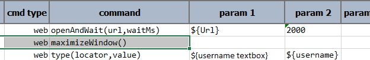

There are situations where the same script targeting IE browser executes as expected on local machine, but fails on 
virtual (remote) machine or cloud-based environment like BrowserStack. Under close observation, one might notice that 
the mouse-click seems to miss the intended DOM element.  

One possible way to rectify this issue is to maximize the browser window prior to further automation.  The browser 
window is created automatically upon the initial call to [web &raquo; `open(url)`](../commands/web/open(url)) or
[web &raquo; `openAndWait(url,waitMs)`](../commands/web/openAndWait(url,waitMs)).  So here's a possible strategy to one
can consider:

- Open browser window with the appropriate `url`.
- Maximize the browser window
- Continue with the rest of the automation.

For example, 

