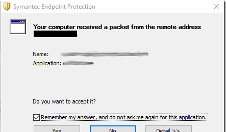

Nexial is shipped a number of executables as part of its automation capabilities.  For example, webdriver executables
are required to run in order to automate browsers. However in some corporate settings, running executables (i.e. 
`.exe` files) in background might be blocked by corporate security measures, such as Symantec Endpoint Protection (SEP).

At times, one might come across an alert dialog like the following: 

If it is not possible to "accept" or allow the executable to run, one might need to work with one's corporate IT 
support to add these executable files to the corporate security exception list.  Below is the list of executables that 
could be started by Nexial during automation:

 1.  `chromedriver.exe`
 2.  `geckodriver.exe`
 3.  `geckodriver64.exe`
 4.  `IEDriverServer.exe`
 5.  `IEDriverServer64.exe`
 6.  `MicrosoftWebDriver.exe`
 7.  `Winium.Desktop.Driver.exe`

