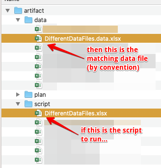
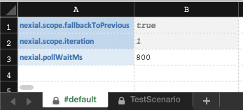
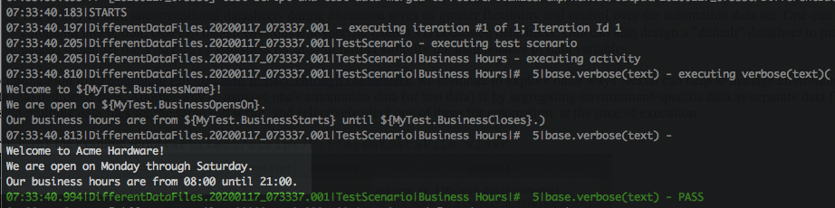
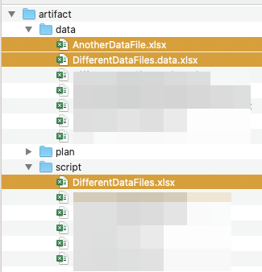
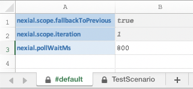
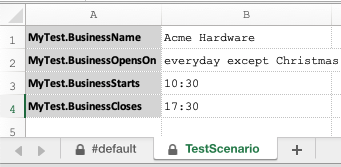
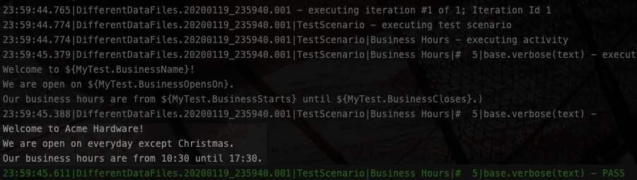

## Manage Environment Impact Through Data File

This is a continuation from [Manage Environment Impact Through Datasheets](TargetedData-Datasheets) (excerpt below)
> The ability to load unconventional datasheets during execution gives us greater flexibility and control over the 
  automation data set. One can achieve via the `-datasheet` command line option. One can design environment-specific 
  dataset via dedicated datasheets. One can also design a "default" datasheet to maintain environment-agnostic dataset 
  (consider the `#default` datasheet for this) to further simplify the maintenance of data variables.

### Data File Convention
We continue to explore other ways Nexial can help to manage environment impact. Besides the use of different datasheets 
at execution time (via `-datasheet`), we can also specify different data file. This means that one can design multiple 
data files for the same test script, and selectively elect one of them for automation, at the time of execution.

First, here's the example script (`artifact/script/DifferentDataFile.xlsx`):<br/>


As highlighted, this simple script references 4 data variables:
- `${MyTest.BusinessName}`
- `${MyTest.BusinessOpensOn}`
- `${MyTest.BusinessStarts}`
- `${MyTest.BusinessCloses}`

By convention, Nexial looks for the matching data file to load during execution. The basic matching rule is as follows:<br/>


So based on this convention, matching data file would be `artifact/data/DifferentDataFile.data.xlsx`. In our case, it
looks like this:<br/>
 &nbsp; 

No surprises here; the output shows what we expect (see highlighted):<br/>


-----

### The Unconventional Way
By using the `-data` command line option, we can override the above convention. For example,
```
./nexial.sh -script $MY_PROJECT_HOME/artifact/script/DifferentDataFile.xlsx -data /Users/me/data/QA/AnotherDataFile.xlsx
```

Nexial will use the fully qualified data file, as specified, instead of the conventional data file. However one can 
also simplify the above command line option by omitting the fully qualified location of the target data file:
```
./nexial.sh -script $PROJECT_HOME/artifact/script/DifferentDataFile.xlsx -data AnotherDataFile.xlsx
```

When the precise location of `AnotherDataFile.xlsx` is not specified, Nexial searches through these locations 
(order precedence):
- `$PROJECT_HOME/artifact/script`
- `$PROJECT_HOME/artifact/data`
- `$PROJECT_HOME/artifact`

Let's see this feature in action. Here, we have `AnotherDataFile.xlsx` located in `artifact/data`:<br/>


The content of `AnotherDataFile.xlsx` looks like this:<br/>
 &nbsp; 

As the execution output shows (below), Nexial is now using the data defined in `artifact/dataAnotherDataFile.xlsx`:


-----

### Combing the Use of `-data` and `-datasheet`
Recalling from [the previous article](TargetedData-Datasheets.md) on the use of `-datasheet` command line option, we
can combine the use of both `-data` and `-datasheet` to device a flexible and extensible way of handling 
environment-specific data. Consider the following examples:

Running "happy path" with the "good data" that is valid in "QA":
```
./nexial.sh -script $MY_PROJECT_HOME/artifact/script/HappyPath.xlsx -data QA.xlsx -datasheet Good-Data
```

Running "happy path" with expected data in "QA", first use "last quarter" data and then override with "this quarter":
```
./nexial.sh -script $MY_PROJECT_HOME/artifact/script/HappyPath.xlsx -data QA.xlsx -datasheet LastQuarter,CurrentQuarter
```

Running the error conditions with the "outdated orders" found in "QA" environment:
```
./nexial.sh -script $MY_PROJECT_HOME/artifact/script/Exceptions.xlsx -data QA.xlsx -datasheet OutdatedOrder
```

Running the error conditions in "UAT", using first the data from "last month" and then overload with data from "this 
month": 
```
./nexial.sh -script $MY_PROJECT_HOME/artifact/script/Exceptions.xlsx -data UA.xlsx -datasheet LastMonth,ThisMonth
```

-----

### Conclusion
The ability to use different data file during execution gives us more coarse-grained control over our data set. One can 
design segregated sets of data - and potentially each with different ownership - for each environment. When use in
combination with the `-datasheet` command line option, we can achieve even flexibility.
