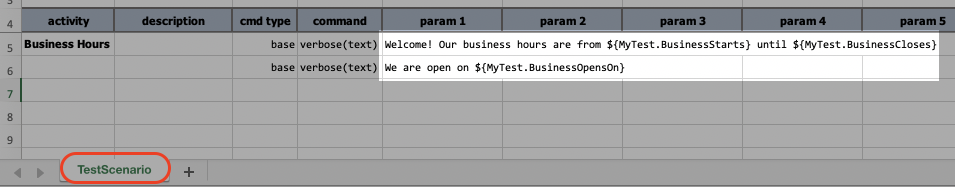
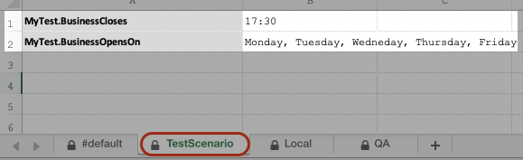
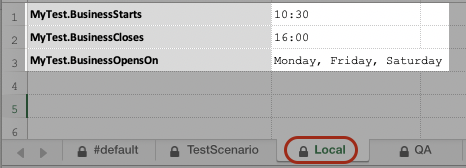
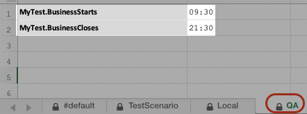
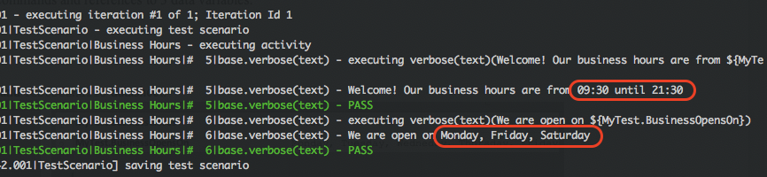
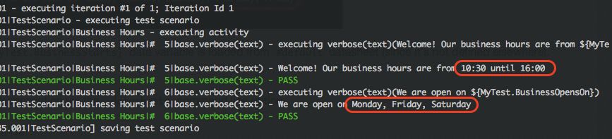

## Manage Environment Impact Through Datasheets

### Datasheet Convention
By convention, Nexial looks for the [datasheet](../userguide/UnderstandingExcelTemplates#anatomy-of-a-nexial-data-file) 
that matches the scenario currently in execution. This means that: 

- When executing scenario `TestScenario` of `artifact/script/MyTest.xlsx`, Nexial will attemp to load the 
  data variables defined in the datasheet `TestScenario` of `artifact/data/MyTest.data.xlsx`.
- Regardless whether the `TestScenario` datasheet is loaded or not (perhaps it does not exist), Nexial will attempt 
  to load `#default` datasheet from the same `artifact/data/MyTest.data.xlsx` data file. This way the `#default` 
  datasheet acts as a form of "catch-all".
- As a "catch-all", the data variables defined in `#default` datasheet will be loaded **ONLY** if they are not
  defined in other datasheet. In other words, `#default` datasheet is of the _least priority_.

The above convention is Nexial's default behavior and is designed to simplify script development and straightforward 
tests. It provides a generally serviceable construct and a good starting point for individuals who are new to test 
automation or to Nexial. To see this in action, let's look at the following example. Below is a simple test scenario 
(named `TestScenario`) with 2 [base &raquo; `verbose(text)`](../commands/base/verbose(text)) commands and it 
references to 3 data variables:

1. On Row 5: `${MyTest.BusinessStarts}`
2. On Row 5: `${MyTest.BusinessCloses}`
3. On Row 6: `${MyTest.BusinessOpensOn}`



For this example, the referenced data variables are defined in the `#default` datasheet and the `TestScenario` 
datasheet:<br/>
 &nbsp; 

When we execute this script, we can see that these 3 data variables are loaded and printed correctly on the console:<br/>
```shell script
./nexial.sh -script $MY_PROJECT_HOME/artifact/script/DifferentDataFiles.xlsx
```


Hence the "catch-all" logic is in effect where the `${MyTest.BusinessStarts}` data variable is loaded from `#default` 
datasheet (since it's not defined elsewhere).

-----

### Alter The Datasheet Loading Sequence
However, Nexial provides the ability to alter the above convention via the `-datasheets` command line option.

Suppose we have 2 other datasheets in the same data file:<br/>
 &nbsp; 

We can specify the use of these datasheets via command line option:
```shell script
./nexial.sh -script $MY_PROJECT_HOME/artifact/script/MyTest.xlsx -datasheets Local,QA
```

Now Nexial will not consider the data variables defined in `TestScenario`. The sequence of data variable resolution
would now be:

- load data variables defined in `#default`
- load data variables defined in `Local`, possibly overriding previously defined ones
- load data variables defined in `QA`, possibly overriding previously defined ones

**NOTE: "The lsat one WINS!"**

Since `${MyTest.BusinessStarts}` is defined in the `#default`, `Local` and `QA` datasheets, the one defined in `QA`
datasheet will take effect because `QA` datasheet is the last one to load. Now observe the execution output:<br/>



The value of referenced data variables are as follows:

- `${MyTest.BusinessStarts}` &Longrightarrow; `09:30` (from `QA` datasheet)
- `${MyTest.BusinessCloses}` &Longrightarrow; `21:30` (from `QA` datasheet)
- `${MyTest.BusinessOpensOn}` &Longrightarrow; `Monday, Friday, Saturday` (from `Local` datasheet)

Suppose we switch the order of the datasheets from `Local,QA` to `QA,Local`. What do you think the output would look 
like:<br/>



In this case, the value of referenced data variables are as follows:

- `${MyTest.BusinessStarts}` &Longrightarrow; `10:30` (from `Local` datasheet)
- `${MyTest.BusinessCloses}` &Longrightarrow; `16:00` (from `Local` datasheet)
- `${MyTest.BusinessOpensOn}` &Longrightarrow; `Monday, Friday, Saturday` (from `Local` datasheet)

-----

### Conclusion
The ability to load different datasheets during execution gives us greater flexibility and control over the automation
data set. One can design a set of datasheets, each designated to a specific environment. One can also design a "default"
datasheet that would apply to all environment (consider using `#default` datasheet for this) to simply the work of
maintaining data variables in the environment-specific datasheets.

