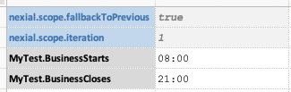
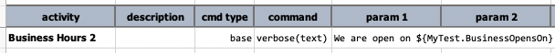
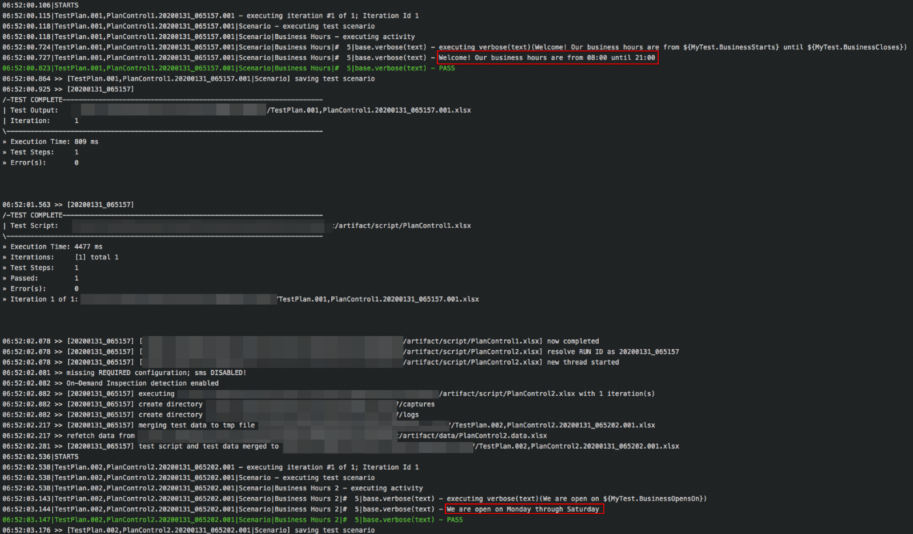

Nexial provides a mechanism to execute multiple scripts, either in succession or in sequence through the use of
[test plan](../userguide/UnderstandingExcelTemplates#anatomy-of-a-nexial-test-plan). A test plan organizes the order 
of executions across multiple scripts, even those in different projects (i.e. different project directories). In 
addition, one can associate different data files and datasheets per script execution, making the test plan a powerful 
tool to create elaborate and dynamic automation. Let's see this in more details.

### Test Plan Primer
Suppose we have the following test plan (`arifact/plan/TestPlan.xlsx): 
 

As shown above, this test plan references 2 scripts: `PlanControl1` and `PlanControl2`. Consistent with 
Nexial's design, the script location is automatically resolved based on convention -- the convention that the test plan
resides in `artifact/plan` and the scripts reside in `artifact/script`. Using the same convention, the data file is also
resolved to `artifact/data/[SCRIPT_NAME].data.xlsx`. Hence based on these conventions, here's the corresponding project 
directory structure would look something like this: 

Notice that:
- In the test plan, the scripts are referenced as `PlanControl1` and `PlanControl2`. Nexial will add the `.xlsx` 
  extension as needed.
- Since no datasheet is specified in the test plan, the convention, _once again_, dictates that the datasheet matching
  to the executing scenario and the fallback `#default` datasheet will be loaded during execution.

Here are the content of the referenced scripts and data files:

| artifact                                                       | content                           |
|----------------------------------------------------------------|-----------------------------------|
| `artifact/script/PlanControl1.xlsx` (scenario: `Scenario`) |  |
| `artifact/data/PlanControl1.data.xlsx` (only `#default`)   |  |
| `artifact/script/PlanControl2.xlsx` (scenario: `Scenario`) |  |
| `artifact/data/PlanControl2.data.xlsx` (only `#default`)   |  |

When this test plan is executed, Nexial will read its content and execute:
1. The scenario `Scenario` in `artifact/script/PlanControl.xlsx`, using the `#default` datasheet in 
   `artifact/data/PlanControl1.data.xlsx`
2. The scenario `Scenario` in `artifact/script/PlanContro2.xlsx`, using the `#default` datasheet in 
   `artifact/data/PlanControl2.data.xlsx`

The execution output looks like this:
`./nexial.sh -plan $PROJECT/artifact/plan/TestPlan.xlsx`

Observe that:
- the scripts are executed in sequence as specified in the test plan
- each script execution ends with a dedicated summary outlining the high-level execution outcome. There is also a 
  separate execution output (in Excel) per script

-----

### Dealing with Multiple Script and Data
The test plan 

-----

### Applying Matching Data File

-----

### Conclusion
