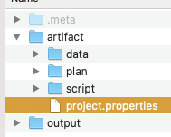
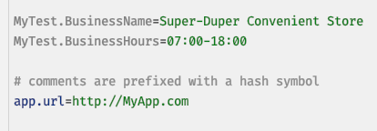

## Introduction
Often in testing - and automation in general - one comes across the need to support multiple environments 
(e.g. DEV, QA, UAT, PROD). These environments create segregated landscapes to serve the different focuses throughout the 
product delivery lifecycle. The so-called "lower" environments, such as DEV or QA, are purposed to support the early 
phases of application development, integration and testing, while the "higher" ones (UAT and PROD) focus on the end-user 
experience and end-to-end workflow. While the target application (a.k.a. _application under test_) could be the same 
version across these environments, the application data and configuration might differ greatly. For example, each 
environment could differ in terms of:
1. Connectivity to external services and components, such as databases, messaging services, integration endpoints
2. User credentials and roles
3. Business rule data and configuration

These environmental differences bring about an additional layer of complexity in terms of test automation. Applying test 
automation across different environments should incur minimal impact to the automation artifacts. Should changes be 
needed, they should be managed in a manner that is easy and independent (to each environment). Nexial provides a
few different strategies of handling environment-specific differences, aiming to minimize, isolate and simplify such
impact. These strategies can be effective either by itself or in combination.

But before we proceed to examine these strategies, an overview to some of Nexial's design concept regarding data 
management is in order.

-----

### Data File Convention
One of the fundamental designs in Nexial is the "default by convention" concept, where files and artifact references
are matched by a conventional project structure. The basic matching rule is as follows: 

Here's the targeted automation script (`artifact/script/DifferentDataFile.xlsx`): 

As highlighted, this simple script references 4 data variables:
- `${MyTest.BusinessName}`
- `${MyTest.BusinessOpensOn}`
- `${MyTest.BusinessStarts}`
- `${MyTest.BusinessCloses}`

By default, Nexial looks for the matching data file to load during execution. In this case the matching data file would 
be `artifact/data/DifferentDataFile.data.xlsx`, which looks like this: 
 &nbsp; 

When we execute this script, no surprises here; the output shows what we expect (see highlighted): 

-----

### Datasheet Convention
By convention, Nexial looks for the [datasheet](../userguide/UnderstandingExcelTemplates#anatomy-of-a-nexial-data-file) 
that matches the scenario currently in execution. This means that: 

- When executing scenario `TestScenario` of `artifact/script/MyTest.xlsx`, Nexial will attempt to load the 
  data variables defined in the datasheet `TestScenario` of `artifact/data/MyTest.data.xlsx`.
- Regardless whether the `TestScenario` datasheet is loaded or not (or if it exists), Nexial will attempt to load 
  `#default` datasheet from the same `artifact/data/MyTest.data.xlsx` data file. This way the `#default` datasheet acts 
  as a form of "catch-all".
- As a "catch-all", the data variables defined in `#default` datasheet will be loaded **ONLY** if they are not
  defined in other datasheet. The `#default` datasheet is of the _least priority_.

This is Nexial's default behavior and is designed to simplify script development and testing. It provides a generally 
serviceable construct and a good starting point for individuals who are new to test automation or to Nexial. To see this 
in action, let's look at the following example. Below is a simple test scenario (named `TestScenario`) with 2 
[base &raquo; `verbose(text)`](../commands/base/verbose(text)) commands and it references to 3 data variables:

1. On Row 5: `${MyTest.BusinessStarts}`
2. On Row 5: `${MyTest.BusinessCloses}`
3. On Row 6: `${MyTest.BusinessOpensOn}`

For this example, the referenced data variables are defined in the `#default` datasheet and the `TestScenario` 
datasheet: 
 &nbsp; 

When we execute this script, we can see that these 3 data variables are loaded and printed correctly on the console: 

`./nexial.sh -script $PROJECT_HOME/artifact/script/DifferentDataFiles.xlsx`

Hence the "catch-all" logic is in effect where the `${MyTest.BusinessStarts}` data variable is loaded from `#default` 
datasheet (since it's not defined elsewhere).

-----

### Project-wide Data Management
Besides the use of data file and various datasheets, Nexial provides another form of data management to handle
project-wide data variables. Within each project, one may create a 
[`project.properties` file under the `artifact/`](../userguide/UnderstandingProjectStructure#artifactprojectproperties)
directory: 

This `project.properties` file is a plain text file that loosely follows the standard Java 
<a href="https://docs.oracle.com/cd/E26180_01/Platform.94/ATGProgGuide/html/s0204propertiesfileformat01.html" class="external-link" target="_nexial_link">Properties file format</a>.
Essentially this is a simple text file that contains a set of name-value pairs that represents data variables and their 
corresponding data value. The data variables defined here are relevant for the entire project (i.e. under the same 
project directory). For example, 

Note the following:
1. As stated, data variables defined here can be used in any of the artifacts within the same project structure
2. One can include project-wide [System variables](../systemvars/) in `project.properties`
3. A data variable can reference another data variable. For example `MyName=${My First Name} ${My Last Name}`
4. One can use [functions](../functions) and [expression](../expressions), just as one could in data files. Observe
   `MyTest.Discount.MaxDiscountPrice` data variable (highlighted)
4. Data variable defined in `project.properties` will supersede those defined in the data files. This is by design to
   keep the project consistent and hierarchically sound. However one can still override the project-bound data variable
   via the use of [base &raquo; `save(var,value)`](../commands/base/save(var,value)) command.

Simple but effective. One can define a set of data variables in `artifact/project.properties` and they will be 
applicable to all the scripts found in the same project (i.e. same project home directory).

-----

### Data Loading, ala Nexial
Separating data from the script (or automation script) is the fundamental impetus of Data-driven Testing and a central
design objective for Nexial. Nexial support multiple ways of doing so. Below are the ways to keep data (and data 
variables) separate from the corresponding scripts, in the order of override priority:
1. **Data can be defined in `#default` data sheet**. Those defined here are the lowest in priority. This means that 
   similar data variable defined elsewhere would override those defined in `#default` data sheet.
2. **Data can be defined in data sheet(s)** (other than `#default`). This can either be the data sheet matching to the 
   active scenario (default behavior), or user-defined data sheet(s) specified as command line option. If more than 1 
   data sheet are specified, the data variable found in the later data sheet will override the earlier ones 
   ("_last one WINs_").
2. **Data can be defined in data files**. This can either be the data file matching to the active script (default 
   behavior), or a user-defined data file specified as command line option. The data overriding rule would follow the 
   same as those of data sheet (above point). 
3. **Data can be defined in [`artifact/project.properties`](../userguide/UnderstandingProjectStructure#artifactprojectproperties)**.
   The `project.properties` is a simple text file with name-value pairs to represent a set of project-wide data 
   variables and their corresponding value. For a given project, there would be at most 1 `project.properties`. All
   data variables defined here would override those found in data files. 
4. **Data can be defined through command line options**. One would use the 
   [`-override` command line option](../userguide/BatchFiles#nexial) to override other definitions of the same data 
   variables found in `artifact/project.properties` or in data file.
5. Lastly, and not recommended, **Data can be defined directly via the scripts**. While this is not recommended, it is
   useful and at times down right necessary. Using the [base &raquo; `save(var,value)`](../commands/base/save(var,value)),
   one may inject or override a data variable dynamically. Data variables such as those derived via date or application 
   behavior can be dynamically created this way.

-----

### Data Management Strategies
Now, back to the topic at hand. Below are a list of strategies in which to handle environment-specific differences via
Nexial:
1. [Through Data File and Datasheets](TargetedData-DataFile_DataSheets)
3. [Through Plan](TargetedData-Plan)
4. [Through `project.properties`](TargetedData-ProjectProperties)
5. [Through Command Line Option](TargetedData-override)
6. Manage environment-specific execution flow
7. Environment-specific data variables and reporting
