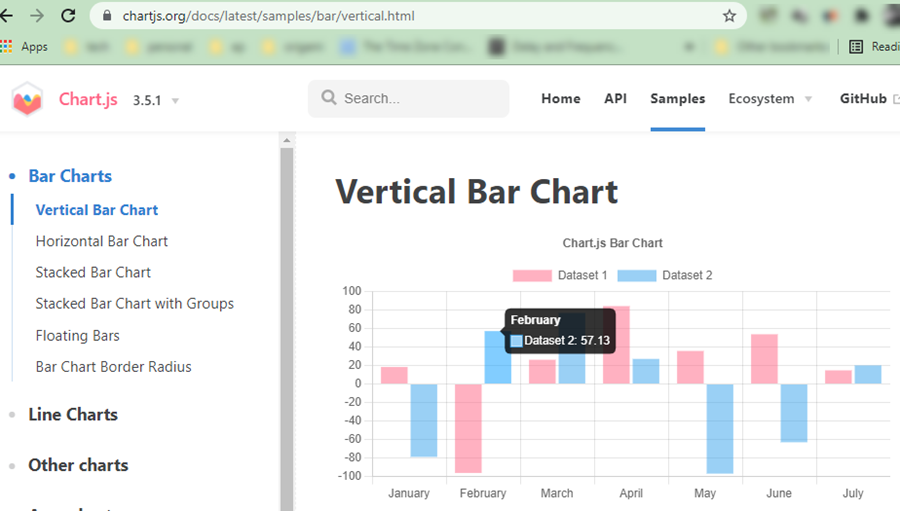
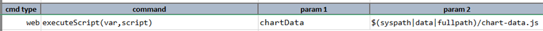

<style>
table {
	width: 950px;
	margin: 15px 0;
	font-size: 10pt;
	font-family: Tahoma, serif;
}

table th {
	font-weight: bold;
}

table td code {
	background-color: transparent;
	border: none;
	font-family: Consolas, monospace;
}

</style>

### Introduction
Canvas-based charts have gained much popularity and are only increasing in usage by the day. It makes sense for many
web applications to move towards such implementation since it alleviates server-side graphics rendering routine by
shifting such work to the client tier (i.e. web browser). This makes for a more scalable and more cost-effective 
architecture. There are many canvas-based charting frameworks. Two of the most popular ones are 
<a href="https://www.chartjs.org" class="external-link" target="_nexial_link">Chart.js</a> and 
<a href="https://www.primefaces.org" class="external-link" target="_nexial_link">Primefaces</a>

Here's the question: **_how would we automate tests on these charts_**?

### Test Automation on Canvas-based charts
Here's a better question: **_What would we want to test about these charts_**?

If you are a part of the Chart.js or Primefaces teams, perhaps your answer would be "_Everything, of course_!". Indeed -
and that would be my answer as well - we would want to ensure product functionality as much as possible. But if you are
playing the part of a test engineer in a project that utilizes a chart framework, then maybe "_everything_" might be an
overkill. There should be a clear delineation between the responsibility of a tool - as in, the charting framework - 
and the responsibility of a product that utilizes such a tool. Since the product generates or collects data for the
charting framework to render, we should likewise focus on observing and evaluating the underlying data. As the saying 
goes: "Garbage in, garbage out". If the source data is not correct, the rendered charts would reflect the same.

So how do we validate the chart data? It turns out that the data used for charting is not easily retrievable. Most of 
the modern JS frameworks hide intermediary dataset within the rendered DOM structure. It would be the bulk of the
work in figuring out where the data is hiding. This article will show a few working examples of where to find charting
data and how to expose them for testing.

Once we figure out where the chart data is located, we can create a simple Javascript file to capture such data into
a more consumable format such as JSON. Using Nexial's 
[web &raquo; `executeScript(var,script)`](../commands/web/executeScript(var,script)) command we can execute such 
Javascript code. then we can use [JSONPath](../jsonpath) to extract portion of the chart data.

Let's break down each of the steps...

### Extracting Chart.js data
Here's an example chart from Chart.js:<br/>


Try as you might, you won't find the corresponding chart data anywhere in the HTML or via DevTools. It turns out that 
Chart.js uses <a href="https://vuejs.org/" class="external-link" target="_nexial_link">VueJS</a> as its UI framework,
and the chart data is hidden somewhere ViewJS's data structure:<br/>


Great, so now we can use this information, along with a bit more Javascript to capture the underlying chart data:
```javascript
let chartMap      = document.querySelector('.chart-view').__vue__.config.data
let chartLabels   = chartMap.labels;
let chartDatasets = chartMap.datasets;
let chartData     = chartLabels.reduce(function (arr, key, index) {
  arr[key] = [{
    label:           chartDatasets[0].label,
    backgroundColor: chartDatasets[0].backgroundColor,
    data:            chartDatasets[0].data[index]
  }, {
    label:           chartDatasets[1].label,
    backgroundColor: chartDatasets[1].backgroundColor,
    data:            chartDatasets[1].data[index]
  }];
  return arr;
}, {});
```

In this case, `chartData` would look something like this:<br/>


With this structure, we can perform validations like this:
- assert that the data values of "April" is 84.127 and 27.112 respectively?
- assert that the data values of "February" is -96.144 and 57.13 respectively?
- etc., etc.

Running these assertions as part of our test automation? **YES!**
Good thing that Nexial can execute arbitrary Javascript code (on the current browser) via its 
[web &raquo; `executeScript(var,script)`](../commands/web/executeScript(var,script)) command:<br/>


Before we delve deep into this Nexial command, let's look at another example.

#### Automating a Primefaces example


In this case, the UI framework used is Angular. As such, the chart data is "hidden away" in a different place:


... slight differences than the Chart.js example - i.e. the use of `__vue__` versus `__ngContext__`. However, once we 
can reference the chart data (`chartMap`), we can apply the same logic as we did in the Chart.js example.

To make a generalized solution, we also want the ability to perform some error handling and to treat all data structure
in a fairly standardized and maintainable format. We can achieve all these by converting the data structure as a JSON
document (think API design). With Nexial we can easily manage such JSON document. And, as previously mentioned, we can 
also use Nexial to run our Javascript code during execution. Here's a working example:

**Step 1**. `artifact/data/chart-data.js`
Let's a Javascript file (plain text) and save it under `artifact/data/chart-data.js`:
```javascript
let chartIndex = ${chartIndex};

let pcharts = document.getElementsByTagName("p-chart");
if (!pcharts || pcharts.length < chartIndex) {
  return '{ "error": "No p-chart can be found or no p-chart instance at index ' + chartIndex + '" }';
}

let pchart = pcharts[chartIndex];
if (!pchart || !pchart.__ngContext__) {
  return '{ "error": "Invalid p-chart instance at index ' + chartIndex + ': no ngContext found" }';
}

let chartMaps = pchart.__ngContext__.filter(item => item && item.config && item.basicData);
if (!chartMaps || chartMaps.length < 1) {
  return '{ "error": "Invalid p-chart instance at index ' + chartIndex + ': no basicData found" }';
}

let chartMap         = chartMaps[0].basicData;
let chartLabels      = chartMap.labels;
let chartDatasets    = chartMap.datasets;
let chartData        = chartLabels.reduce(function (arr, key, index) {
  arr[key] = [{
    label:           chartDatasets[0].label,
    backgroundColor: chartDatasets[0].backgroundColor,
    data:            chartDatasets[0].data[index] || 0
  }, {
    label:           chartDatasets[1].label,
    backgroundColor: chartDatasets[1].backgroundColor,
    data:            chartDatasets[1].data[index] || 0
  }];
  return arr;
}, {});

chartData["_labels"] = chartLabels;
chartData["_data"]   = chartDatasets;
chartData["_count"]  = chartLabels.length;

return JSON.stringify(chartData);
```

Note that there are multiple error handling routine in the first half of the code above. Each error condition results in
a JSON document with 1 single node named as `error`.

Notice the Nexial data variable `${chartIndex}` in Line 1. We will be assigning a value to this data variable in our
Nexial script next.

Also notice that we've added a few more "metadata" to the `chartData` - namely `_labels`, `_data`, and `_count`.  These
metadata nodes can prove to be very useful during the validation.

**Step 2**. Invoking `chart-data.js` from Nexial
We can execute this Javascript file from Nexial using the 
[web &raquo; `executeScript(var,script)`](../commands/web/executeScript(var,script)) command.<br/>


Notice that the use of [base &raquo; `save(var,value)`](../commands/base/save(var,value)) command before calling the
`executeScript()` command? We use this command to assign a value to `chartIndex`. In this way, when Nexial is reading
the content of `chart-data.js` the appropriate substitution can be performed and the `chartIndex` variable in Javascript
will have the value of `0`. We can apply this technique to gather chart data for another chart on the same web page. 
Note that Javascript is 0-based (much like Nexial is). So index 0 means the first item, index 1 means the second item, 
and so on.

**Step 3**. Perform validation on the returned Javascript object
Now that we've executed the Javascript code in `chart-data.js`, we can examine and validate its return JSON data.<br/>


First, we can print out `chartData` as a beautified (meaning formatted) JSON, which can be helpful for debugging purpose.
Next, we check that no error was found during the execution of our Javascript code.
Lastly, a series of assertion:
- assert that there are 7 labels
- assert that the labels present the first 7 months of the year
- assert that the data values for February are 59 and 48. 

### Another real-life example
Here's another canvas-based charting example for your consideration:<br/>


This example shows 2 charts rendered side-by-side. The chart data, in this case, is slightly different than the previous
example:<br/>


With some minor adjustments to the previous script, we can proceed with similar testing for this example:<br/>
```javascript
let chartIndex = ${chartIndex};

if (!(window.Chart && window.Chart.instances && Object.keys(window.Chart.instances).length > chartIndex)) {
  return '{ "error": "Unable to find a chart object at index ' + chartIndex + '" }';
}

let charts = window.Chart.instances;
let chart = charts[Object.keys(charts)[chartIndex]];

if (!chart.data || !chart.data.datasets || !chart.data.labels) {
  return '{ "error": "Invalid chart found at index ' + chartIndex + '" }';
}

let dataMaps = chart.data.datasets.filter(item => item && item.data && item.data.length > 0);
if (!dataMaps || dataMaps.length < 1) {
  return '{ "error": "Unable to derive at a dataset from chart ' + chartIndex + '" }';
}

let dataMap        = dataMaps[0]
let dataValues     = dataMap.data
let dataLabels     = chart.data.labels
let dataset        = dataLabels.reduce(function (arr, key, index) {
  arr[key]         = dataValues[index] || 0;
  return arr;
}, {});

dataset["_labels"] = dataLabels;
dataset["_data"]   = dataValues;
dataset["_count"]  = dataLabels.length;

return JSON.stringify(dataset);
```

We'll save this script to `artifact/data/chart-data.js`.

The rest of the work would be performed within our Nexial script:<br/>


**Step 6**: assign `0` to a data variable `chartIndex`.<br/>
**Step 7**: Nexial reads `artifact/data/chart-data.js`, which in turn substitutes `${chartIndex}` with `0`, and executes
the Javascript on the current browser.<br/>
**Step 8**: print out the result JSON document, which represent the chart data.<br/>
**Step 9**: assert that no error is found from executing the Javascript.<br/>
**Step 10**: assert that there are 6 data points in the first chart.<br/>
**Step 11**: test the label of the 6 data points.<br/>
**Step 12**: test the value of the 6 data points.<br/>
**Step 13-14**: test value of specific data point via its label.<br/>
**Step 15-23**: same as Step 6-14, except that `chartIndex` is assigned the value `1` (for the second chart) and a 
different technique is used for label-specific data validation.<br/>

Step 22-23 uses the `REGEX:` syntax to reference a specific node in a JSON document. This technique can be useful
when a node is too long or the node value might be dynamic. See [Rules and Filters](../jsonpath/index#rules-and-filters)
for more details.

-----

### Conclusion
There you have it! It's true that Nexial is mainly designed for a non coding-centric approach towards automation. But
canvas-based charting and the advent of modern UI frameworks are making automation much more challenging, especially
since there aren't any locators we can use. Hopefully this article gives you some confidence and some ideas how to
automate the testing of chart data.
