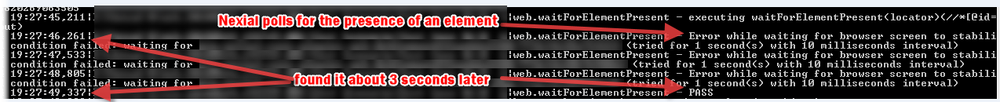

### Wait for web element Creation Or Activation
**Note: Refer to [System Variables](../systemvars) page for more details.  Search for for `nexial.web.alwaysWait` 
and `nexial.pollWaitMs`**

On hitting the URL, the page takes certain time to load all the elements. User may want the script to perform certain
operations on any specific web element. For example like clicking a specific button, entering a value in the text box,
checking a check box etc. But the script should wait for the element to get created or loaded before performing any
actions over them.

Nexial allows the user to refer to a particular element through many ways like locator, label, attributes, text content
etc. Refer to the following commands for more information:-
- [waitForElementPresent(locator)](../commands/web/waitForElementPresent(locator))
- [assertElementPresent(locator)](../commands/web/assertElementPresent(locator))
- [assertElementNotPresent(locator)](../commands/web/assertElementNotPresent(locator))
- [assertElementByAttributes(nameValues)](../commands/web/assertElementByAttributes(nameValues))
- [assertLinkByLabel(label)](../commands/web/assertLinkByLabel(label))
- [assertTextPresent(text)](../commands/web/assertTextPresent(text))

By default Nexial will query for the specified locator/attribute/label etc. until the time as specified by 
`nexial.pollWaitMs` (default is 30000ms, or 30 seconds) has passed. There is a provision where user can specify a 
shorter `poll time` to signify the desired wait time tolerance (in milliseconds).

To accommodate for different response time throughout the user interaction with application, one would likely need to 
set `nexial.pollWaitMs` to fit the slowest time. This can be time consuming, error prone and inefficient.
Instead, one can use another System variable called `nexial.web.alwaysWait` to simplify things a bit. Here’s how:
- Set `nexial.web.alwaysWait` to true
- Set `nexial.pollWaitMs` to a high number, like 30000 (30 seconds).
- Nexial will poll for the target locator every 10ms, until the specified value of `nexial.pollWaitMs`. 
 As soon as the web component is found, Nexial will proceed with the rest of the command so there’s very little 
 time wasted here.
 
### Example
**Script**: 

**Output**: 

 
The use of `nexial.pollWaitMs` can be further considered as a simple way to check for the response time.
Web components that are not loaded within the specified time can be considered as cases of response time violation i.e.
too slow response time, albeit a very rudimentary approach. This technique is for early detection (of slowness).
This does not replace the need for performance testing.

