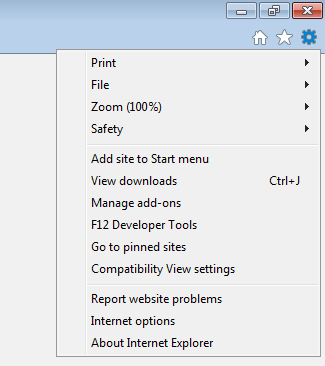

### Context
Nexial scripting is same for all the browsers but IE browser has its own unique constraints and limitation. In order to 
optimize the automation experience with IE, some additional settings are required prior to automation. Note that these
tips are not necessarily required or guaranteed to resolve one's challenges with IE. Both OS version and browser 
version play a part in the performance and reliability of the web automation running against IE.

Many of the tips show below are adapted from other websites and blogs such as 
- <a href="http://toolsqa.com/selenium-webdriver/challenges-to-run-selenium-scripts-with-ie-browser/" class="external-link" target="nexial-link">http://toolsqa.com/selenium-webdriver/challenges-to-run-selenium-scripts-with-ie-browser/</a>,
- <a href="https://github.com/SeleniumHQ/selenium/wiki/InternetExplorerDriver" class="external-link" target="nexial-link">https://github.com/SeleniumHQ/selenium/wiki/InternetExplorerDriver</a>.

### Before starting automation
1. **100% zoom**.  
   IE browser must be 100% zoom for reliable automation. Here's how one can check/change such setting: 
   - Open IE browser. You can see a "cog wheel" menu icon at its top-right corner:  
      
   - Go to Tools option (`Alt+X`). You will get Zoom option with value in bracket. 
      
   - If the value is not 100%, click on Zoom and select 100% Zoom. 
      
   
   Alternative for above steps is open IE browser and simply press **`Ctrl+0`**.

2. **Maximize Window**. 
   This seems to help to stabilize automation on IE. One can use 
   [**web &raquo; `maximizeWindow()`**](../commands/web/maximizeWindow()) to maximize the window page.

3. **Click automation on IE should be rendered via JavaScript during automation**. 
   For certain web applications, especially with heavy utilization of AJAX, timing between clicks can be tricky for IE 
   using the conventional Selenium `click()` method. This is a 
   <a href="https://github.com/SeleniumHQ/selenium/issues/4075#issuecomment-305110961" class="external-link" target="nexial-link">fairly well-known and oft-discussed issue</a>.
   Many workarounds evolve around implicit and/or explicit waits, which either slow down the automation or increase 
   compute requirement. Another way to get around the click issue is use JavaScript (instead of Selenium/WebDriver). In 
   Nexial, one can enable click automation via JavaScript by setting 
   [**`nexial.browser.forceJSClick`**](../systemvars/index#nexial.browser.forceJSClick) to `true`. For more details, 
   click [here](../systemvars/index#nexial.forceJSClick).

4. **Forcing the use of the 32-bit WebDriver for IE**. 
   While both Windows (7 and up) and IE (10 and up) have been upgraded to 64-bit, there are still a few 
   <a href="https://github.com/seleniumhq/selenium-google-code-issue-archive/issues/5116#issuecomment-192106556" class="externa-link" target="nexial-link">internal 
   and background components that are still running as 32-bit processes</a>. As such, until all the dependent processes
   are converted to 64-bit so that IE runs truly in the 64-bit space, it would be best to continue using the 32-bit 
   version of the IE WebDriver for browser automation.  The system variable [**`nexial.forceIE32`**](../systemvars/index#nexial.forceIE32)
   is designed for specifically this purpose. By setting its value to `true` Nexial will continue to use the 32-bit
   IE WebDriver instead of the 64-bit one. 
   Note that this is a known issue for Windows 7 and IE 10. Future version of IE might rectify this issue such that one
   may be find using the 64-bit version of IE WebDriver to be satisfactory. If you are experiencing slowness during 
   type-key automation, this is a telltale sign that the 32-bit version of the WebDriver is needed.

5. **Adjust implicit waits between command**. 
   Depending on the application under test and the underlying IE and OS, it is at times necessary to adjust the maximum 
   amount of wait time before proceeding to subsequent commands. The system variable 
   [`nexial.pollWaitMs`](../systemvars/index#nexial.pollWaitMs) is designated for such adjustment. It seems to be a 
   common practice to adjust this system variable to a higher number for IE automation. Note that this will have 
   direct performance implication.

6. **Browser Focus**. 
   It seems that IE appears to not fully comply with the WebDriver-backed automation when it does not have the focus. 
   This is especially apparent with regards to the click, mouse-down and mouse-up events. You can find further 
   documentation around this topic from the 
   <a href="https://github.com/SeleniumHQ/selenium/wiki/InternetExplorerDriver#browser-focus" class="external-link" target="nexial-link">**Browser Focus** section of the Internet Explorer Driver wiki page</a>.
   In order to force browser focus, one can set the [**`nexial.browser.ie.requireWindowFocus`**](../systemvars/index#nexial.browser.ie.requireWindowFocus)
   system variable as `true`.

7. **Preemptive Alert Check**. 
   During automation, sometimes the AUT would generate a JavaScript alert dialog, perhaps unexpectedly. While such 
   dialog component is active, no automation can proceed. In order to ease automation effort, Nexial has a feature to 
   automatically check for the presence of a JavaScript alert dialog after a type- or click- command is executed. 
   This can help reduce the effort to check for such dialog and possibly incur additional script development time. 
   However, this checking routine in IE can be noticeably slow. For performance reason, one may choose to turn off such
   feature by setting [**`nexial.web.preemptiveAlertCheck`**](../systemvars/index#nexial.web.preemptiveAlertCheck) as
   `false`. Our tests show that turning off this feature could potentially improve overall automation performance by 
   12-20%.

