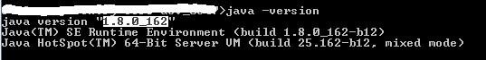
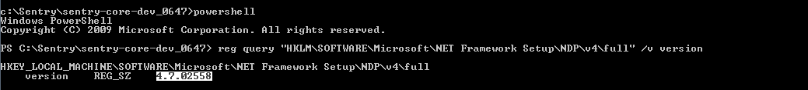

### Getting Error While Starting Winium Driver
**Context:**
- When running Nexial scripts for automating desktop application some of the machine will get the error as 
  **Timed out waiting for driver server to start.Build**. Then the underlying Winium driver will try to restart again 
  while execution is completed. 

**Fix:**
1. Use the latest Nexial version.
2. Check whether Java is installed and its version. It must be **JDK 1.8**. See the highlighted text in image. 
		 1. Open command prompt. 
		 2. Run the **`java -version`** 
		  
		 3. If it is not installed, download <a href="http://www.oracle.com/technetwork/java/javase/downloads/jdk8-downloads-2133151.html" class="external-link" target="_nexial_external">here</a>.
3. Check whether .net framework is installed and its version on the test machine. It must be **greater than 3.0**. See 
	 the highlighted text in image. 
		 1. Open the command prompt. 
		 2. Run  **reg query "HKLM\SOFTWARE\Microsoft\NET Framework Setup\NDP\v4\full" /v version**. 
		     
		 3. If it is not installed, download <a href="https://docs.microsoft.com/en-us/dotnet/framework/install/guide-for-developers" class="external-link" target="_nexial_external">here</a>.  
4. You might need to restart the test machine.
