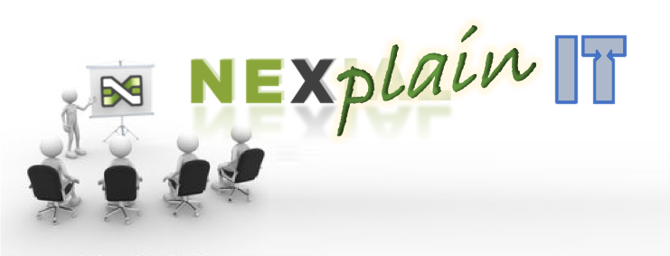

## What is this?
17 months ago - to the exact day - March 30th, 2018 saw the [first release](https://github.com/nexiality/nexial-core/releases/tag/nexial-core-1.0)
of [Nexial Automation to GitHub](https://github.com/nexiality/nexial-core). Since then we have been fairly consistent
in our monthly release cadence. We have added a wide array of capabilities to Nexial. The culmination of these 
capabilities opens up greater possibilities and opportunities to test, to automate and ultimately to elevate Product 
Quality. The [Commands](http://nexiality.github.io/documentation/commands) page gives one a sense of what can be 
accomplished through Nexial. In addition, we continually enhancing Nexial's 
[built-in functions](https://nexiality.github.io/documentation/functions/),
[Nexial Expression](https://nexiality.github.io/documentation/expressions/), 
[JsonPath](https://nexiality.github.io/documentation/jsonpath/), 
[Nexial Interactive](https://nexiality.github.io/documentation/interactive/), etc. While Nexial cannot solve all the
testing and automation hurdles (_no, it doesn't make breakfast, yet_), we are committed, in one or more ways, to better
equip you as a Quality Engineer.

Following this same spirit of continuous improvement, we recognize the need to drastically improve the existing
Nexial documentation in terms of details and clarity.  In addition, we need more content for learning and understanding 
Nexial. Better content will certainly benefit the existing Nexial community as well as boost new adoptions. And this
is where _you_ come in...

Help us create <u><i>awesome</i></u> Nexial tutorials - and, this is a contest! 
(translation: prizes)

 

Welcome to... 

This contest is to come up with the best online tutorial - either a screencast, a video or an online step-by-step 
guide - that demonstrates Nexial Automation and explains how a Nexial feature (or a combination of features) works. 
In keeping up with the culture of "QA Helping QA" and Continuous Learning, this is an **invitation** for all of us to 
participate. Fly solo or work as a small team, this is your opportunity to enlighten your fellow QE's with your 
knowledge on Nexial, your wit about test automation, or even better, your insight on amplifying Product Quality using
Nexial. 

Your tutorial can be anything regarding Nexial that is impactful and relevant to the world of Quality 
Engineering. Perhaps an introductory screencast on how to run Web Automation on Nexial, or how 
[Nexial Interactive](../interactive) can speed up automation scripting. How about automating multiple API endpoints 
using dynamically generated data set? Or the setup and tear-down automation of seeding dataset to 
multiple databases? Another thought-provoking idea is to use Nexial to collect data for post-execution analysis. 
Maybe a tutorial on automation regarding image or Excel or PDF? Maybe a series on JSON manipulation using 
[JsonPath](../jsonpath)? Or perhaps you can create a screencast to demonstrate how you overcome a tricky automation 
hurdle... The possibilities are endless!

When we all participate together, all of us benefit from it. Sharing these tutorials within the Nexial community
strengthens the community from within. And, _did I mention there're prizes_...?

## What is it in for me?
- Again, prizes (multiple)
- Bragging rights
- Instant fame (submitted tutorials will be posted to Nexial website and YouTube)
- A set of well-crafted tutorials on Nexial Automation

## How do I get started?
I'm glad you ask! Here's how:
1. Decide:
    1. **Who** - You could venture on your own or join forces with someone. A team must not be more than 3 people.
    2. **Name** - It can be anything! If you are out of ideas, here are a few fun name generators to help:
        - [https://www.wordlab.com/name-generators/team-name-generator/](https://www.wordlab.com/name-generators/team-name-generator/)
        - [http://www.leadershipgeeks.com/cool-team-names/](http://www.leadershipgeeks.com/cool-team-names/#cool)
        - [https://www.fantasynamegenerators.com/squad-names.php](https://www.fantasynamegenerators.com/squad-names.php)
        - [https://www.mountaingoatsoftware.com/blog/an-agile-team-name-generator](https://www.mountaingoatsoftware.com/blog/an-agile-team-name-generator)
    3. **Topic** - Anything Nexial. Be original, be fun, be epic!
2. Submit to enter the contest - 
    - **This contest is open to all EP employees and contractors (including offshore)**
    - The contest is open for submission NOW
3. Start creating your tutorial
    - For screencast and video, please upload through YouTube (as unlisted video). Here are some links to help:
        - [https://support.google.com/youtube/answer/57407](https://support.google.com/youtube/answer/57407?co=GENIE.Platform%3DDesktop&hl=en)
        - [https://www.wikihow.com/Upload-a-Video-to-YouTube](https://www.wikihow.com/Upload-a-Video-to-YouTube)
        - [https://www.youtube.com/watch?v=43Nvd12yqxU](https://www.youtube.com/watch?v=43Nvd12yqxU)
        - [https://creatoracademy.youtube.com/page/lesson/editing](https://creatoracademy.youtube.com/page/lesson/editing)
        - [https://www.youtube.com/watch?v=Go_HDCANWf8](https://www.youtube.com/watch?v=Go_HDCANWf8)
        - [https://support.google.com/youtube/answer/157177](https://support.google.com/youtube/answer/157177?co=GENIE.Platform%3DDesktop&hl=en)
    - For step-by-step tutorial, please create private post on Confluence
4. After you have completed your tutorial, submit your masterpiece to - 
    - the last day to submit your tutorial is **October 4th 2019**!

5. Everyone will get to vote! The top 3 tutorials will be handsomely awards. :-)
    - the exact date will be announced later.

Rules:
- This is important! PLEASE READ!!
- All tutorials MUST NOT use any EP products or applications as its target application. Since we are using publiclly 
  accessible Internet resource, we need to be mindful of this.
- All screencast or video submission must not be more than 10 minutes long.
- Your tutorial topic might be the same as someone else's. But it's up to you to make yours more interesting.
- All submissions, whether selected as top 3 or not, will be upload to Nexial website. That way everyone can benefit
  from your effort!

## Here we go!
You still reading this?! Let's go!

## Additional Information
I'm here to help and I'm on slack, like, too much. Find me at http://nexiality.slack.com (under `automike`).

