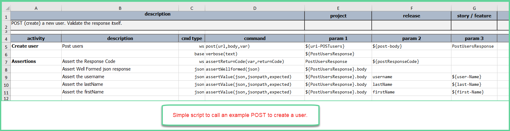
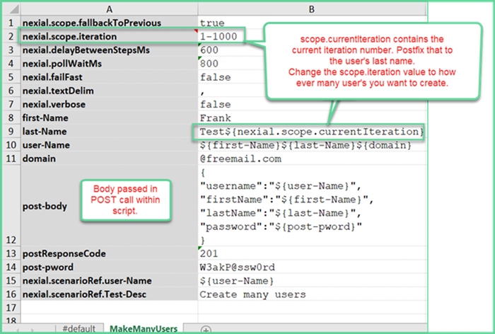
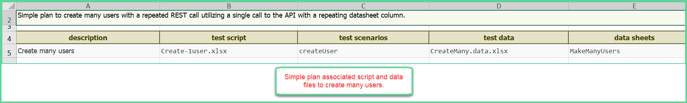

### Create many entries with a POST call iterating on a single data column

Say you have a need during API testing to create a bunch of data entries using one of the API's POST calls.
Using a POST script in conjunction with a datasheet column it is possible to iterate within a single column.

Example of a simple script with simple validation of a response body:

Here’s the trick, in the datasheet column. Using `nexial.scope.iteration` in conjunction with nexial.scope.currentIteration.

The datasheet in the image will create 1000 users named `Frank Test1` through `Frank Test1000` with email addresses of 
FrankTest1@freemail.com through FrankTest1000@freemail.com. All will have the same password.

Simple plan that ties it all together:

