##### Created by: Canaan Matsunaga
 

## Introduction
The Weather Data project is designed to collect weather data on a list of cities and output into readable, organized 
structure. The automation script is made up of four different sections, of which each will be explained in detail. 
Each of the applied Nexial features/concepts will also be explained.

## Prerequisites
1. Basic working knowledge of Nexial Automation
2. Some experience with using [base &raquo; `repeatUntil(steps,maxWaitMs)`](../../commands/base/repeatUntil(steps,maxWaitMs)) command.
3. Some experience with using some of the common [web](../../commands/web) commands.
4. Some experience with [Nexial Expressions](../../expressions).

## Process
### 1. Collecting Search Value 
The first step is to obtain a random city name from [Random City](https://randomcity.net/?) so that we can use it to
gather weather information.

Script: 
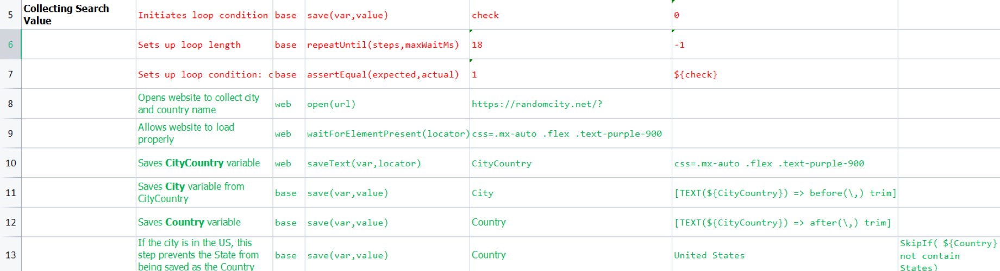
 
- Step 8 opens the browser to [https://randomcity.net/?](https://randomcity.net/?). 
  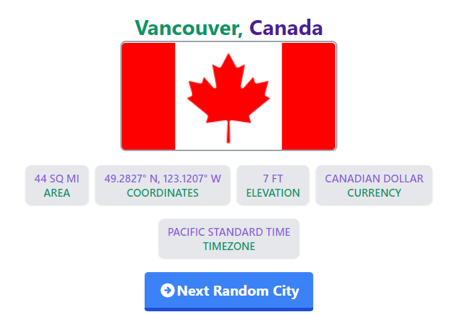
- Step 10 through 13 saves the "city" and "country" from the web page.

### 2.Collect Weather Data
Once the city name is collected, it can be used to search on [Wunderground Website](https://www.wunderground.com/). 
The weather data is subsequently pulled from the resulting webpage.

Script: 
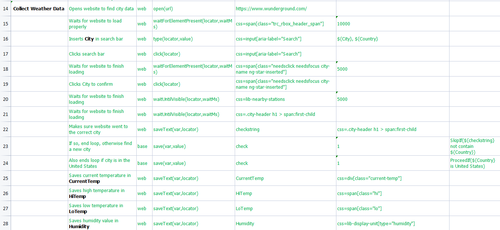

- Step 14 opens the browser to [https://www.wunderground.com/](https://www.wunderground.com/).
- Step 16 through 17 performs the search using the "city" and "country" data obtained in the previous process. 
  
- Step 19 through 21 automates the display of weather information:
  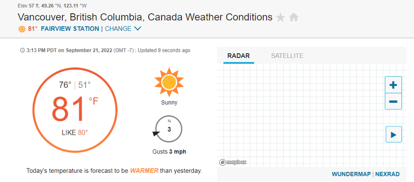
- Step 22 through 28 gathers from the display weather information:
  1. `CurrentTemp` - current temperature (of the day)
  2. `HiTemp` - the high template (of the day)
  3. `LoTemp` - the low template (of the day)
  4. `Humididy` - the humidity (of the day)

### 3. Save weather information
The final step is to output the saved data into a spreadsheet.

Script: 
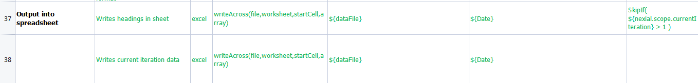

- Step 37 write the header row (Row 1) into the designated spreadsheet. Note that this step only executes during the 
  first iteration.
- Step 38 write a new row data into the designated spreadsheet.

Result: 
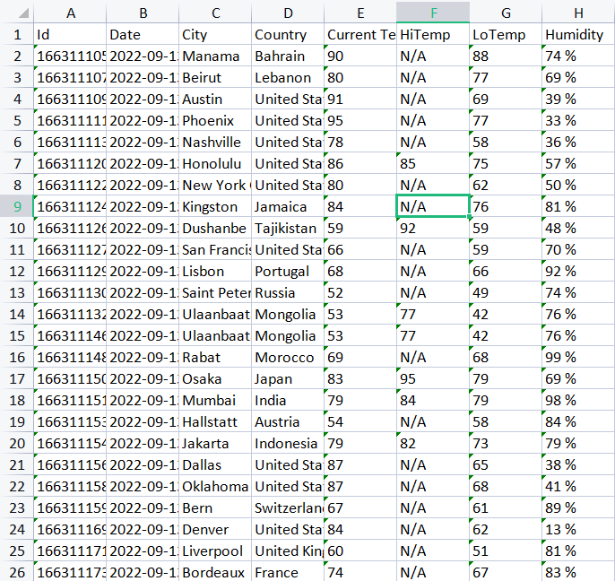

-----

## Concepts/Features
### Variables
Variables are used to store data, which can be used to control the execution flow of an automation script. There are 
two types of variables: local variables and system variables.

#### Local Variables
Local variables are variables initialized by the user, in either the script or the data file. They can be used to save
and edit different types of values such as strings or integers.

This script used two main commands to save/edit variables:
1. [web &raquo; `saveText(var,locator)`](../../commands/web/saveText(var,locator))
	- This instructs Nexial to reference a web element on the current web page and save the text of such element under 
    the specify variable name.
2. [base &raquo; `save(var,value)`](../../commands/base/save(var,value))
	- This allowed one to create or edit the contents of a variable

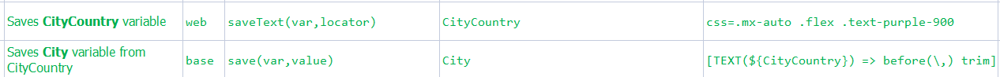

#### System Variables
More details can be found [here](../../systemvars).

For example: 
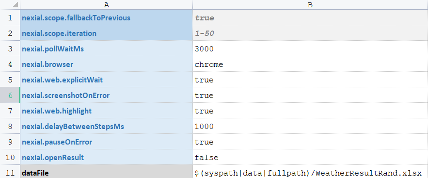

System variables are unlike local variables in that they have predetermined names and usages. They can be used to
accomplish a plethora of goals such as 
["capture a screenshot of the current web page when an automation error occurs"](../../systemvars/index.html#nexial.screenshotOnError) 
or ["highlighting text as they are referenced during execution"](../../systemvars/index.html#nexial.web.highlight).

### Iterations
Nexial supports the repeating of a scenario (i.e. worksheet). Each iteration runs from the first step in a scenario 
until the last step, then the next iteration starts. This concept was utilized in the script to enable a clean output 
of data, where each row would be the result of a single iteration. 
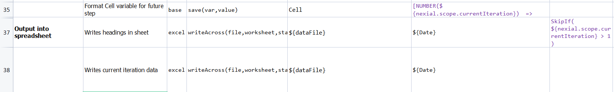

### Flow Controls
More details can be found [here](../../flowcontrols).

Flow controls are a way of controlling a step or group of steps to either run or not run based on a given condition. 
For example, this step only runs if the `Country` variable contains the text `States`. Otherwise, this step will be 
skipped. 
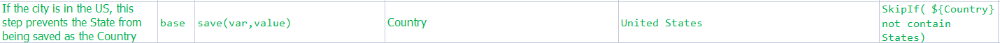

### RepeatUntil
[repeatUntil](../../commands/base/repeatUntil(steps,maxWaitMs).md) is another form of loop (different than 
[Iteration](#iterations)) where we can utilize multiple steps to acquire a single condition.

Loops require three steps:
1. Initializing the loop length
2. Initializing the condition
	- The third optional step is changing the condition.

The Weather script utilizes a loop to ensure each iteration outputs usable data.

Script: 
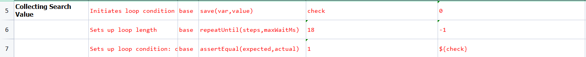
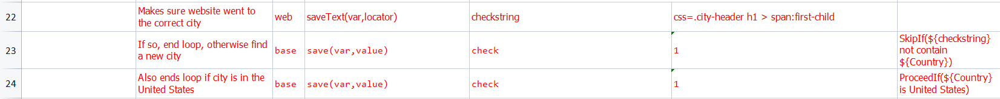

Explanation:
1. Step 5 - A local variable `check` is initialized as 0.
2. The length of the loop is set at 18 steps
3. The loop end condition is set: When the value of **check** is 1, end the loop
4. The variable `check` would have a value of 1 if either of two conditions are met.
5. The loop ends.

### localdb
[Localdb](../../commands/localdb) is a set of commands that allows the exporting of spreadsheets into an embedded 
(local) relational database. 
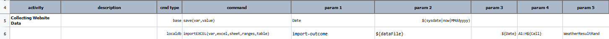

When opened in an SQL website, this is how the data is displayed:
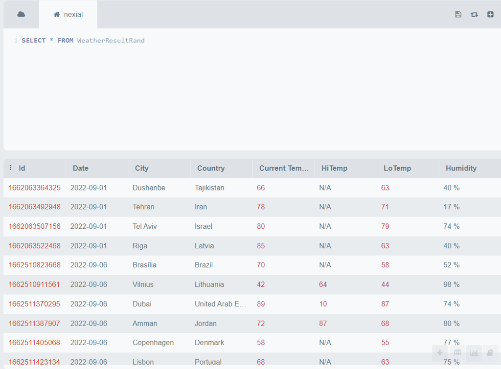

This table should display every entry of data no matter the day collected

This data can now be organized in many different ways.
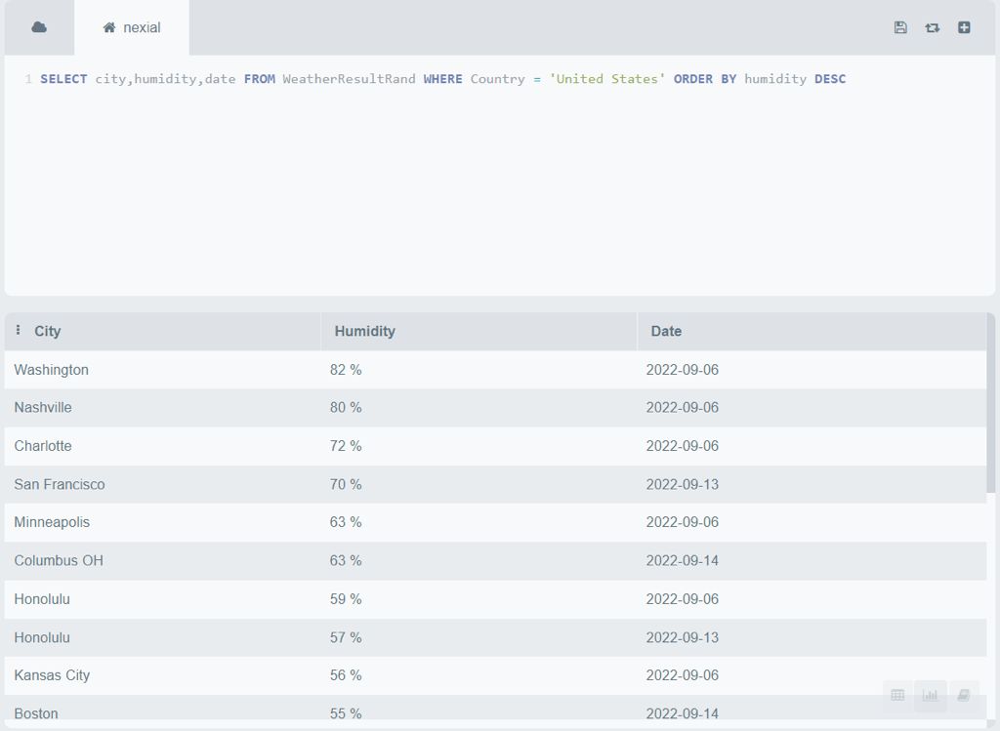

The above example illustrates the ability to
- show only cities from the United States,
- showed City, Humidity, and Date columns
- sort data by highest humidity to lowest.
