### Overview
Azure DevOps is a service provided by Microsoft which supports teams to plan work, collaborate on code
development, build and deploy applications. This tool automates CI/CD process and supports automatic builds and 
code deployment. It also provides Test Management service required for planned testing, user acceptance testing,
exploratory testing. Please go through [**Azure DevOps Services**](https://docs.microsoft.com/en-in/azure/devops/?view=azure-devops)
to learn more.

Nexial supports Test management using `Azure DevOps Test Plan` Service in which user can import testcases created by
Nexial user as a part of script and subplan. Also, user can upload execution results to Azure Test Run. 
Nexial also supports Azure pipelines to execute script and create test run result for the pipeline build.
Please go through following section to check import of testcase and their result and creating test run through azure pipeline.

### HOW to import test cases in Azure DevOps
Follow below steps to import test cases:
1. Prerequisite configuration to access Azure DevOps.
2. Configure Azure DevOps using Nexial Data Variables to access Azure DevOps through apis.
3. Configure project meta file to access particular project from Azure DevOps.
4. Import testcases using Nexial batch file [nexial-tms-importer](./BatchFiles#nexial-tms-importer).

**Prerequisite Configuration on Azure DevOps**:- 
User need to have proper subscription plan and provide proper permissions to user to access Azure DevOps using APIs.
- Firstly, Azure DevOps needs to have **Basic + Test Plan** subscription to utilize `Test Plan` service in general. 
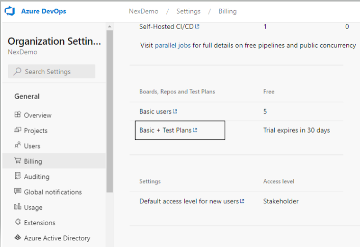 
- User must have **Basic + Test Plan** level access to utilize `Test Plan`. 
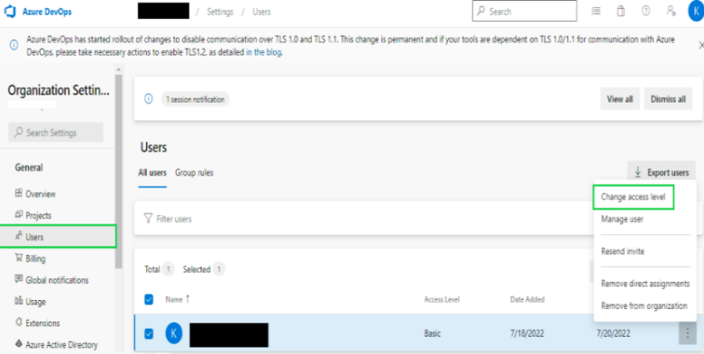 
 
- Generate PAT(Personal Access Token) to access Azure DevOps. Please go through docs to see
[How to Generate PAT](https://docs.microsoft.com/en-us/azure/devops/organizations/accounts/use-personal-access-tokens-to-authenticate?view=azure-devops&tabs=Windows) in detail. 
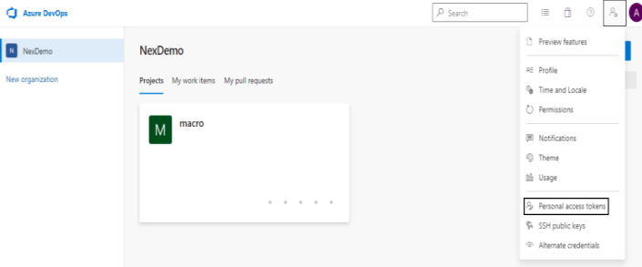 
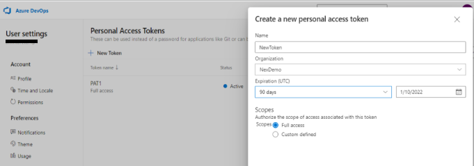 

**Configure Using Data Variables**:- 
- [nexial.tms.source](../systemvars/index#nexial.tms.source):- User must specify tms source tool to import testcases. For AzureDevOps, it must be **azure**.
- [nexial.tms.url](../systemvars/index#nexial.tms.url):- URL of the Azure DevOps server. e.g. `https://dev.azure.com/<organization name>/`.
- [nexial.tms.accessToken](../systemvars/index#nexial.tms.accessToken):- Generated PAT(Personal Access Token) to access Azure DevOps.
- Azure DevOps doesn't require any username to access Azure devOps.

~~~
# values are for azure devops for reference except source name
nexial.tms.source=azure
nexial.tms.url=https://dev.azure.com/AzureOrganization
nexial.tms.accessToken=4hsg6n5bb5n56ahixmdu7suoah65kk6bro3yu3rokcqhee5u5
~~~

User needs to provide above configurations to access Azure DevOps through Nexial variables using one-time setup, you can
provide Azure integration configuration details once and build `setup.jar` using [`nexial-setup.cmd|.sh`](BatchFiles#nexial-setup) 


**Note : `projectId` is the name of project in the Azure DevOps.**

**Import Test cases**:-
- User can import testcase using Nexial batch file [nexial-tms-importer.](BatchFiles#nexial-tms-importer)
- If there are any changes made to testcases for example adding new test case, deleted or updated,
  user need to update testcases using the same batch file command [nexial-tms-importer.](BatchFiles#nexial-tms-importer)

Sample screenshots after importing test result: 
- Test Suite screenshot
  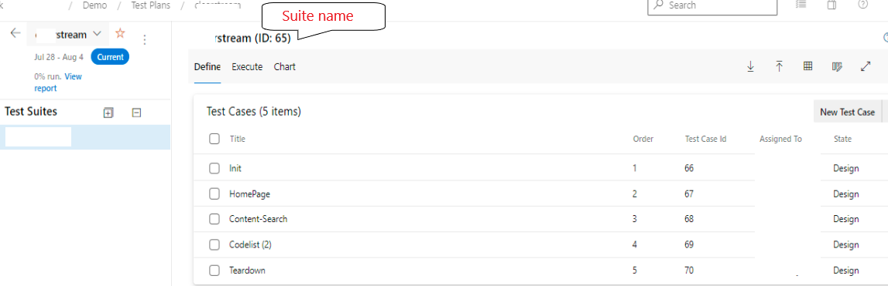
- Individual Test Case screenshot
  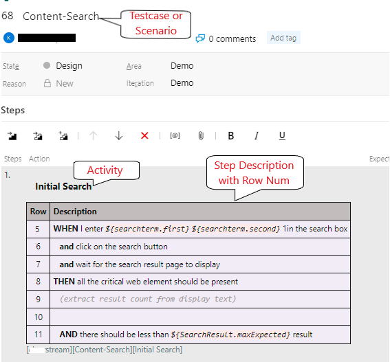

### HOW to upload Execution Results
1. **(Mandatory)** Make sure testcases are already imported to Azure DevOps before uploading result as explained above.
2. Test result is uploaded as Test Runs with cumulative results for testcases from `execution-detail.json`. Make sure
   during script execution in Nexial, [`nexial.generateReport`](../systemvars/index#nexial.generateReport) is set to `true`.
3. Upload results for imported test case using batch file [`nexial-tms-result-uploader.cmd|.sh`](BatchFiles#nexial-tms-result-uploader)

**Steps while uploading Execution Result(FYI):-**
1. Nexial will create new Test Run for first execution for Test Suite.
2. User will get option to close test run or not at the end after uploading the result.
3. If test run for imported test suite is active(not closed), then next time execution test result will be uploaded to
   the same test run.
4. If test run is not active(closed), new test run will be created.

Sample screenshots after uploading test result: 
- Test Run created for sample execution with attachment output excel and html report 
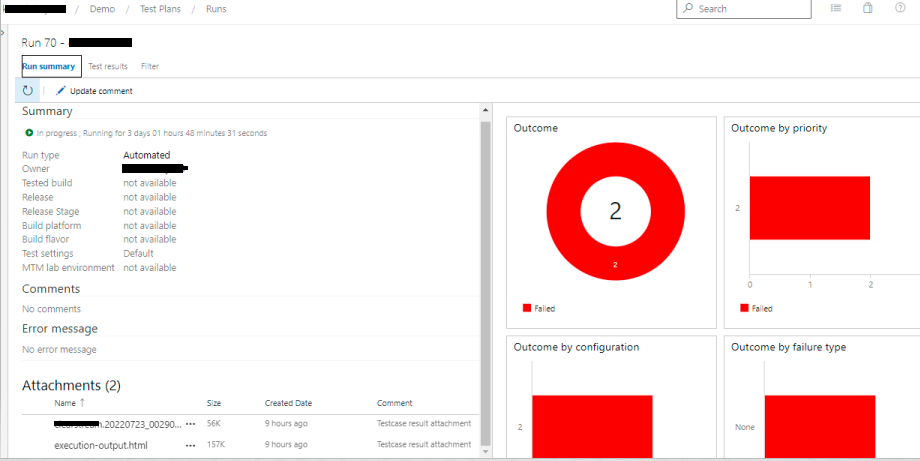
- All test result for the test run with outcome 
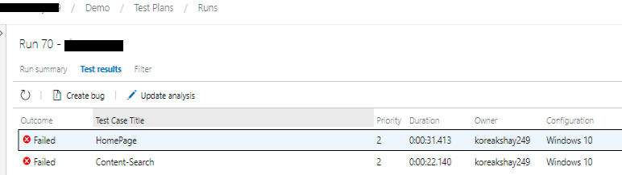
- Test result for individual test case with execution stats added as comment 
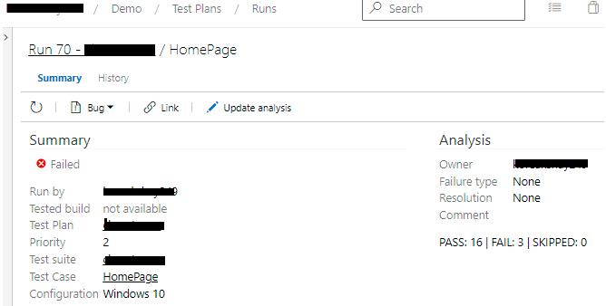

### HOW to upload execution results through Azure Pipelines
1. Create azure pipeline. Please walk through [Azure Pipelines](https://docs.microsoft.com/en-in/azure/devops/pipelines/?view=azure-devops).
to get to know how to create pipeline and task for the same.
2. Create Task to run the Nexial script and to publish test result afterwards in yml file as mentioned below.
3. Execute scripts from the azure repo using Nexial through `step script task`. Sample step scripts from 
`azure-pipelines.yml` to execute Nexial will look something like this, 
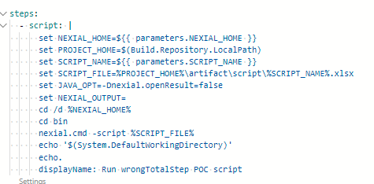
4. Setup task `publish test result` for `vstest` test result format in pipeline `azure-pipelines.yml`. 
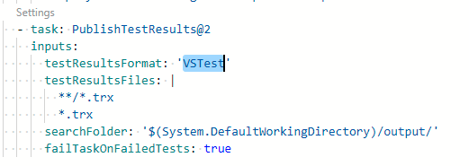
5. Set [`nexial.generateTrxReport`](../systemvars/index#nexial.generateTrxReport) to `True` to generate `vstest` 
report which will be used by pipeline to create test run.
6. Run the pipeline and new test run will be created with result.

### See Also
- [TestRail](TestRailSetup)
- [Jira](JiraSetup)
- [Tms Management](TmsManagement)
