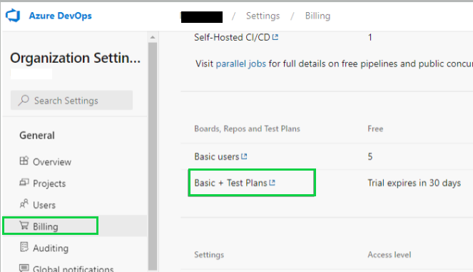
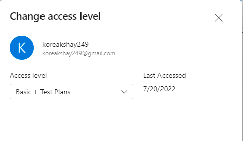

### Overview
Azure DevOps is a service provided by Microsoft which supports teams to plan work, collaborate on code
development, build and deploy applications. This tool automates CI/CD process and supports automatic builds and 
code deployment. It also provides Test Management service required for planned testing, user acceptance testing,
exploratory testing. Please go through [**Azure DevOps Services**](https://docs.microsoft.com/en-in/azure/devops/?view=azure-devops)
to learn more.

Nexial supports Test management using `Azure DevOps Test Plan` Service in which user can import testcases created by
Nexial user as a part of script and subplan.

### HOW to import test cases in Azure DevOps
Follow below steps to import test cases:
1. Prerequisite configuration to access Azure DevOps.
2. Configure Azure DevOps using Nexial Data Variables to access Azure DevOps through apis.
3. Configure project meta file to access particular project from Azure DevOps.
4. Import testcases using Nexial batch file [nexial-tms-importer](./BatchFiles#nexial-tms-importer).

**Prerequisite Configuration on Azure DevOps**:- 
User need to have proper subscription plan and provide proper permissions to user to access Azure DevOps using APIs.
- Firstly, Azure DevOps needs to have **Basic + Test Plan** subscription to utilize `Test Plan` service in general. 
 
- User must have **Basic + Test Plan** level access to utilize `Test Plan` completely. 
 
 
- Generate PAT(Personal Access Token) to access Azure DevOps. Please go through docs to see
[How to Generate PAT](https://docs.microsoft.com/en-us/azure/devops/organizations/accounts/use-personal-access-tokens-to-authenticate?view=azure-devops&tabs=Windows) in detail. 
 
 

**Configure Using Data Variables**:- 
- [nexial.tms.source](../systemvars/index#nexial.tms.source):- User must specify tms source tool to import testcases. For AzureDevOps, it must be **azure**.
- [nexial.tms.url](../systemvars/index#nexial.tms.url):- URL of the Azure DevOps server. e.g. `https://dev.azure.com/<organization name>/`.
- Azure DevOps doesn't require any username to access Azure devOps.
- [nexial.tms.password](../systemvars/index#nexial.tms.password):- Generated PAT(Personal Access Token) to access Azure DevOps. 

~~~
# values are for azure devops for reference except source name
nexial.tms.source=azure
nexial.tms.url=https://dev.azure.com/AzureOrganization
nexial.tms.password=4hsg6n5bb5n56ahixmdu7suoah65kk6bro3yu3rokcqhee5u5
~~~

User needs to provide above configurations to access Azure DevOps through Nexial variables using one-time setup, you can
provide Azure integration configuration details once and build `setup.jar` using [`nexial-setup.cmd|.sh`](BatchFiles#nexial-setup) 


**Note : `projectId` is the name of project in the Azure DevOps.**

### HOW to upload Testcase Execution Results
1. **(Mandatory)** Make sure testcases are already imported to Azure DevOps before uploading result as explained above.
2. Test result is uploaded as Test Runs with cumulative results for testcases from `execution-detail.json` from output folder.
3. Upload results for imported script or plan Test suite using batch file [`nexial-tms-result-uploader.cmd|.sh`](BatchFiles#nexial-tms-result-uploader)

### HOW to upload Testcase Execution Results using Azure Pipelines
1. Create azure pipeline. Please walk through [Azure Pipelines](https://docs.microsoft.com/en-in/azure/devops/pipelines/?view=azure-devops).
2. Execute script of the azure repo using Nexial through script. Sample step scripts to execute Nexial will look like, 

3. Setup task `publish test result` for `VSTest` test result format in pipeline `azure-pipelines.yml`. 

### See Also
- [TestRail Setup](TestRailSetup)
- [Jira Setup](JiraSetup)
- [Tms Management](TmsManagement)
