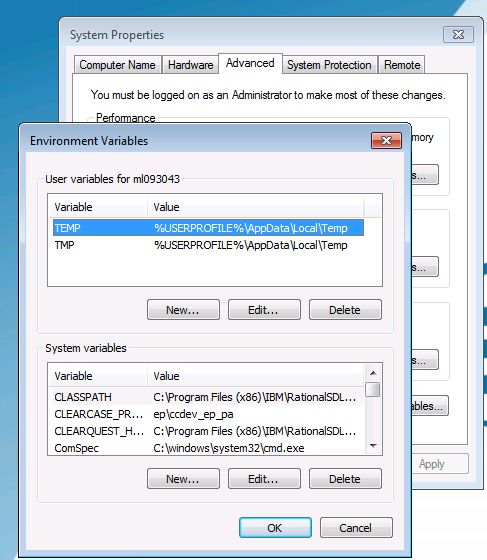

### Using The Nexial Installer
**Note**: Nexial requires Java 1.8.0_151 or above and Excel 2007/2010 or above. Scroll down for additional installation 
and setup instructions. test

    <ul class="tab-links">
        <li class="active"><a href="#tab1">Windows</a></li>
        <li><a href="#tab2">Mac OSX</a></li>
    </ul>
    

        

        <ol>
            <li>
                To keep things more structured, we will create a new directory for our installation process:   
                Navigate to your local hard drive and create a new folder called **projects** (i.e. `C:\projects`).
                 
                
            </li>
            <li>
                Click the following link to begin downloading the Nexial installer: 
                <a href="https://github.com/nexiality/nexial-installer/releases/download/nexial-installer-v1.4.2/nexial-installer-1.4.2.zip" class="external-link" target="_nexial_link">Nexial Installer</a>.
            </li>            
            <li>
                Next, locate the downloaded zip file in your Downloads folder.
                 
                
            </li>            
            <li>
                Unzip the <code>nexial-installer.zip</code> file into the <code>C:\projects\</code> directory that you 
                just created.
                 
                
            </li>            
            <li>
                Navigate to the <code>C:\projects\</code> directory and double click on the newly created 
                <code>nexial-installer</code> folder then double click the <code>bin</code> folder
                 
                
            </li>            
            <li>
                Double click <code>install-latest.cmd</code> file (<b>NOT</b> the <code>install-latest.sh</code> file).
                 
                
            </li>            
            <li>
                Let the command prompt run; this may take a while. When it finishes, it should close itself and you 
                now have the latest Nexial installed onto your computer!
            </li>
        </ol>
        

        

        <ol>
            <li>
            </li>
        </ol>
        

    

 

For troubleshooting or any other issues read the following steps:

### Install Java

1. Check if Java is installed - **Java 1.8.0_151 or above required, and 64-bit Java is highly recommended**
   **If possible, consider installing the latest version of Java 1.8 or the latest release of Java.** 
   

    <ul class="tab-links">
        <li class="active"><a href="#tab3">Windows</a></li>
        <li><a href="#tab4">Mac OSX</a></li>
    </ul>
    

        

        <ol>
            <li>
			   Open the console by first pressing the Start menu. Next, press Run and type in <b>"cmd"</b> and press <b>&lt;ENTER&gt;</b> 
            </li>
			<li>
			Type, <b>"java -version"</b> and press <b>&lt;ENTER&gt;</b> 
			If you get something like the following, please follow Step 2 down below (Download Java): 
            
			</li>
			<li>
			If you are not getting the above message, check that the version of Java installed is 1.8 
			or above. For example, 
			 
			Below is a snapshot of an outdated Java installation (1.6.0.45).
			 
			If the version of your Java installation
			is not <b>1.8.x</b>, then please consider a reinstallation or upgrade to the latest version of 
			<a href="http://www.oracle.com/technetwork/java/javase/downloads/jdk8-downloads-2133151.html" class="external-link" target="_nexial_link">Nexial Installer</a>. 
			</li>
			<li>
			If the version of Java installed is <b>1.8</b> or above, skip to the next section (Check Excel Version), otherwise if the 
      version of Java installed is less than <b>1.8</b>, proceed to Step 2 down below (Download Java).
			</li>
        </ol>
        

        

        <ol>
            <li>
			   Open the Terminal app, or open Spotlight (CMD-Space) and then type, <b>"terminal"</b> and press <b>&lt;ENTER&gt;</b> 
            </li>
			<li>
			Type, <b>"java -version"</b> and press <b>&lt;ENTER&gt;</b> 
			If you get something like the following, please follow Step 2 down below (Download Java): 
            
			</li>
			<li>
			If you are not getting the above message, check that the version of Java installed is 1.8 
			or above. For example, 
			 
			Below is a snapshot of an outdated Java installation (1.6.0.45).
			 
			If the version of your Java installation
			is not <b>1.8.x</b>, then please consider a reinstallation or upgrade to the latest version of 
			<a href="http://www.oracle.com/technetwork/java/javase/downloads/jdk8-downloads-2133151.html" class="external-link" target="_nexial_link">Nexial Installer</a>. 
			</li>
			<li>
			If the version of Java installed is <b>1.8</b> or above, skip to the next section (Check Excel Version), otherwise if the 
      version of Java installed is less than <b>1.8</b>, proceed to Step 2 down below (Download Java).
			</li>
        </ol>
        

    

 

2. Download Java

   1. Click the following link: <a href="http://www.oracle.com/technetwork/java/javase/downloads/index.html" class="external-link" target="_nexial_link">http://www.oracle.com/technetwork/java/javase/downloads/index.html</a>
   
   2. Click on the Download button just below JDK. 
      
   
   3. Click on **Accept License Agreement**. 
      
   
   4. Select the appropriate download file suitable for your workstation. It is recommended to select the **64bit version**
      for better performance and efficient memory management.

3. Installing Java
   
   1. **For Windows only: IT IS HIGHLY RECOMMENDED TO INSTALL JAVA IN A DIRECTORY THAT DOES NOT CONTAIN SPACES**
      **Windows**: double-click on the downloaded installer. Follow the instructions of the installer. It is
      _**highly recommended**_ to install Java in a directory that does not contain any spaces. For example, 
      `C:\tools\jdk1.8`.  
       
      - By default, Java is installed to either `C:\Program Files\Java\jdk...` or 
        `C:\Program Files (x86)\Java\jdk...`.   
      - For more hep, visit <a href="https://java.com/en/download/help/download_options.xml#windows" class="external-link" target="_nexial_link">https://java.com/en/download/help/download_options.xml#windows</a>
       
      **MacOSX**: double-click on the downloaded installer.  Follow the instructions of the installer.  For more help, 
      visit 
      <a href="https://java.com/en/download/help/mac_install.xml" class="external-link" target="_nexial_link">https://java.com/en/download/help/mac_install.xml</a>

4. Check `PATH`, `JAVA_HOME`, `JRE_HOME`
   Windows:
   
   1. Click on the Start menu then click on "Run" and (or if on **Windows 10**, in the search bar) enter: "sysdm.cpl" then press `<ENTER>`. Click the "Advanced" tab then click the "Environment Variables..." button at the bottom  
   
    
   
   2. Under System variable, search for a variable named `Path`.
   
   3. Ensure that the `bin\` directory of the installed Java is part of the value of `PATH`.  
      Preferably it should be the first entry of its value.  For example: 
       
   
   4. Similarly search for a variable named `JAVA_HOME`.  If not found, click `New...` button to create one. Its value 
      should be that of the installed directory of Java.
   
   5. Similarly search for a variable named `JRE_HOME`.  If not found, there is no need to create it. If found, check 
      that it has the same value as `JAVA_HOME`.
   
   6. These changes will *NOT* take effect on any opened console. Either open new console or restart existing ones.

### Check Excel Version
Nexial requires Excel 2007/2010 or above. It requires the use of XLSX format (old XLS format not supported).

### Checking Browser Availability and Version
1. **Internet Explorer** - Nexial at this time only supports Internet Explorer 9 or above.  In the future we might 
   consider older versions of Internet Explorer.  Nexial however will support either 32 or 64 bit.

2. **Firefox** - as stated on Selenium's website: "..._Support for Firefox is the latest release, the previous 
   release, the latest ESR release and the previous ESR release..._"  However there is a high likelihood that older 
   versions of Firefox will work as well.  Support from Nexial team is provided on a case-by-case basis.

3. **Chrome** - latest and almost all recent versions are supported.  Older version can be supported via using the 
   corresponding 
   <a href="https://sites.google.com/a/chromium.org/chromedriver/downloads" class="external-link" target="_nexial_link">older versions of chrome driver</a>.

4. **Safari** \- version 9 or above is supported, with the latest most likely to be most stable.