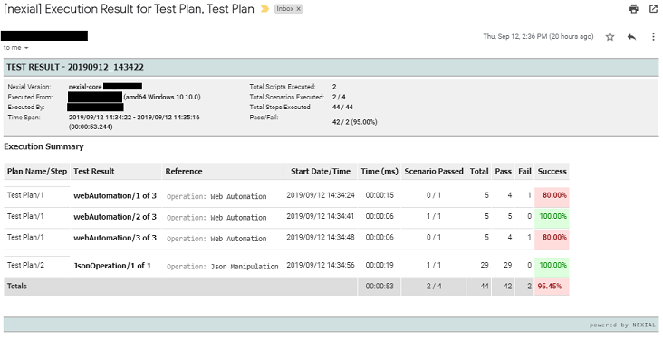
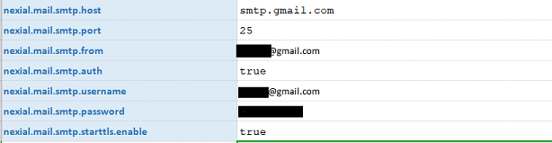
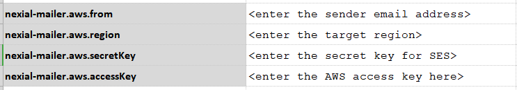
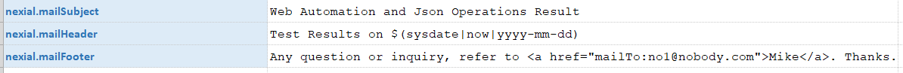
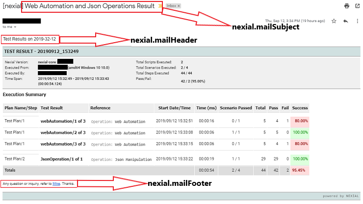
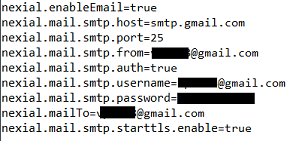
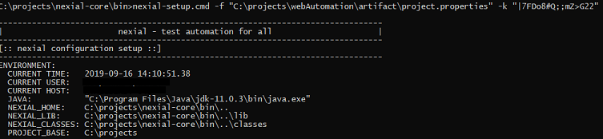
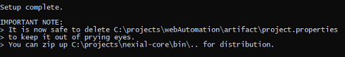

> Nexial supports email notification at the end of an execution through the use of System Variables. By default, sending
> email notifications is not enabled as using email to communicate execution status carries a variety of possible side 
> issues. Nonetheless, email notification is supported in Nexial. 

### Execution Summary
The email notification at the end of an execution provides a basic summary of the execution process. This summary 
includes:
- The version of Nexial used.
- The host name and user name from which the execution was run.
- The number of scripts executed and the time span.
- Number of passed/failed steps and scenarios and the total success percentage.
- Summarized results of the script/plan execution.

Additionally, Nexial provides features like:
- Sending email notification to multiple recipients.
- Adding custom subject, footer and header to the notification.
- Sending pre-configured emails.
- Conditional notification.

Read more about pre-configured emails and conditional notifications on the [Event Notification](EventNotification) page.

**Example of an Email Notification:** 
 

### Configuring Data Variables
<ol>
    <li>Use the system variable <a href="../systemvars/#nexial.enableEmail">nexial.enableEmail </a>and set it to <code>
    true</code></li> 
    <li>
    Define the mail server connectivity details in the data file according to your email service. 
     
        

            <ul class="tab-links tabs-collapsed">
                <li class="active"><a href="#tab3">SMTP Service</a></li>
                <li><a href="#tab4">AWS - Simple Email Service</a></li>
            </ul>
            

                

                <b>Nexial uses the following variables to specify connection details:</b> 
                 
                <ol>
                    <li><code>nexial.mail.smtp.host</code> - the hostname or DNS name of your mail server.</li>
                    <li><code>nexial.mail.smtp.port</code> - <code>25</code> (or whatever the configured SMTP port).</li>
                    <li><code>nexial.mail.smtp.from</code> - sender's email address.</li>
                    <li><code>nexial.mail.smtp.auth</code> - <code>true|false</code>.</li>
                    <li><code>nexial.mail.smtp.username</code> - username only needed if <code>nexial.mail.smtp.auth</code> 
                    is set to <code>true</code>.</li>
                    <li><code>nexial.mail.smtp.password</code> - username only needed if <code>nexial.mail.smtp.auth</code> 
                    is set to <code>true</code>.</li>                                                                         
                </ol> 
                 
                <b>Example:</b> 
                 
                 
                <b>Note:</b> <code>nexial.mail.smtp.starttls.enable</code> is required to be <code>true.</code> when
                Gmail is used as the email service.            
                

                

                
SES, or Simple Email Service, is a cloud service provided by Amazon AWS. One can utilize such service 
                to send, receive and manage email activities in the cloud. Currently Nexial supports the use of SES for
                sending email to one or more recipients.
 
                Nexial uses the following variables to specify AWS connection details: 
                 
                <ol>
                <li><code>nexial-mailer.aws.accessKey</code> - The access key valid for the target AWS service.</li>
                <li><code>nexial-mailer.aws.from</code> - the FROM email address.</li>
                <li><code>nexial-mailer.aws.region</code> - The target region to connect to.</li>
                <li><code>nexial-mailer.aws.secretKey</code> - The secret key valid for the target AWS service.</li>
                </ol>                 
                 
                <b>Example:</b> 
                
                

            

        

       </li> 
    <li>Define the recipient email or comma separated list of recipients via the <a href="../systemvars/#nexial.mailTo"> 
    nexial.mailTo</a> System variable.</li> 
    <li>[<code>OPTIONAL</code>] Use <a href="../systemvars/#nexial.mailSubject"> nexial.mailSubject</a>, <a href="../systemvars/#nexial.mailHeader"> nexial.mailHeader</a> 
    and <a href="../systemvars/#nexial.mailFooter"> nexial.mailFooter</a>
    system variables to add subject, header and footer to the email respectively.
    </li> 
     
</ol>

**Email Notification with header, footer and subject:** 
 

### One Time Server Setup
Using the `nexial-setup.cmd` command allows you to setup the email server by providing it the location of the 
configuration file. 

**Advantages**
- One time setup, no need to configure system variables for every project/test.
- Encryption of sensitive information such as passwords and secret keys. 
- Running the command creates a configuration jar. This nexial build can be distributed to other members of team 
allowing the team to work with the same configuration without having to set it up individually. 

#### Example
project.properties 
 
Command: 

Read more about nexial-setup.cmd on the [Nexial Batch Files](BatchFiles#nexial-setup) page. 

### See Also 
- [commands &raquo; `mail`](../commands/mail)
- [tipsandtricks &raquo; `IntegratingNexialWithEmail`](../tipsandtricks/IntegratingNexialWithEmail)
