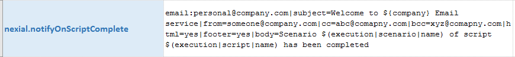
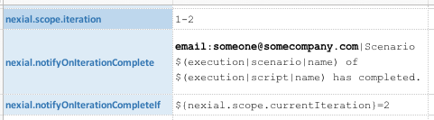
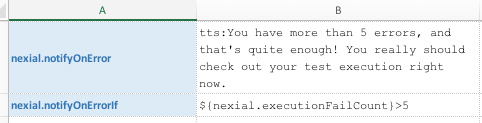
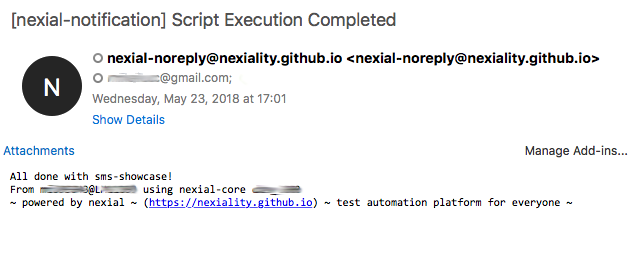
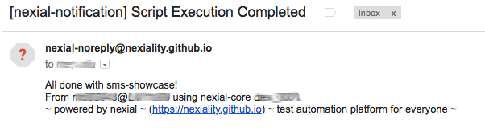
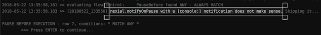

Starting [v1.2](../release/nexial-core-v1.2.changelog), Nexial has added event notification to aid in the awareness of
critical execution events and to improve user experience with automation. Nexial provides the capability to notify
the intended audience of significant events during the execution. It does so via multiple form of techniques.

Currently, these are the events that can be configured for notification:

  | Event Name              | System Variable                    | Explanation                                         |
  |:------------------------|:-----------------------------------|:----------------------------------------------------|
  | **OnExecutionStart**    | `nexial.notifyOnExecutionStart`    | Start of an Execution                               |
  | **OnExecutionComplete** | `nexial.notifyOnExecutionComplete` | Completion of an Execution; the end of a Nexial run.|
  | **OnScriptStart**       | `nexial.notifyOnScriptStart`       | Start of a Script; indicates the start of the first iteration of a script (note: by default all scripts have at least one iteration). |    
  | **OnScriptComplete**    | `nexial.notifyOnScriptComplete`    | Complete of a Script; indicates the completion of a script. |
  | **OnIterationStart**    | `nexial.notifyOnIterationStart`    | Start of an Iteration; indicates the start of an iteration (note: by default all scripts have at least one iteration). |    
  | **OnIterationComplete** | `nexial.notifyOnIterationComplete` | Complete of an Iteration; indicates the completion of an iteration. |
  | **OnScenarioStart**     | `nexial.notifyOnScenarioStart`     | Start of a Scenario.                                |
  | **OnScenarioComplete**  | `nexial.notifyOnScenarioComplete`  | Completion of a Scenario.                           |
  | **OnError**             | `nexial.notifyOnError`             | An failure occurred; indicates when an error occurred or when a step failed. |
  | **OnPause**             | `nexial.notifyOnPause`             | Execution is Paused; indicates when an execution is paused, such as via the [PauseBefore flow control](../flowcontrols/index#pausebefore()-/-pauseafter()). |

<br/>

Notifications can be send to one of the following channels by using one of these keyword as prefix:
1. **`audio:`** one can use one of the [included audio samples](../commands/sound/play(audio)#example) or specify your 
   own.
2. **`tts:`** Text-to-Speech; create your own notification message and let Nexial speak it on your behalf.
3. **`sms:`** send a preconfigured message to one or more mobile numbers, separated by 
   [`nexial.textDelim`](../systemvars/index#nexial.textDelim). Phone numbers and text configuration are separated by 
   a pipe (`|`) character. The text configuration has 2 forms:

   (a) A set of pipe-delimited configurations:

   | name    | value           | description                                                                         |
   |:------- |:----------------|:------------------------------------------------------------------------------------|
   | text    | text or file    | (REQUIRED) text to send. This may be _templatized_ via external file.               |
   | footer  | yes or no       | (OPTIONAL) `yes` means adding an email footer to include execution metadata in the form of "{NEXIAL VERSION}/{USER}@{HOST}". Default is `no`. |
   
   For example: `sms:1213-555-8000,1(374)123-4567|footer=yes|text=hello world!`<br/>
   
   (b) Just text message to send. Such text will not contain any footer. For example:<br/>
   For example: `sms:1213-555-8000,1(374)123-4567|hello world!`

4. **`email:`** send a preconfigured message to one or more email addresses, separated by 
   [`nexial.textDelim`](../systemvars/index#nexial.textDelim). Email addresses and message configuration are separated 
   by a pipe (`|`) character. The message configuration are expected in the form of `name=value` pairs separated by 
   pipe (`|`). Here are the possible configurations:
   
   | name    | value           | description                                                                         |
   |:------- |:----------------|:------------------------------------------------------------------------------------|
   | from    | email address   | (OPTIONAL) customize sender email address. Default is `nexial-noreply@ep.com`.      |
   | cc      | email addresses | (OPTIONAL) Add to CC recipient list, separated by `nexial.textDelim`.               |
   | bcc     | email addresses | (OPTIONAL) Add to BCC recipient list, separated by `nexial.textDelim`.              |
   | subject | email subject   | (OPTIONAL) customize mail subject. Default is `[nexial-notification] {EVENT NAME}`. |
   | body    | text or file    | (REQUIRED) mail body to send. This may be _templatized_ via external file.          |
   | html    | yes or no       | (OPTIONAL) `yes` means send email as HTML. Default is `no`.                         |
   | footer  | yes or no       | (OPTIONAL) `yes` means adding an email footer to include execution metadata in the form of "{NEXIAL VERSION}/{USER}@{HOST}". Default is `no`. |

   Since only `body` is required, the following can be considered as the minimum setup to enable email notification:
   ```
   nexial.notifyOn... | email:person1@company.com|body=This is to inform you that...
   ```
   
   Here's an example of a more complete setup:<br/>
   
       
   **Note**: 
   For backward compatibility, Nexial still supports the older format of `email:[recipient1,...]|Email content`. 
5. **`console:`** pause the console with a preconfigured message.

It may be of help to consider using the [$(execution) built-in function](../functions/$(execution)), which can expose
execution-time automation metadata such as script, scenario, iteration, activity and step information.


### Conditional Notification
Notifications can also be further controlled via [Nexial Filter](../flowcontrols/filter.md). In this way, the 
notifications can be suppressed until the specific conditions (i.e. filters) are met. Notification conditions are 
represented via a set of System variables corresponding to each event:

  | Notification Event                 | Notification Condition               |
  |:-----------------------------------|:-------------------------------------|
  | `nexial.notifyOnExecutionStart`    | `nexial.notifyOnExecutionStartIf`    |
  | `nexial.notifyOnExecutionComplete` | `nexial.notifyOnExecutionCompleteIf` |
  | `nexial.notifyOnScriptStart`       | `nexial.notifyOnScriptStartIf`       |    
  | `nexial.notifyOnScriptComplete`    | `nexial.notifyOnScriptCompleteIf`    |
  | `nexial.notifyOnIterationStart`    | `nexial.notifyOnIterationStartIf`    |    
  | `nexial.notifyOnIterationComplete` | `nexial.notifyOnIterationCompleteIf` |
  | `nexial.notifyOnScenarioStart`     | `nexial.notifyOnScenarioStartIf`     |
  | `nexial.notifyOnScenarioComplete`  | `nexial.notifyOnScenarioCompleteIf`  |
  | `nexial.notifyOnError`             | `nexial.notifyOnErrorIf`             |
  | `nexial.notifyOnPause`             | `nexial.notifyOnPauseIf`             |

<br/>


#### Example 1


The above data sheet indicates that the "OnIterationComplete" event notification, which is configured as an email 
notification, will be triggered only at the completion of the 2nd iteration. 

The notification is enabled via the `nexial.notifyOnIterationComplete` System variable, and the 
"triggered only at the completion of the 2nd iteration" is specified via `nexial.notifyOnIterationCompleteIf`.

Note: See [`nexial.scope.currentIteration`](../systemvars/index#nexial.scope.currentIteration) for more details about
this System variable.

#### Example 2


This example shows how one can delay the speech announcement until the 6th occurrence of failure.

Note: See [`nexial.executionFailCount`](../systemvars/index#nexial.executionFailCount) for more details about this
System variable.


### More Examples
One can mix-and-match the desired event with one of the available notification channels via System variables. For 
examples:


  | Notify By      | Example | Explanation                                                                              |
  |:---------------|:--------|:-----------------------------------------------------------------------------------------|
  | Audio          | Row 8   | Play the predefined "chime3" sound at the start of an execution.                         |
  | Audio          | Row 9   | Play the "MySound.mp3" file in the data directory when the current execution is complete.|
  | Text-to-Speech | Row 10  | _Speak_ `On __ hour, __ minutes and __ seconds, an error was found on [step position]`.<br/>Check [execution built-in function](../functions/$(execution)) for more details about `$(execution)`.|
  | SMS            | Row 11  | When a script completes, send a text message to `1(213)456-7890` informing the same.<br/>Check [sms](../commands/sms/index) commands for more details about SMS automation. |
  | Email          | Row 12  | When current execution is paused (such as via `PauseAfter()` flow control), email <br/>`my_email@my_company.com` of the same, along of current date/time |
  | Email          | Row 12  | When a scenario starts to execution, email `person1@my_company.com` and <br/>`another@geemail.com` with a message "Scenario ___ of ____ has started. |
  | Console        | Row 13  | When a scenario is done, pause the execution with a message on the console: <br/>"Waiting for Your Command, Master..." |

<br/>

Here are a couple of examples of the email send out via Nexial's event notification feature:<br/>
 <br/>
 <br/>

Check [Mail Settings](../commands/mail/index#mail-settings) for details on setting up SMTP connectivity.

Note that it does not make sense to create a "console" notification on a "pause" event.  Nexial will inform you of 
such scenario via console log:<br/>
 


### Additional Notes
1. Audio, TTS and console notification will be disabled in zero-touch environment (CI/CD, Jenkins, e.g.).
2. TTS, sms and email notification requires additional setup for proper connectivity. 
3. Check out [$(execution) built-in function](../functions/$(execution)) to retrieve execution-time automation metadata.
