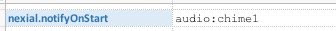
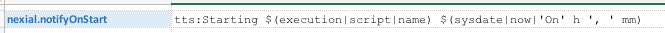
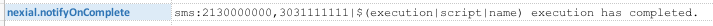
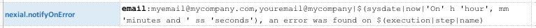

Starting [v1.2](../release/nexial-core-v1.2.changelog), Nexial has added event notification to aid in the awareness of
critical execution events and to improve user experience with automation. Nexial provides the capability to notify
the intended audience of significant events during the execution. It does so via multiple form of techniques.

Currently, these are the events that can be configured for notification:
1. **OnScriptStart**: represented by a System variable **`nexial.notifyOnScriptStart`**; indicates the start of an 
   iteration (note: by default all scripts have at least one iteration).
2. **OnScriptComplete**: represented by a System variable **`nexial.notifyOnScriptComplete`**; indicates the completion 
   of an iteration.
3. **OnError**: represented by a System variable **`nexial.notifyOnError`**; indicates when an error occurred or when a 
   step failed.
4. **OnPause**: represented by a System variable **`nexial.notifyOnPause`**; indicates when an execution is paused, 
   such as via the [PauseBefore flow control](../flowcontrols/index#pausebefore()-/-pauseafter()).

Notifications can be send to one of the following channels by using one of these keyword as prefix:
1. **`audio:`** one can use one of the [included audio samples](../commands/sound/play(audio)#example) or specify your 
   own.
2. **`tts:`** Text-to-Speech; create your own notification message and let Nexial speak it on your behalf.
3. **`sms:`** send a preconfigured message to one or more mobile numbers, separated by 
   [`nexial.textDelim`](../systemvars/index#nexial.textDelim). Phone numbers and message are separated by a pipe 
   (`|`) character.
4. **`email:`** send a preconfigured message to one or more email addresses, separated by 
   [`nexial.textDelim`](../systemvars/index#nexial.textDelim). Email addresses and message are separated by a pipe 
   (`|`) character.
5. **`console:`** pause the console with a preconfigured message.

### Examples
One can mix-and-match the desired event with one of the available notification channels via System variables. For 
examples:

1. At the start of executing a script (or an iteration), play "chime1" sound:  
   
   
2. At the start of executing a script (or an iteration), speak "`Starting [SCRIPT NAME] On [HOUR], [MINUTES]`": 
    
   Check [execution built-in function](../functions/$(execution)) for more details about `$(execution)`.
   
3. When a script has completed (execution), send a SMS text to 2 mobile numbers: 
    
   Check [sms](../commands/sms/index) commands for more details about SMS automation.
   
4. When a step fails, send an email to 2 email addresses: 
    
   Here are a couple of examples of the email send out via Nexial's event notification feature: 
    
    
   Check [Mail Settings](../commands/mail/index#mail-settings) for details on setting up SMTP connectivity.
   
5. When the execution is paused, sound an "alert": 
    
   
   Note that it does not make sense to create a "console" notification on a "pause" event.  Nexial will inform you
   of such scenario via console log: 
   

### Additional Notes
1. Audio, TTS and console notification will be disabled in zero-touch environment (CI/CD, Jenkins, e.g.).
2. TTS, sms and email notification requires additional setup for proper connectivity. 

